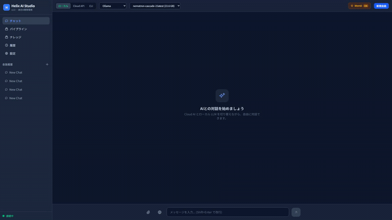
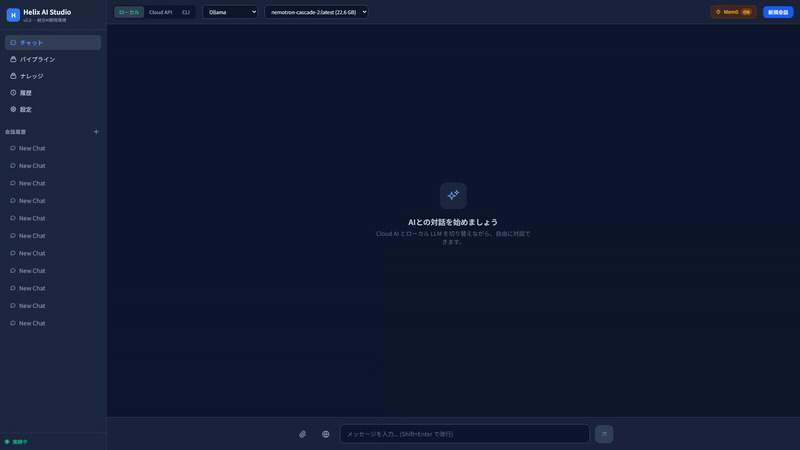
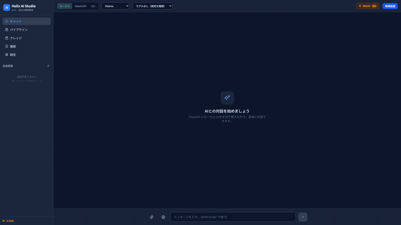
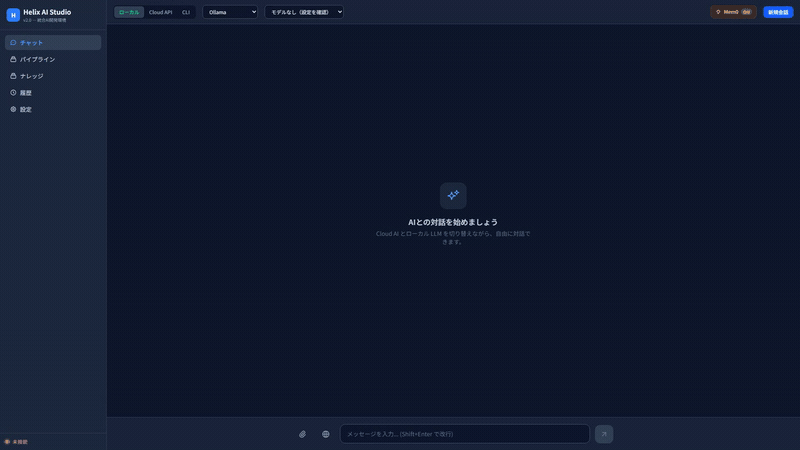
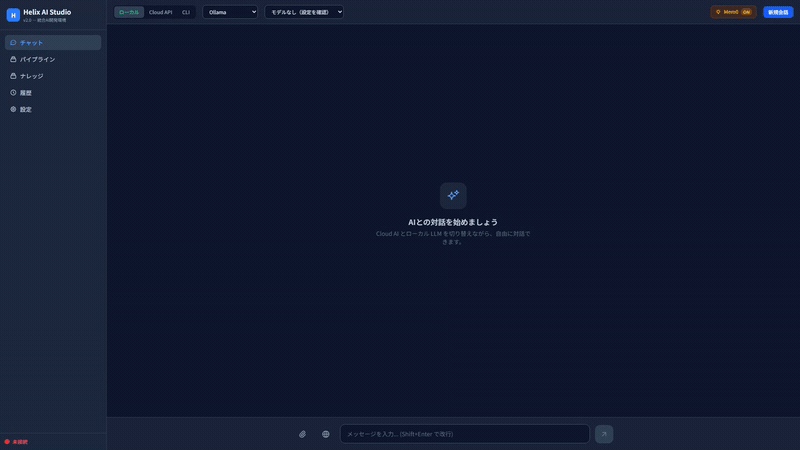
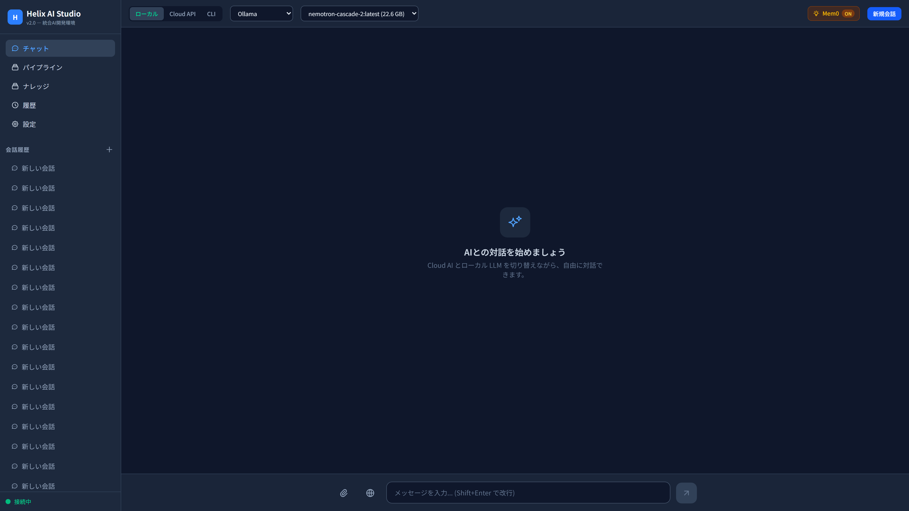
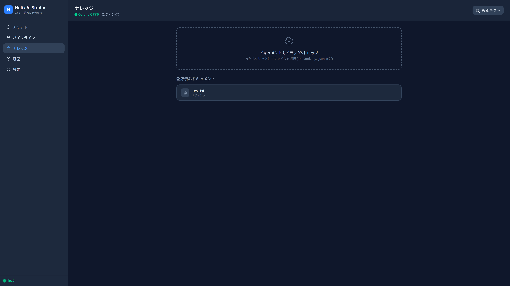
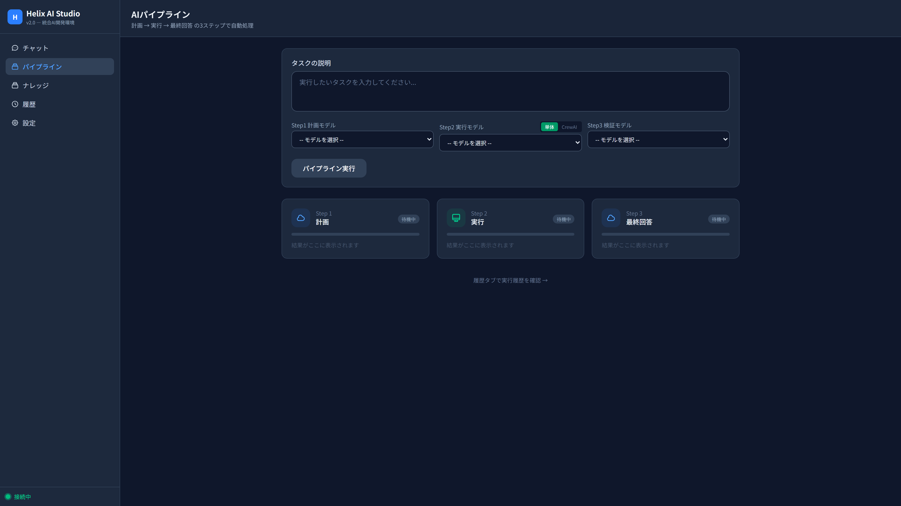
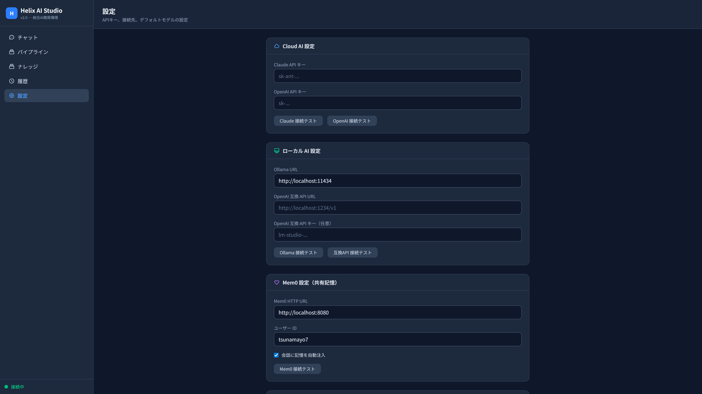

# Helix AI Studio

**CLI AIエージェント (Claude Code/Codex/Gemini) を統合した、唯一のオールインワンAIチャットスタジオ。** 7プロバイダ・RAG・MCP・Mem0・パイプラインを軽量Webアプリで。

[](https://helix-ai-studio.onrender.com)

[](https://github.com/tsunamayo7/helix-ai-studio/releases)
[](https://github.com/tsunamayo7/helix-ai-studio)
[](https://www.python.org/)
[](https://opensource.org/licenses/MIT)
[](https://docs.docker.com/)
[](https://ollama.com/)
[](https://github.com/tsunamayo7/helix-ai-studio)
[](https://ollama.com/library/gemma4)

> **[English README (README.md)](README.md)**

---

## 目次

- [デモ](#デモ)
- [なぜ Helix AI Studio？](#なぜ-helix-ai-studio)
- [特徴](#特徴)
- [クイックスタート](#クイックスタート)
- [セットアップ](#セットアップ)
- [アーキテクチャ](#アーキテクチャ)
- [ページ一覧](#ページ一覧)
- [API エンドポイント](#api-エンドポイント)
- [関連プロジェクト](#関連プロジェクト)
- [開発](#開発)
- [サポート](#サポート)
- [ライセンス](#ライセンス)

---

## デモ

### チャット — ストリーミング応答



OllamaによるリアルタイムWebSocketストリーミング。プロンプトを入力して送信すると、シンタックスハイライト付きのコードブロックが即座にストリーミング表示されます。

### プロバイダ & モデル切替



ローカル (Ollama)・Cloud API (Claude/OpenAI)・CLI (Claude Code/Codex/Gemini) をワンクリックで切替。モデルはプロバイダに応じて自動読み込み。

### Web検索 — LLM自律検索



🌐ボタンでWeb検索を有効化。tool use対応モデルではLLMが自律的に検索判断します。

### パイプライン — 計画 → 実行 → 検証



CLI（Claude Code/Codex）で計画・検証、ローカルLLM（Ollama）で実行する3ステップ自動パイプライン。CrewAIマルチエージェントモードも利用可能。

### アプリツアー — 全機能



チャット → パイプライン → ナレッジベース → 設定 — すべてが1つの軽量Webアプリに。

### スクリーンショット

| チャットUI | RAGナレッジベース | パイプライン | 設定 |
|:---:|:---:|:---:|:---:|
|  |  |  |  |
| ダークテーマ、サイドバー、履歴 | ドラッグ&ドロップ、Qdrant検索 | 計画 → 実行 → 検証 | Cloud/Local/Mem0/MCP設定 |

---

## なぜ Helix AI Studio？

- **7プロバイダを1つのUIで** — Ollama、Claude、OpenAI、vLLM/llama.cpp、Claude Code CLI、Codex CLI、Gemini CLI。ワンクリックで切替。
- **100% ローカル対応** — Ollama + Qdrant だけでマシン上で完全に動作。クラウドAPI不要。
- **ベンダーロックインなし** — お好みのモデルを使い、いつでもプロバイダを切替、データは自分のハードウェアに。
- **RAG + Mem0 + MCP を一つのアプリに** — ナレッジベース、永続共有記憶、外部ツール統合 — すべてビルトイン、プラグイン不要。

---

## 特徴

### 7つのAIプロバイダ

| プロバイダ | 方式 | モデル検出 | ストリーミング |
| --- | --- | :---: | :---: |
| **Ollama** | HTTP API (localhost:11434) | 自動 | Yes |
| **Claude API** | Anthropic SDK | 自動 (キー検証) | Yes |
| **OpenAI API** | OpenAI SDK | 自動 (`models.list()`) | Yes |
| **OpenAI互換** | HTTP API (vLLM, llama.cpp, LM Studio) | 自動 (`/v1/models`) | Yes |
| **Claude Code CLI** | `claude -p` | 自動検出 | 疑似 |
| **Codex CLI** | `codex exec` | 自動検出 | 疑似 |
| **Gemini CLI** | `gemini -p` | 自動検出 | 疑似 |

CLIツールは自動検出 — 未インストールの場合はUIから非表示。

### RAG ナレッジベース

- ドラッグ&ドロップでドキュメントアップロード (.txt, .md, .py, .json 他25+形式)
- **Docling Parser** — PDF、Office (docx/pptx/xlsx)、画像をDocling Serveで解析
- **ハイブリッド検索** — dense ベクトル + BM25 スパース + RRF (Reciprocal Rank Fusion)
- **TEI Reranker** — bge-reranker-v2-m3 による再スコアリング
- **Qdrant** ベクトルDBでセマンティック検索
- **Ollama embedding** (qwen3-embedding:8b) — ローカル実行、API費用ゼロ
- 関連ナレッジチャンクをチャットコンテキストに自動注入
- 検索テストUI搭載
- Mem0とは独立 (`helix_rag` コレクションを使用)

### MCP ツール統合

- **Model Context Protocol** クライアントで外部ツール接続
- **stdio transport** — 任意のMCPサーバーと互換
- サーバー起動/停止管理、ツール検出・実行
- 設定画面から設定可能

### チャット

- WebSocketストリーミングでリアルタイム応答
- プロバイダ・モデルをワンクリックで切替
- 応答ごとにモデル情報バッジ表示
- 会話履歴の自動保存・復元
- `@search`, `@file`, `@ls` チャットコマンド
- **ファイル添付** — ドラッグ&ドロップまたはクリップアイコンでファイル添付、RAGに自動登録
- Mem0記憶 + RAGナレッジをコンテキストに自動注入

### Mem0 共有記憶

- Mem0 HTTP API で記憶の検索・追加
- 関連記憶をチャットコンテキストに自動注入
- Qdrant直接検索フォールバック
- 全AIツール（Claude Code, Codex, Open WebUI）で共有

### パイプライン

3ステップ自動パイプライン:

```
Step 1: 計画 (Cloud/CLI/Local) — タスク分析と計画生成
Step 2: 実行 (Local/CrewAI)   — 計画の実行
Step 3: 検証 (Cloud/CLI/Local) — 結果検証と品質評価
```

### CrewAI マルチエージェント

- Ollamaのみ、VRAM管理付きマルチエージェント実行
- 3つのプリセットチーム: dev_team, research_team, writing_team
- ロールごとのモデル選択とVRAM推定

### UI

- ダークテーマ + レスポンシブデザイン
- **日本語 / 英語** 言語切替
- Markdownレンダリング + シンタックスハイライト + コードコピー
- Tailscale経由でモバイルアクセス可能

---

## クイックスタート

### 方法0: ワンクリックデプロイ（無料）

[](https://render.com/deploy?repo=https://github.com/tsunamayo7/helix-ai-studio)

Renderの無料枠にワンクリックでデプロイ。Cloud APIプロバイダ (Claude/OpenAI) を使用 — デプロイ後に設定画面でAPIキーを入力してください。

### 方法1: ローカルインストール

```bash
git clone https://github.com/tsunamayo7/helix-ai-studio.git
cd helix-ai-studio
uv sync
uv run python run.py
```

ブラウザで http://localhost:8504 を開く。

### 方法2: Docker Compose

```bash
git clone https://github.com/tsunamayo7/helix-ai-studio.git
cd helix-ai-studio
docker compose up -d
```

Helix AI Studio + Ollama + Qdrant + Mem0 が起動します。

> **Note**: ローカルインストールはポート **8504**、Docker Compose はポート **8502**。

---

## セットアップ

### 1. Ollama（必須）

```bash
ollama pull gemma4:31b            # 推奨（2026年4月リリース）
ollama pull qwen3-embedding:8b    # RAG & Mem0用
```

> **ヒント**: `gemma4:31b` がデフォルトモデルです。`gemma3:27b` などの他モデルもUIから選択可能です。

### 2. Qdrant（RAGに必須）

```bash
docker run -d -p 6333:6333 qdrant/qdrant:latest
```

または、同梱の `docker-compose.yml` を使用。

### 3. Cloud AI（任意）

設定画面でAPIキーを入力:

- **Claude**: [Anthropic Console](https://console.anthropic.com/)
- **OpenAI**: [OpenAI Platform](https://platform.openai.com/)

### 4. CLIエージェント（任意）

```bash
npm install -g @anthropic-ai/claude-code   # Claude Code
npm install -g @openai/codex                # Codex CLI
npm install -g @google/gemini-cli           # Gemini CLI
```

### 5. Mem0 共有記憶（任意）

設定画面でMem0 HTTP URLを設定（デフォルト: http://localhost:8080）。

---

## アーキテクチャ

```
ブラウザ (http://localhost:8504)
  |
  |-- WebSocket --- ストリーミングチャット
  |-- REST API ---- 設定, 履歴, モデル, 記憶, RAG, MCP, パイプライン
  |
  Helix AI Studio (FastAPI + Jinja2 + Tailwind CSS + Alpine.js)
    |
    |-- Cloud AI ---------> Claude API / OpenAI API
    |-- Local AI ---------> Ollama / OpenAI互換 (vLLM, llama.cpp)
    |-- CLI Agents -------> Claude Code / Codex / Gemini CLI
    |-- RAG --------------> Qdrant + Ollama Embedding (helix_rag)
|-- RAG解析 ----------> Docling Serve (PDF/Office/画像)
    |-- Memory -----------> Mem0 HTTP -> Qdrant + Ollama Embedding (mem0_shared)
    |-- MCP --------------> stdio transport -> 任意のMCPサーバー
    |-- CrewAI -----------> マルチエージェント (Ollamaのみ, VRAM管理)
    |-- Web Search -------> SearXNG (複数エンジン横断) / DuckDuckGo フォールバック
|-- Reranker ---------> TEI (bge-reranker-v2-m3)
    |-- File Operations --> ローカルファイルシステム (パストラバーサル保護)
    |-- Pipeline ---------> 計画 -> 実行 -> 検証
```

### 技術スタック

| レイヤー | 技術 |
| --- | --- |
| バックエンド | Python 3.12, FastAPI, aiosqlite, httpx |
| フロントエンド | Jinja2, Tailwind CSS v4 (静的ビルド), Alpine.js (CDN) |
| データベース | SQLite (アプリデータ), Qdrant (ベクトル) |
| AI | anthropic SDK, openai SDK, Ollama HTTP API |
| RAG | Qdrant ハイブリッド検索 (dense + BM25), Ollama embedding, TEI Reranker, Docling |
| 記憶 | Mem0 HTTP API, Qdrant 直接検索フォールバック |
| MCP | JSON-RPC over stdio (mcp SDK 依存なし) |
| 検索 | SearXNG (複数エンジン横断), DuckDuckGo フォールバック |

---

## ページ一覧

| パス | 説明 |
| --- | --- |
| `/` | チャット |
| `/knowledge` | RAG ナレッジベース |
| `/pipeline` | パイプライン |
| `/history` | 会話履歴 |
| `/settings` | 設定 |

---

## API エンドポイント

### チャット

| メソッド | パス | 説明 |
| --- | --- | --- |
| WebSocket | `/ws/chat` | ストリーミングチャット |
| POST | `/api/chat` | 非ストリーミングチャット |
| POST/GET | `/api/conversations` | 会話の作成 / 一覧 |
| GET/DELETE | `/api/conversations/{id}` | 会話の取得 / 削除 |

### RAG

| メソッド | パス | 説明 |
| --- | --- | --- |
| GET | `/api/rag/status` | RAGサービスステータス |
| GET | `/api/rag/documents` | アップロード済みドキュメント一覧 |
| POST | `/api/rag/upload` | ドキュメントアップロード (multipart) |
| POST | `/api/rag/search` | ベクトル検索 |
| DELETE | `/api/rag/documents/{doc_id}` | ドキュメント削除 |

### MCP

| メソッド | パス | 説明 |
| --- | --- | --- |
| GET | `/api/mcp/servers` | MCPサーバー一覧 |
| POST | `/api/mcp/servers/start` | MCPサーバー起動 |
| POST | `/api/mcp/servers/{name}/stop` | MCPサーバー停止 |
| GET | `/api/mcp/tools` | MCPツール一覧 |
| POST | `/api/mcp/tools/call` | MCPツール呼び出し |

### モデル / 設定 / 記憶 / ツール / パイプライン / CrewAI

| メソッド | パス | 説明 |
| --- | --- | --- |
| GET | `/healthz` | ヘルスチェック（外部依存なし） |
| GET | `/api/models` | 全プロバイダモデル |
| GET/PUT | `/api/settings` | 設定 CRUD |
| POST | `/api/memory/search` | Mem0記憶検索 |
| POST | `/api/memory/add` | 記憶追加 |
| POST | `/api/tools/search` | Web検索 |
| POST | `/api/pipeline/start` | パイプライン開始 |
| GET | `/api/pipeline/{run_id}` | パイプライン実行状況 |
| GET | `/api/pipeline/history/list` | パイプライン実行履歴 |
| GET | `/api/crew/teams` | CrewAIチーム |

---

## Docker サービス構成（フルスタック）

| サービス | URL | 用途 |
| --- | --- | --- |
| **Helix AI Studio** | localhost:8504 | メインアプリ |
| **Docling Serve** | localhost:5001 | PDF/Office/画像パース |
| **SearXNG** | localhost:8888 | Web検索（複数エンジン横断） |
| **TEI Reranker** | localhost:8480 | bge-reranker-v2-m3 再スコアリング |
| **Ollama** | localhost:11434 | ローカルLLM |
| **Qdrant** | localhost:6333 | ベクトルDB |
| **Mem0** | localhost:8080 | 共有記憶サーバー |

---

## 関連プロジェクト

| プロジェクト | 説明 |
| --- | --- |
| [helix-pilot](https://github.com/tsunamayo7/helix-pilot) | GUI自動操作MCPサーバー — AIがWindowsデスクトップを操作 |
| [helix-sandbox](https://github.com/tsunamayo7/helix-sandbox) | セキュアサンドボックスMCPサーバー — Docker + Windows Sandbox |

---

## 開発

```bash
uv sync --dev
uv run python -m pytest tests/ -v    # 118テスト
uv run ruff check helix_studio/
```

---

## サポート

このプロジェクトが役に立ったら、ぜひスターをお願いします！他の人の目に留まりやすくなり、開発のモチベーションにもなります。

[](https://star-history.com/#tsunamayo7/helix-ai-studio&Date)

---

## ライセンス

MIT
