<!-- SPDX-FileCopyrightText: 2026 Helix AI Studio Contributors -->
<!-- SPDX-License-Identifier: MIT -->

<div align="center">

# 🧬 Helix AI Studio

**One prompt. Multiple AI models. One integrated answer.**

*A desktop app that makes Claude, GPT, Gemini, and local LLMs actually work **together** — no copy-pasting, no coding required.*

[](https://github.com/tsunamayo7/helix-ai-studio/stargazers)
[](https://opensource.org/licenses/MIT)
[](https://www.python.org/downloads/)
[](https://pypi.org/project/PyQt6/)
[](https://github.com/tsunamayo7/helix-ai-studio/releases)


[🇯🇵 日本語 README](README_ja.md) · [📖 Setup Guide](SETUP_GUIDE.md) · [📋 Changelog](CHANGELOG.md) · [🔒 Security](SECURITY.md)

> ⭐ **If Helix AI Studio looks useful to you, a star helps more developers discover it. Thank you!**

</div>

---

## 📋 Table of Contents

- [See It in Action](#-see-it-in-action)
- [Get Started in 60 Seconds](#-get-started-in-60-seconds)
- [What Makes Helix Different?](#-what-makes-helix-different)
- [How the Pipeline Works](#-how-the-pipeline-works)
- [Features at a Glance](#-features-at-a-glance)
- [Installation Guide](#-installation-guide)
- [Tech Stack](#-tech-stack)
- [Security & Privacy](#-security--privacy)
- [Screenshots](#-screenshots)
- [Version History](#-version-history)
- [Articles & Resources](#-articles--resources)
- [Contributing](#-contributing)
- [License](#-license)

---

## 🎬 See It in Action

### mixAI Pipeline — Multiple AIs collaborating on your task

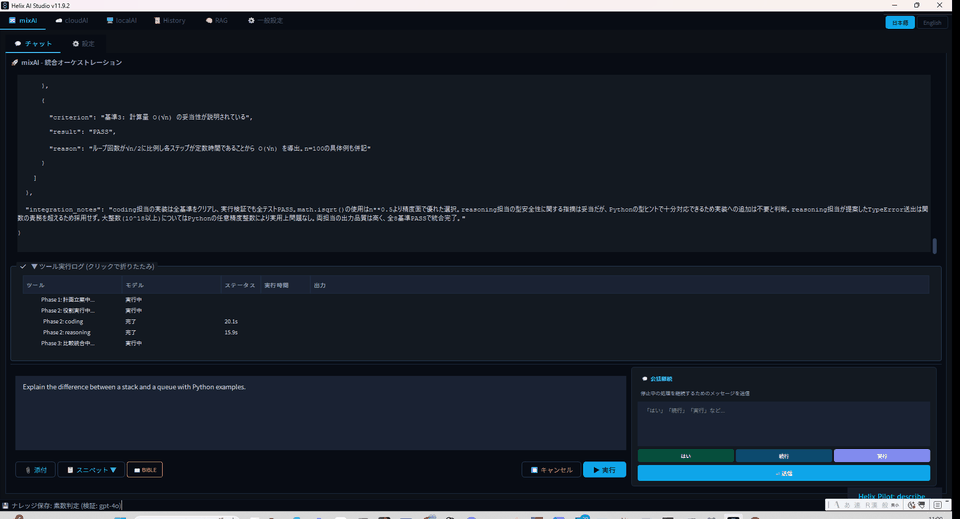

> Claude plans the work, local LLMs execute in parallel, Claude validates the result. All in one click.

### Desktop + Web UI — Use it anywhere

| Desktop (PyQt6) | Web UI (React) |
|:---:|:---:|
| 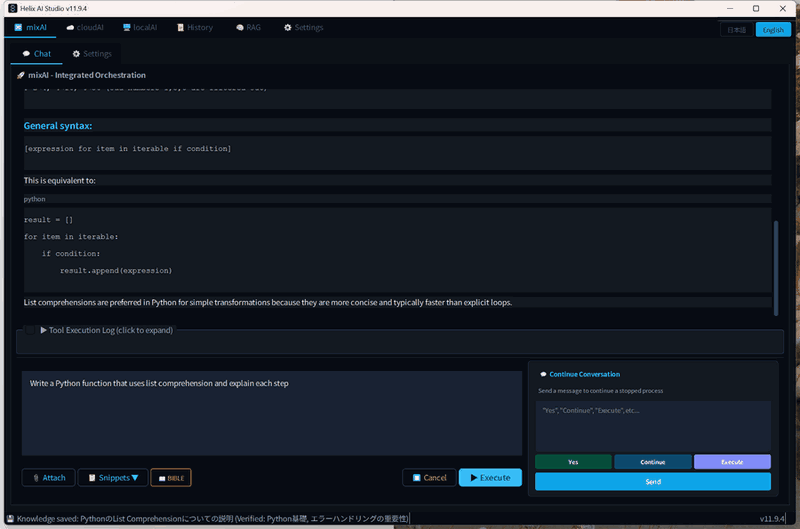 | 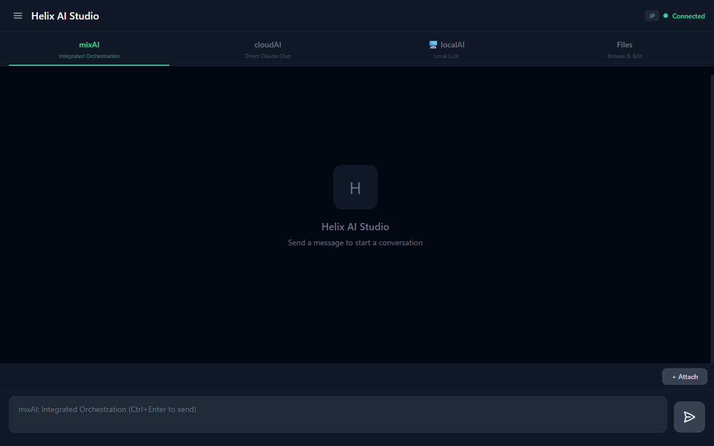 |

> The desktop app runs on your PC. The Web UI lets you chat from your phone, tablet, or any browser on your network.

### Helix Pilot v2.0 — AI that controls the UI for you

> 🆕 **New in v11.9.4**: Helix Pilot is a local Vision LLM agent that reads your screen and operates the app autonomously. Claude Code describes a task in plain English — Helix Pilot handles every click, scroll, and keystroke.

```bash
python scripts/helix_pilot.py auto "Open the mixAI tab, type a prompt, and send it" --window "Helix AI Studio"
```

---

## 🚀 Get Started in 60 Seconds

```bash
git clone https://github.com/tsunamayo7/helix-ai-studio.git
cd helix-ai-studio
pip install -r requirements.txt
python HelixAIStudio.py
```

That's it. The app opens with a built-in Web UI at `http://localhost:8500`.
Add your API keys in **Settings**, or install [Ollama](https://ollama.com) for fully local, private inference.

> **New to this?** Check out [SETUP_GUIDE.md](SETUP_GUIDE.md) for a step-by-step walkthrough.

---

## 💡 What Makes Helix Different?

Most AI tools give you a chat window with **one** model. Helix gives you a **pipeline** where multiple models collaborate.

**The key insight**: every AI has blind spots. Routing your prompt through models with different architectures — then validating the combined result — produces answers that are more accurate and complete than any single model.

| | Helix AI Studio | Single-model apps |
|---|---|---|
| 🤖 **Multi-AI pipeline** | Claude plans, local LLMs execute, Claude validates | One model does everything |
| 💰 **Cost efficient** | Claude handles 20% (planning + validation). Free local models handle 80%. | Everything goes through the paid API |
| 🔒 **Privacy where it matters** | Execution runs entirely on your GPU. Sensitive code never leaves your machine. | Cloud-only |
| 📱 **Desktop + Mobile** | Native desktop app with built-in Web UI. Chat from your phone. | Usually one or the other |
| 🤖 **Helix Pilot v2.0** | Vision LLM agent that operates the app via plain English. | Static UI, no automation |
| 🖱️ **No code required** | GUI app with settings panels. Point and click. | Many orchestration tools require code |
| 🆓 **Free and open** | MIT licensed. No subscription, no telemetry. | Often SaaS or freemium |

### Helix vs. Popular Alternatives

| | Open WebUI | AnythingLLM | Dify | LangChain | **Helix** |
|---|:---:|:---:|:---:|:---:|:---:|
| **GitHub Stars** | 60k+ ⭐ | 30k+ ⭐ | 129k+ ⭐ | 80k+ ⭐ | — |
| **Auto pipeline (cloud+local)** | ❌ Manual | ❌ Manual | ⚠️ Visual builder | ⚠️ Code required | ✅ 1-click |
| **Desktop app** | ❌ | ✅ | ❌ | ❌ | ✅ |
| **LAN Web UI** | ✅ | ❌ | ❌ | ❌ | ✅ |
| **Docker required** | ✅ Required | Optional | ✅ Required | N/A | ❌ Not needed |
| **Setup** | `docker run` | Installer | `docker compose` | `pip` + code | `pip` + run |
| **Claude/GPT/Gemini native** | ⚠️ Via proxy | ✅ | ✅ | ✅ | ✅ |
| **Cost optimization** | ❌ | ❌ | ❌ | Manual | ✅ Built-in |
| **MIT License** | ✅ | ✅ | ✅ | ✅ | ✅ |

> **The gap Helix fills**: A GUI desktop app that automatically orchestrates cloud + local models in a cost-optimized pipeline — zero Docker, LAN access built in.

---

## ⚙️ How the Pipeline Works

```
        YOUR PROMPT
              |
              v
 ┌─────────────────────────┐
 │    Phase 1: PLANNING    │  ← Cloud AI (Claude / GPT / Gemini)
 │  - Design analysis      │
 │  - Acceptance criteria  │
 │  - Per-model tasks      │
 └─────────────────────────┘
              |
    ┌────┬───┴───┬────┐
    v    v       v    v
 ┌──────┐ ┌────────┐ ┌─────────┐ ┌────────┐
 │Coding│ │Research│ │Reasoning│ │ Vision │  ← Phase 2: LOCAL
 │(GPU) │ │ (GPU)  │ │  (GPU)  │ │ (GPU)  │     Your GPU
 └──────┘ └────────┘ └─────────┘ └────────┘
    |         |           |           |
    └────┬────┘           └─────┬─────┘
         └──────────┬───────────┘
                    v
 ┌─────────────────────────┐
 │   Phase 3: VALIDATION   │  ← Cloud AI (Claude / GPT / Gemini)
 │  - Integrate outputs    │
 │  - PASS/FAIL check      │
 │  - Final synthesis      │
 └─────────────────────────┘
                    |
                    v
              FINAL OUTPUT
```

| Phase | Who runs it | What happens |
|-------|-------------|-------------|
| **Phase 1** | Cloud AI | Analyzes your prompt, creates structured instructions for each local model |
| **Phase 2** | Local LLMs (your GPU) | Coding, research, reasoning, translation, and vision specialists run in parallel |
| **Phase 3** | Cloud AI | Combines outputs, validates against acceptance criteria, produces the final answer |

---

## ✨ Features at a Glance

| Feature | What it does |
|---------|-------------|
| 🔀 **mixAI Pipeline** | 3+1 Phase orchestration: plan → execute → validate → (optionally) apply file changes |
| ☁️ **cloudAI Chat** | Direct chat with Claude, GPT, Gemini via API or CLI |
| 💻 **localAI Chat** | Chat with any Ollama model on your local GPU |
| 🤖 **Helix Pilot v2.0** | Vision LLM agent that reads your screen and operates the app via plain-English commands |
| 📚 **RAG Builder** | Drop documents in — AI builds a searchable knowledge base automatically |
| 🌐 **Web UI** | React-based mobile-friendly interface, accessible from any device on your network |
| 🧠 **4-Layer Memory** | Thread, Episodic, Semantic, Procedural — your AI remembers context across sessions |
| 🌍 **i18n** | Full Japanese and English UI, switchable at any time |
| 🔔 **Discord Notifications** | Get notified when your AI tasks complete |
| 📜 **Chat History** | SQLite-backed history shared between Desktop and Web |
| 📖 **BIBLE System** | Project documentation auto-injected into AI prompts for better context |

---

## 📦 Installation Guide

### Requirements

| Item | Requirement |
|------|-------------|
| OS | Windows 10/11 or macOS 12 Monterey+ (Apple Silicon & Intel) |
| Python | 3.10+ (3.11 recommended) |
| GPU | NVIDIA with CUDA (optional, for local LLMs on Windows) |
| RAM | 16GB+ (32GB+ recommended for large models) |

> macOS: Ollama uses Metal/CPU inference. NVIDIA GPU is **not** required.

### Step-by-step

**1. Clone and install**

```bash
git clone https://github.com/tsunamayo7/helix-ai-studio.git
cd helix-ai-studio
pip install -r requirements.txt
```

**2. (Optional) Set up local LLMs**

```bash
# Download Ollama from https://ollama.com/download, then:
ollama pull gemma3:4b         # Lightweight — runs on most GPUs
ollama pull gemma3:27b        # Higher quality — needs 16GB+ VRAM
ollama pull mistral-small3.2  # Good for vision tasks
```

**3. (Optional) Add API keys for cloud AI**

```bash
# Windows
copy config\general_settings.example.json config\general_settings.json
# macOS / Linux
cp config/general_settings.example.json config/general_settings.json
```

Then edit `config/general_settings.json` with your keys:

| Provider | Where to get a key | What it enables |
|---|---|---|
| Anthropic | [console.anthropic.com](https://console.anthropic.com/settings/keys) | Claude chat + pipeline planning |
| Google | [aistudio.google.com](https://aistudio.google.com/app/apikey) *(free tier)* | Gemini chat |
| OpenAI | [platform.openai.com](https://platform.openai.com/api-keys) | GPT chat |

**4. Launch**

```bash
# Windows
python HelixAIStudio.py

# macOS
python3 HelixAIStudio.py
```

**5. (Optional) Access from your phone**

Enable Web UI in Settings, then open `http://localhost:8500` from any device on your network.

> For detailed setup including CLI tools, Node.js, and troubleshooting, see [SETUP_GUIDE.md](SETUP_GUIDE.md).

---

## 🛠️ Tech Stack

| Component | Technology |
|-----------|-----------|
| Desktop GUI | PyQt6 |
| Web UI | React + Vite + Tailwind CSS |
| Web Server | FastAPI + Uvicorn (WebSocket) |
| Cloud AI | Anthropic / OpenAI / Google Gemini APIs |
| CLI Backends | Claude Code CLI / Codex CLI |
| Local LLM | Ollama |
| Memory | SQLite + vector embeddings + knowledge graph |
| i18n | Shared JSON (ja/en) for Desktop + Web |

---

## 🔒 Security & Privacy

- **Phase 2 is 100% local** — Your code and documents stay on your machine during the execution phase
- **API keys stay local** — Stored in `config/general_settings.json` (git-ignored), never transmitted
- **Web UI is private** — Designed for local/VPN access, not public internet
- **Memory injection guard** — Safety prompts prevent stored context from being used for prompt injection

> For details on compliance with Anthropic, OpenAI, and Ollama terms, see [SECURITY.md](SECURITY.md).

---

## 📸 Screenshots

<details>
<summary><strong>Click to expand screenshots</strong></summary>

### Pipeline Monitor — Watch your AIs work in real time
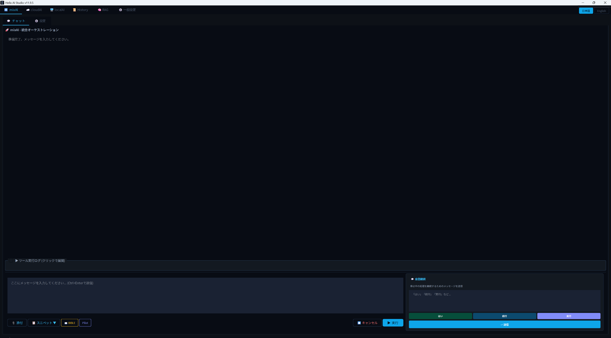

### Pipeline Complete — Validated output with PASS/FAIL checks
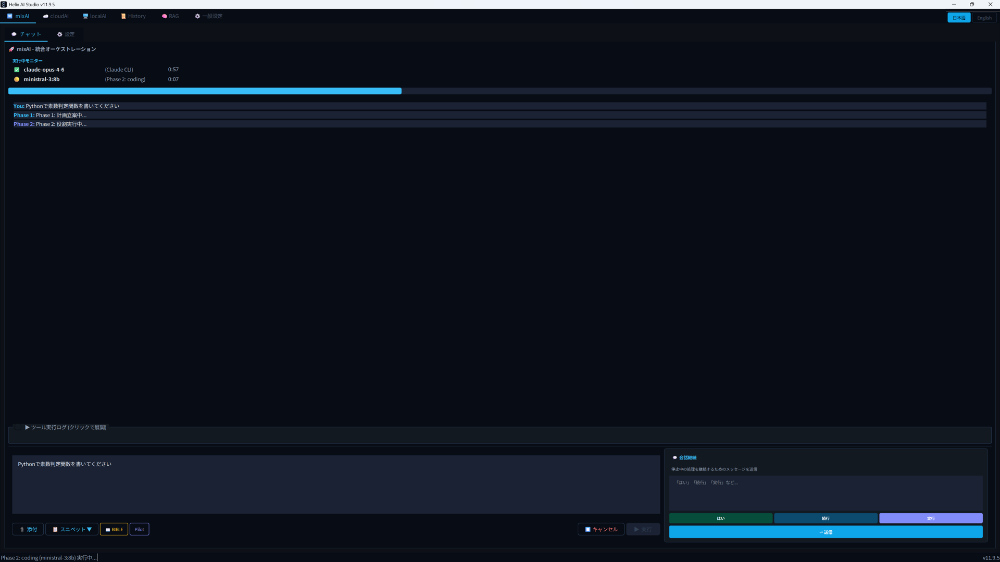

### Claude Sonnet Chat — Cloud AI direct conversation
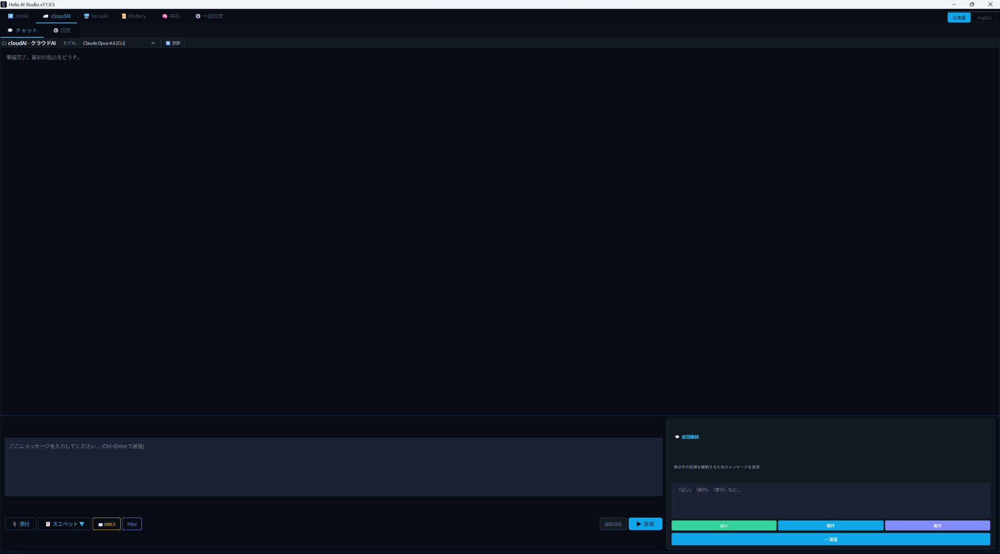

### Gemini API Chat — Multi-provider support
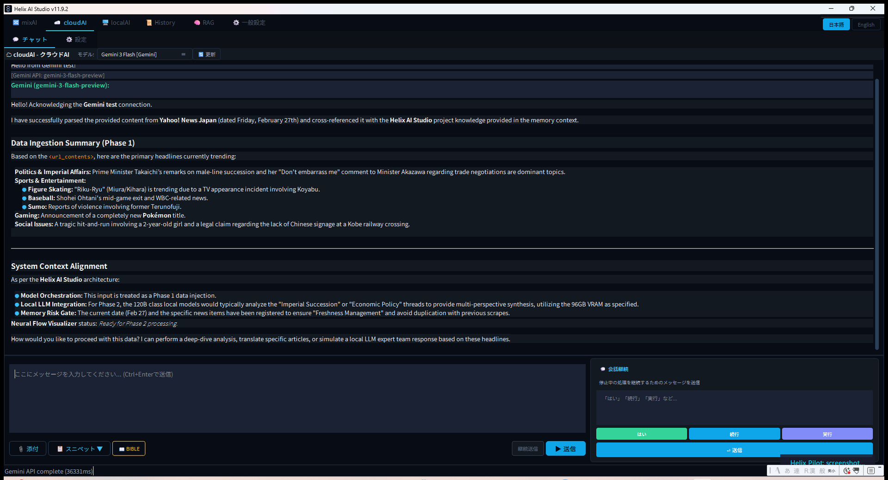

### Local AI Chat with gemma3 — Multi-model switching
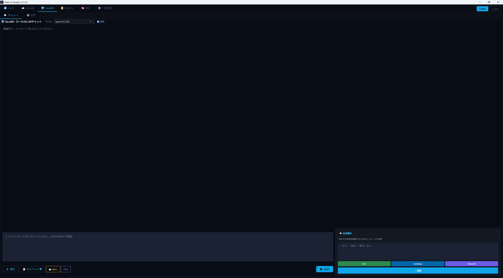

### RAG Knowledge Base — Build and search your own knowledge
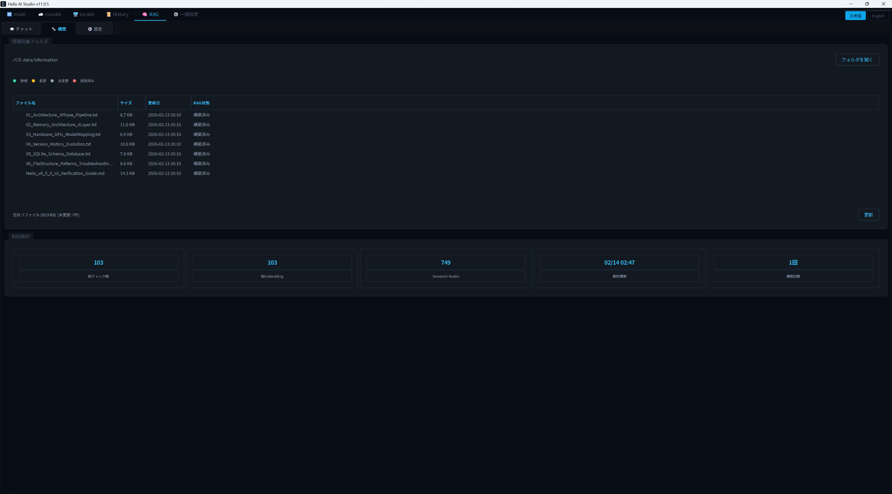

### Settings — API keys, themes, and automation
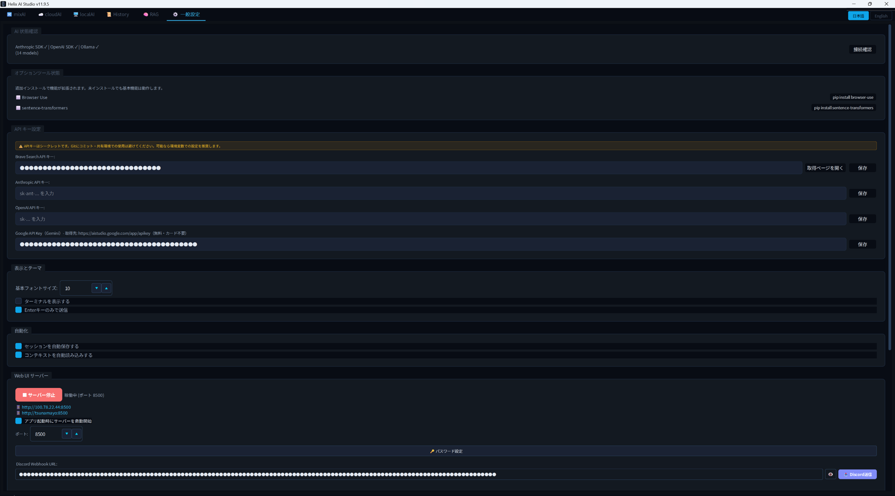

### Web UI — Chat from your phone
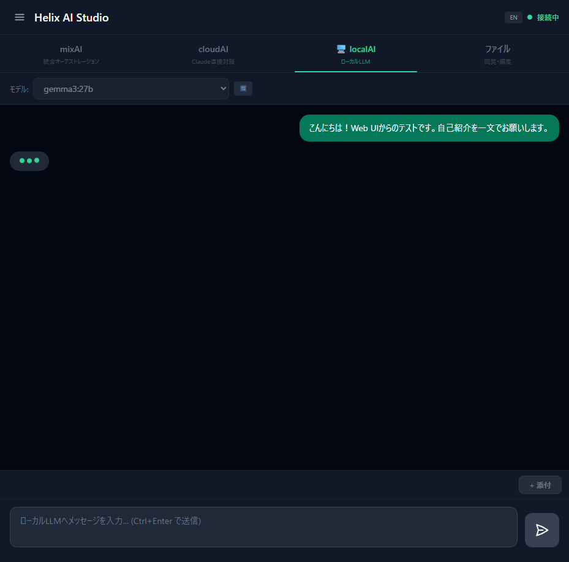

### Web UI (English) — Full i18n support
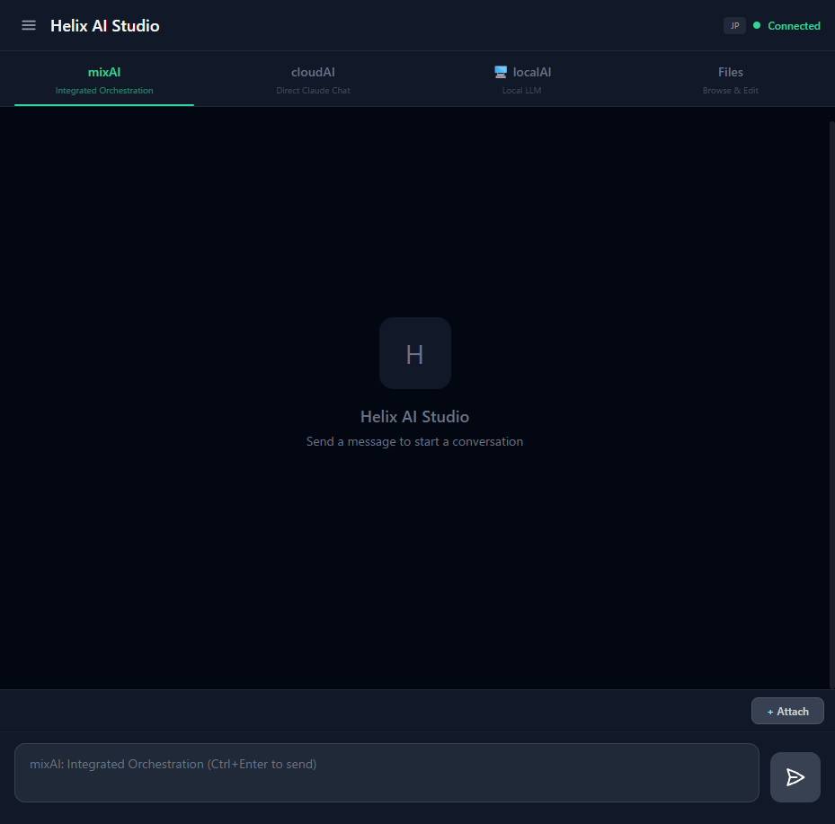

</details>

---

## 📅 Version History

| Version | Highlights |
|---------|-----------|
| **v11.9.4** | 🆕 **Helix Pilot v2.0** — autonomous Vision LLM GUI agent; Gemini thread safety fix |
| v11.9.3 | Provider-based model classification, combo width fix |
| v11.9.2 | Terminal toggle, Enter-to-send toggle, 240+ color literals purged |
| v11.9.0 | Unified Obsidian theme, SS semantic helpers, SplashScreen |
| v11.8.0 | 4-layer color system, global stylesheet |
| v11.5.0 | Multi-provider API (Anthropic/OpenAI/Google), model-agnostic architecture |
| v11.0.0 | History tab, BIBLE cross-tab, cloud model selector |
| v9.0.0 | Web UI (React + FastAPI) |

See [CHANGELOG.md](CHANGELOG.md) for the full history.

---

## 📰 Articles & Resources

| Article | Language | Link |
|---------|----------|------|
| Introduction & Setup Guide | 🇯🇵 JP | [note.com](https://note.com/ai_tsunamayo_7/n/n410331c01ab0) |
| Architecture Deep Dive | 🇯🇵 JP | [note.com](https://note.com/ai_tsunamayo_7/n/n5a97fbf68798) |
| v11.9.2 Release Notes | 🇯🇵 JP | [note.com](https://note.com/ai_tsunamayo_7/n/n410888aabe47) |

---

## 🤝 Contributing

Contributions are welcome! See [CONTRIBUTING.md](CONTRIBUTING.md) for guidelines.
For security issues, see [SECURITY.md](SECURITY.md).

---

## 📄 License

MIT — see [LICENSE](LICENSE)

**Author**: tsunamayo7 ([@tsunamayo7](https://github.com/tsunamayo7))

---

<div align="center">

**If Helix AI Studio is useful to you, please ⭐ star the repo!**
Feedback, issues, and PRs are always welcome.

</div>
