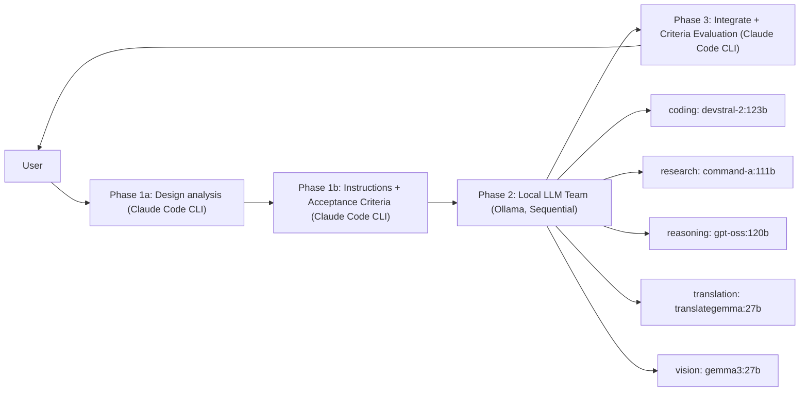

<!-- SPDX-FileCopyrightText: 2026 Helix AI Studio Contributors -->
<!-- SPDX-License-Identifier: MIT -->

# Helix AI Studio

**Claude-centric multi-model orchestration desktop app (Windows)**  
Claude Code CLI as the brain, local LLMs (Ollama) as specialized workers — unified in a Cyberpunk Minimal GUI.


> Japanese README: [README_ja.md](README_ja.md)

---

## What it does

Helix AI Studio runs a **3-Phase pipeline**:

1. **Phase 1 (Claude Code CLI)** — design analysis → structured instructions for each local model
2. **Phase 2 (Local LLM team via Ollama, sequential)** — specialized execution (coding / research / reasoning / translation / vision)
3. **Phase 3 (Claude Code CLI)** — integrate, validate with Acceptance Criteria (PASS/FAIL), produce final output

This approach improves answer quality by combining multiple viewpoints while staying practical for **VRAM-heavy 120B-class models** (run sequentially).

---

## Key Features (v8.4.2 "Contextual Intelligence")

### Orchestration
- **3-Phase Pipeline**: Claude plans → local team executes → Claude integrates & validates
- **Structured Phase 1**: design_analysis + acceptance_criteria + expected_output_format
- **Acceptance Criteria evaluation in Phase 3** (PASS/FAIL checklist)
- **Quality loop**: configurable Phase-2 retry cap (`max_phase2_retries`)
- **Neural Flow / phase progress visualization** (pipeline transparency)

### Local LLM Team (Ollama)
- **5 specialized categories**: coding / research / reasoning / translation / vision
- **SequentialExecutor** for large models (load → run → unload)
- **Resident models**: Control AI + Embedding model pinned to smaller GPU (optional)

### Memory & Knowledge (Adaptive / Living Memory)
- **4-layer memory**: Thread / Episodic / Semantic / Procedural
- **Memory Risk Gate**: resident LLM quality-checks memory candidates (ADD/UPDATE/DEPRECATE/SKIP)
- **RAPTOR multi-level summaries** (session → weekly) for scalable long-term context
- **Temporal KG edges** + **GraphRAG community summaries**
- **Defensive memory injection** (guard text to reduce prompt injection via stored memory)

### "BIBLE-first" Documentation System
- **BIBLE Manager**: auto-discover → parse → inject into Phase 1/3 → lifecycle management
- Completeness score & section count for your current BIBLE

### UX / Desktop App
- Cyberpunk Minimal UI with consistent styling and tooltips (self-documenting UI)
- File attach / clipboard import / spot actions / tool execution log
- **VRAM Budget Simulator**
- **GPU Monitor** with timeline + recording

### MCP (Model Context Protocol) Support
- MCP server management (e.g., filesystem / git / web search connectors)
- Use MCP carefully; third-party MCP servers can introduce prompt-injection risks.
  See official MCP docs for details.

---

## Demo

### mixAI — 3-Phase Pipeline (Claude → Local LLMs → Claude)


### soloAI — Direct Claude CLI


---

## Screenshots

| mixAI Chat | mixAI Settings | soloAI Chat | General Settings |
|---|---|---|---|
|  |  |  |  |

---

## Quick Start

### Prerequisites
- Windows 10/11
- Python 3.12+
- NVIDIA GPU (CUDA) recommended
- **Ollama** running locally (default API: `http://localhost:11434/api`)
- **Claude Code CLI** (Node.js 18+)

Official docs:
- Claude Code CLI overview: https://docs.claude.com/en/docs/claude-code/overview
- Ollama API intro: https://docs.ollama.com/api/introduction
- MCP docs: https://docs.anthropic.com/en/docs/mcp

### Installation

```bash
git clone https://github.com/tsunamayo7/helix-ai-studio.git
cd helix-ai-studio

pip install -r requirements.txt

# Install Claude Code CLI (Node.js 18+)
npm install -g @anthropic-ai/claude-code

# (Optional) Pull local models for Phase 2 via Ollama
ollama pull devstral-2:123b
ollama pull command-a:111b
ollama pull gpt-oss:120b
ollama pull translategemma:27b
ollama pull gemma3:27b

# Resident models (optional)
ollama pull ministral-3:8b
ollama pull qwen3-embedding:4b

# Run the app
python HelixAIStudio.py
````

### Build standalone executable (Windows)

```bash
pip install pyinstaller
pyinstaller HelixAIStudio.spec --noconfirm
# dist/HelixAIStudio/HelixAIStudio.exe
```

---

## Architecture



---

## Security & Privacy Notes

* Helix can run sensitive workflows with **local LLMs** (Ollama) for Phase 2.
* When enabling **MCP tools**, be careful with third-party servers. Treat them as untrusted unless you audit them.
* Prefer allowlists, confirmations, and scoped access for filesystem / git / network tools.

---

## Tech Stack

| Component        | Technology                                   |
| ---------------- | -------------------------------------------- |
| GUI              | PyQt6                                        |
| Claude           | Claude Code CLI (`claude`)                   |
| Local LLM        | Ollama API (`http://localhost:11434/api`)    |
| Memory/Knowledge | SQLite + vector embeddings + graph utilities |
| Build            | PyInstaller                                  |
| Design           | Cyberpunk Minimal                            |

---

## Project Structure (high-level)

```
src/
  backends/          # Claude/Ollama orchestration (mix orchestrator, sequential executor)
  tabs/              # mixAI / soloAI / settings
  widgets/           # Neural Flow, VRAM simulator, GPU monitor
  bible/             # BIBLE discovery/parser/panel
  memory/            # 4-layer memory, risk gate, RAPTOR/GraphRAG
  mcp/               # MCP integration / server management
  security/          # approvals / safety gates
  utils/             # constants, diagnostics
config/
  app_settings.json
```

---

## License

MIT (see LICENSE)

## Changelog

See [CHANGELOG.md](CHANGELOG.md) for detailed version history.

---

## Contributing

Contributions are welcome! Please read [CONTRIBUTING.md](CONTRIBUTING.md) before submitting PRs.

## Security

For security vulnerabilities, see [SECURITY.md](SECURITY.md).

---
