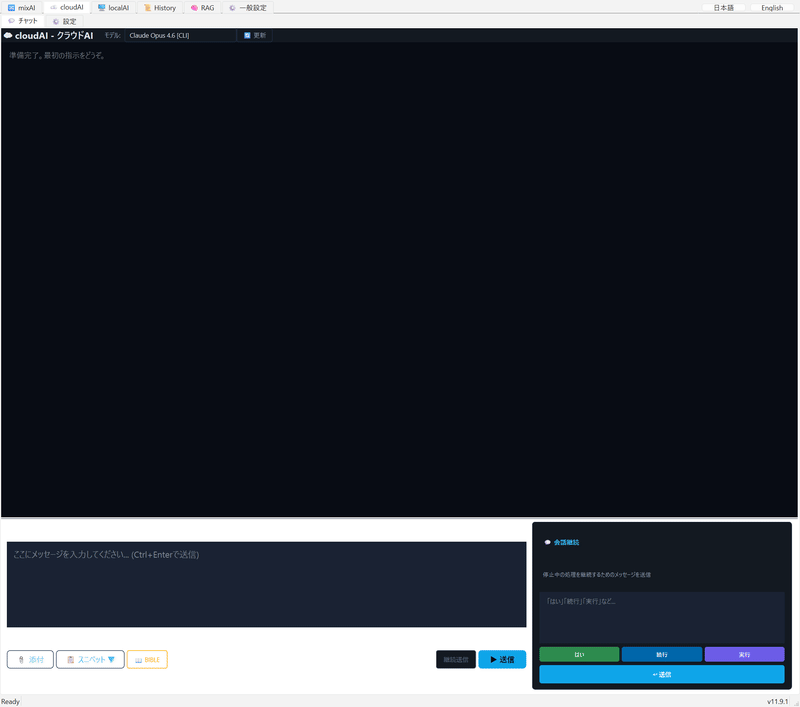
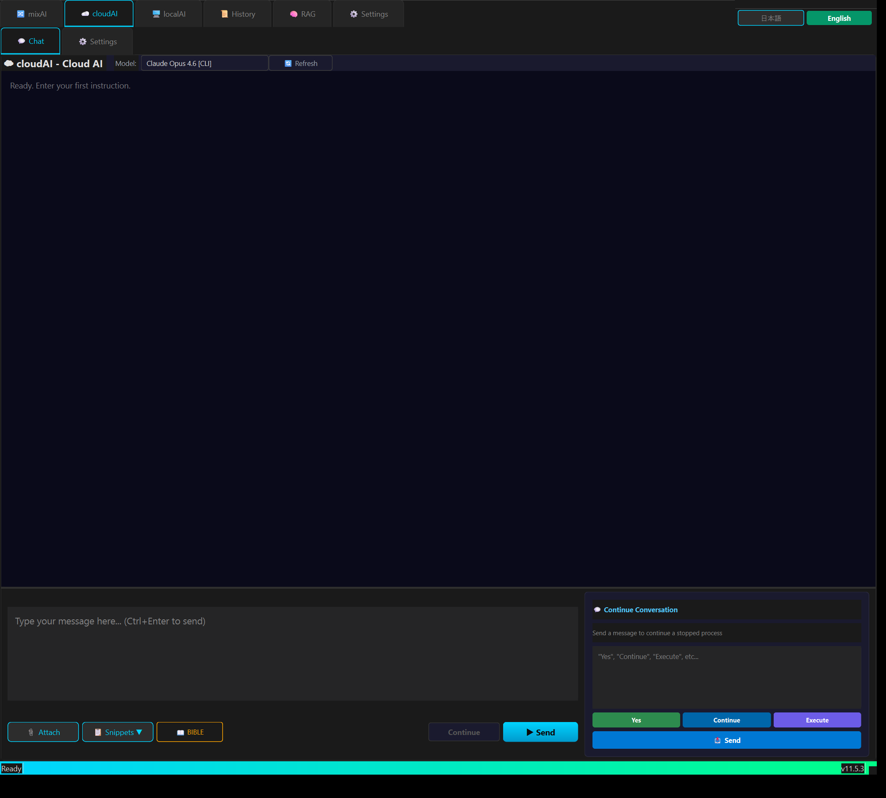
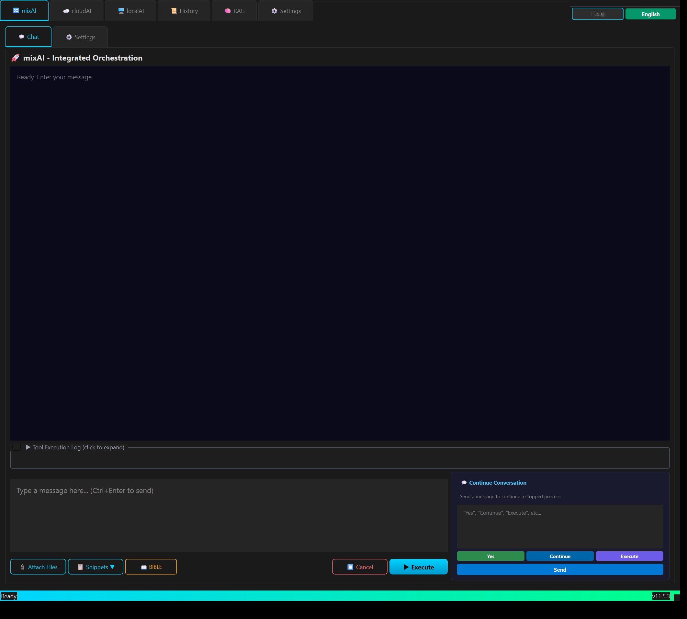
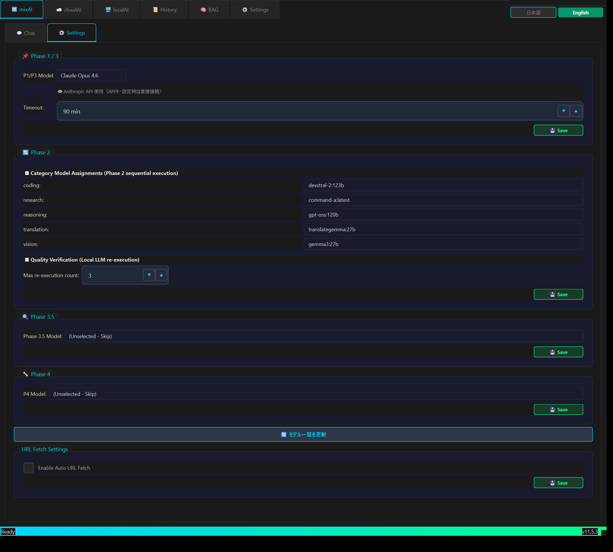
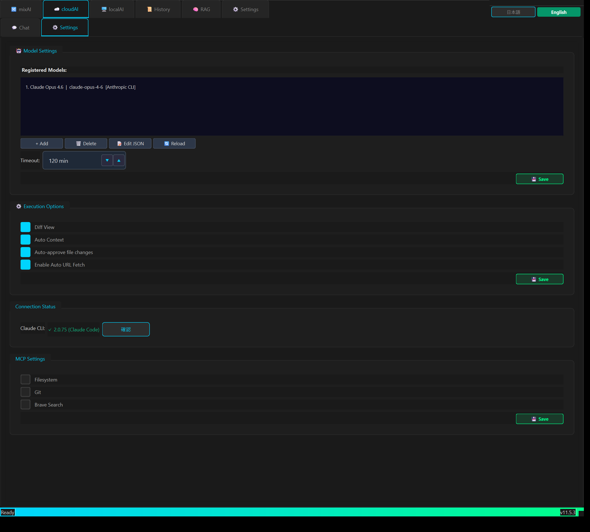
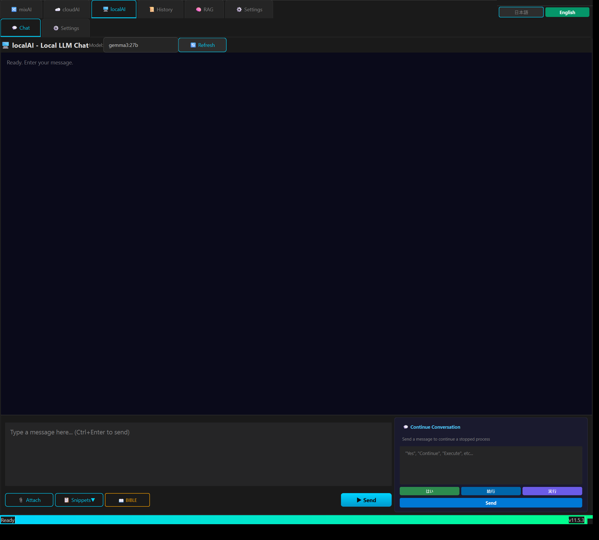
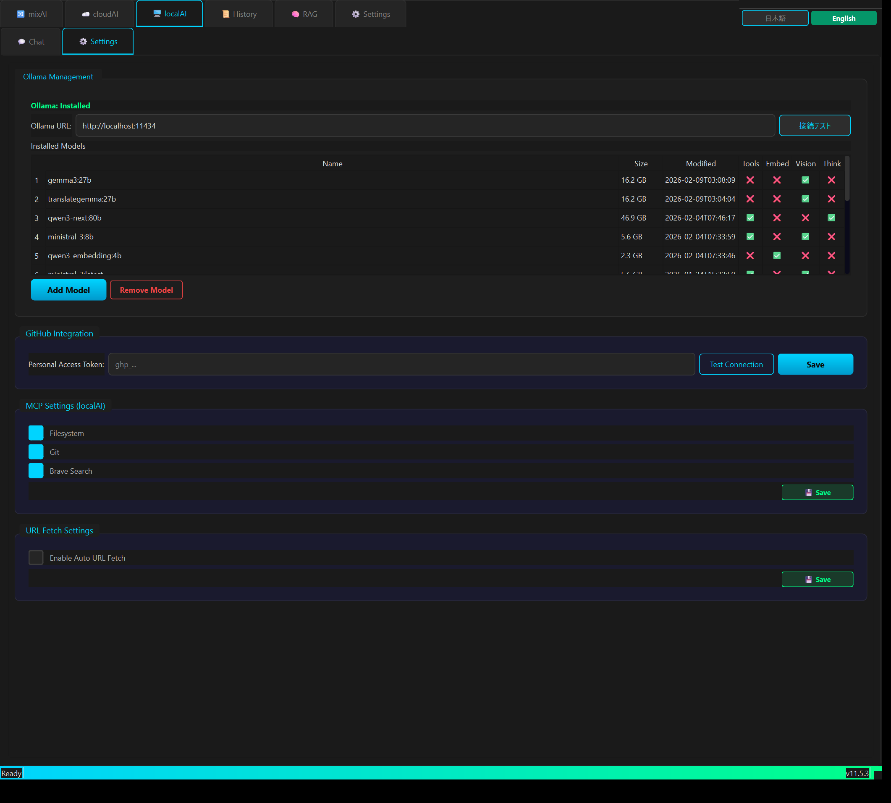
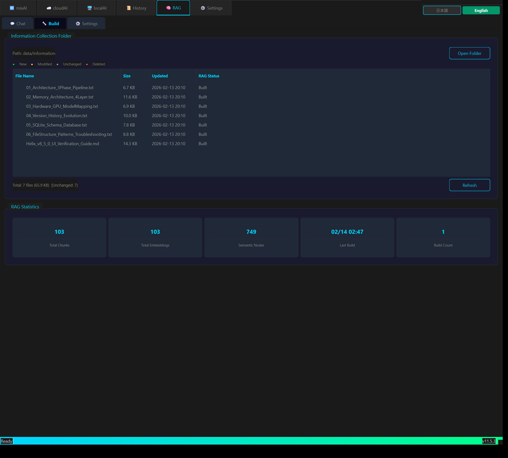
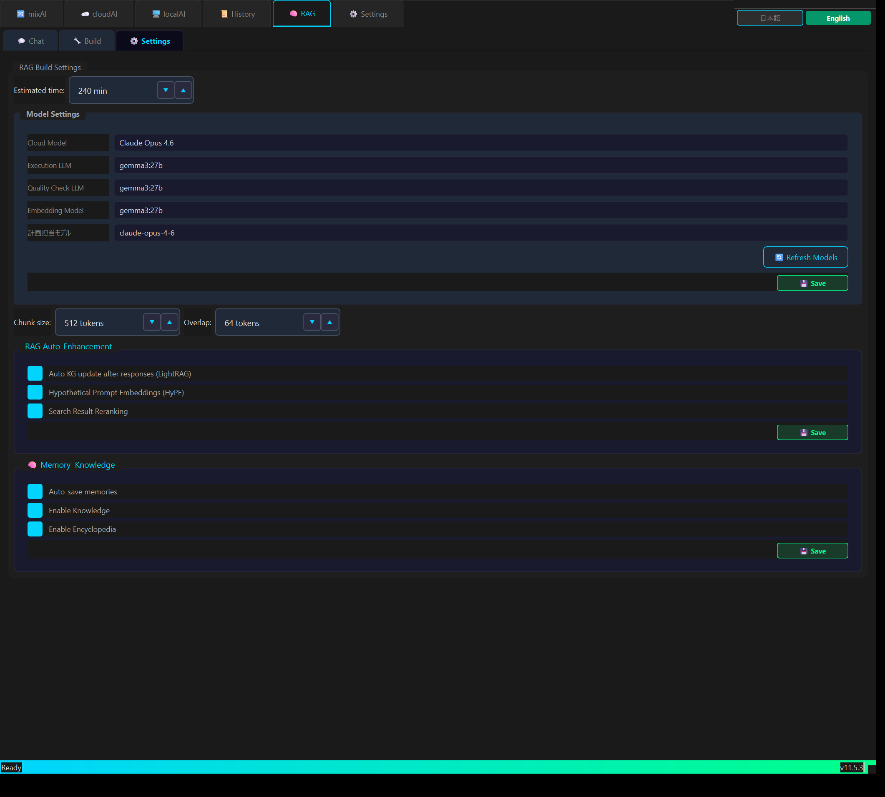
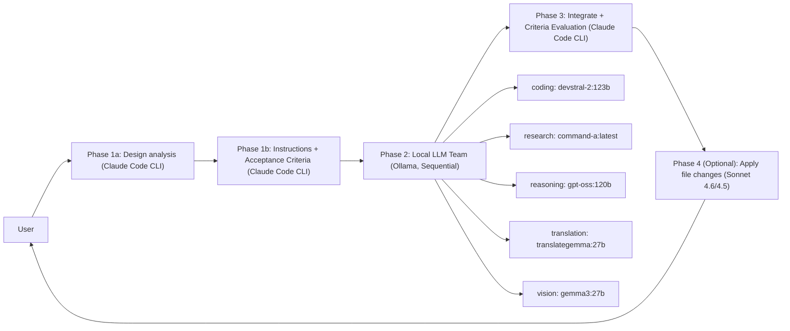

<!-- SPDX-FileCopyrightText: 2026 Helix AI Studio Contributors -->
<!-- SPDX-License-Identifier: MIT -->

# Helix AI Studio

**Claude-centric multi-model AI orchestration platform with dual interface (Desktop + Web)**
Claude Code CLI as the brain, local LLMs (Ollama) as specialized workers — unified in a Cyberpunk Minimal GUI with cross-device Web UI.

[](https://github.com/tsunamayo7/helix-ai-studio/stargazers)
[](https://opensource.org/licenses/MIT)
[](https://www.python.org/downloads/)
[](https://pypi.org/project/PyQt6/)
[](https://github.com/tsunamayo7/helix-ai-studio/releases)


> Japanese README: [README_ja.md](README_ja.md)

> **"AI plans, another AI executes, and yet another AI validates"**
> This pipeline runs in a code-free GUI desktop app.

**Why Helix AI Studio?**

| Problem | Helix's Solution |
|---------|-----------------|
| Switching browsers and copy-pasting between AIs is tedious | One app for Claude/GPT/Gemini/Ollama |
| Don't want to send sensitive data to the cloud | Local LLM (Ollama) mode — zero external transmission |
| Worried about local LLM quality | Claude auto-validates and integrates (3+1 Phase Pipeline) |
| Want to use it from my phone too | Built-in Web UI accessible from any device on the same network |
| English-only UI is hard to use | Full Japanese support (English toggle available) |

---

## What it does

Helix AI Studio runs a **3+1 Phase pipeline**:

1. **Phase 1 (Claude Code CLI)** — design analysis → structured instructions for each local model
2. **Phase 2 (Local LLM team via Ollama, sequential)** — specialized execution (coding / research / reasoning / translation / vision)
3. **Phase 3 (Claude Code CLI)** — integrate, validate with Acceptance Criteria (PASS/FAIL), produce final output
4. **Phase 4 (Optional)** — Sonnet 4.6/4.5 applies file changes from Phase 3 structured output

This approach improves answer quality by combining multiple viewpoints while staying practical for **VRAM-heavy 120B-class models** (run sequentially).

Access from **anywhere** via the built-in Web UI — chat from your phone, tablet, or any browser while the desktop GPU server does the heavy lifting.

---

## Why Helix?

| | Helix AI Studio | CLI Coding Agents¹ | Local LLM UIs² | Agent Frameworks³ |
|---|---|---|---|---|
| **Claude as orchestrator** | ✅ Plans + validates | ✅ Executes code tasks | ❌ | Configurable |
| **Local LLMs as workers** | ✅ Parallel verification | ❌ | ✅ Inference only | Configurable |
| **Desktop + Web dual UI** | ✅ Shared DB/config | ❌ | Partial | ❌ |
| **BIBLE-first context** | ✅ Auto-inject | ❌ | ❌ | ❌ |
| **Works out of the box** | ✅ App, no code | ❌ | ✅ | ❌ requires code |

¹ OpenCode, Aider, Cline — great for coding tasks, single-model focus
² OpenWebUI, AnythingLLM, LM Studio — great for local inference UI, no orchestration
³ CrewAI, LangGraph, AutoGen — powerful frameworks, but require you to write the agent logic

**Helix sits above these layers**: Claude plans and validates quality; local LLMs (Ollama) provide multi-perspective verification; the whole pipeline runs in a ready-to-use desktop + web app with no coding required.

> Research note: Multi-agent orchestration has shown [80–140× quality improvement](https://arxiv.org/abs/2511.15755) over single-agent approaches in controlled trials — the architecture Helix is built on.

---

## Key Features (v11.9.1 "Color Purge")

### Orchestration (mixAI)
- **3+1 Phase Pipeline**: Claude plans → local team executes → Claude integrates & validates → (optional) Sonnet applies changes
- **Phase 4 (Optional)**: Sonnet 4.6/4.5 applies file changes from Phase 3 structured output
- **Structured Phase 1**: design_analysis + acceptance_criteria + expected_output_format
- **Acceptance Criteria evaluation in Phase 3** (PASS/FAIL checklist)
- **Quality loop**: configurable Phase-2 retry cap (`max_phase2_retries`)
- **Phase 2 skip**: each local LLM category can be set to "none" to skip
- **Neural Flow / phase progress visualization** (pipeline transparency)
- **Switchable P1/P3 Engine**: Claude API, local LLM, or GPT-5.3-Codex for orchestration phases
- **Presets**: One-click "P1=Opus4.6 / P3=GPT-5.3-Codex" preset button

### Direct Claude Chat (soloAI)
- **Claude Code CLI** direct conversation mode
- **GPT-5.3-Codex (CLI)** as an optional model — routes to Codex CLI backend
- **Adaptive thinking (effort)** for Opus 4.6 — configurable reasoning intensity (low/medium/high)
- **Search/Browse mode**: None / Claude WebSearch / Browser Use selector
- Streaming responses via WebSocket
- File attachment and context injection

### Local LLM Team (Ollama)
- **5 specialized categories**: coding / research / reasoning / translation / vision (each category can be skipped)
- **SequentialExecutor** for large models (load → run → unload)
- **Resident models**: Control AI + Embedding model managed in General Settings (optional, GPU-aware)

### Dual Interface (Desktop + Web)
- **Desktop**: PyQt6 native app with full control over all settings
- **Web UI**: React SPA accessible from any device (phone, tablet, remote PC)
- **Cross-Device Sync**: Tailscale VPN-based secure access, execution lock, file transfer
- **Persistent Sessions**: Chat history preserved across sessions with context modes (single/session/full)
- **Desktop Chat History** (v9.7.0): QDockWidget side panel with search, tab filters, date grouping — shares the same SQLite DB with Web UI

### Memory & Knowledge (Adaptive / Living Memory)
- **4-layer memory**: Thread / Episodic / Semantic / Procedural
- **Memory Risk Gate**: resident LLM quality-checks memory candidates (ADD/UPDATE/DEPRECATE/SKIP)
- **RAPTOR multi-level summaries** (session → weekly) for scalable long-term context
- **Temporal KG edges** + **GraphRAG community summaries**
- **RAG pipeline**: document chunking, vector search, knowledge graph integration

### "BIBLE-first" Documentation System
- **BIBLE Manager**: auto-discover → parse → inject into Phase 1/3 → lifecycle management
- Completeness score & section count for your current BIBLE

### i18n (Internationalization)
- **Japanese (default) + English** UI switching
- Shared translation files (`i18n/ja.json`, `i18n/en.json`) used by both Desktop and Web
- Language preference synced between Desktop and Web via `general_settings.json`

### UX / Desktop App
- Cyberpunk Minimal UI with consistent styling and tooltips (self-documenting UI)
- File attach / clipboard import / spot actions / tool execution log
- **VRAM Budget Simulator**
- **GPU Monitor** with timeline + recording

### MCP (Model Context Protocol) Support
- MCP server management (e.g., filesystem / git / web search connectors)
- Use MCP carefully; third-party MCP servers can introduce prompt-injection risks.
  See official MCP docs for details.

---

## Demo

### App Overview


### mixAI — 3+1 Phase Pipeline (Claude → Local LLMs → Claude → Sonnet)


### cloudAI — Direct Claude Chat


---

## Screenshots

| mixAI Chat | mixAI Settings | cloudAI Chat | cloudAI Settings | localAI Chat |
|---|---|---|---|---|
|  |  |  |  |  |

| localAI Settings | History | RAG Chat | RAG Build | RAG Settings |
|---|---|---|---|---|
|  |  |  |  |  |

---

## Quick Start

### Prerequisites
- Windows 10/11
- Python 3.12+
- NVIDIA GPU (CUDA) recommended
- **Ollama** running locally (default API: `http://localhost:11434/api`)
- **Claude Code CLI** (Node.js 18+)

Official docs:
- Claude Code CLI overview: https://docs.claude.com/en/docs/claude-code/overview
- Ollama API intro: https://docs.ollama.com/api/introduction
- MCP docs: https://docs.anthropic.com/en/docs/mcp

### Installation

```bash
git clone https://github.com/tsunamayo7/helix-ai-studio.git
cd helix-ai-studio

# Interactive installer (recommended)
install.bat

# Or manual install:
pip install -r requirements.txt
python HelixAIStudio.py
```

> **First-time users**: See [SETUP_GUIDE.md](SETUP_GUIDE.md) for step-by-step instructions covering Python, Node.js, Ollama, API keys, and troubleshooting.

### API Direct Connection (v11.5.0+)

Claude / GPT / Gemini models can be used directly via API keys.
Get your keys from each provider and enter them in **Settings > API Key Setup**.

| Provider | Get API Key | SDK |
|---|---|---|
| Anthropic (Claude) | [console.anthropic.com](https://console.anthropic.com/settings/keys) | `pip install anthropic` |
| OpenAI (GPT / Codex) | [platform.openai.com](https://platform.openai.com/api-keys) | `pip install openai` |
| Google (Gemini) | [aistudio.google.com](https://aistudio.google.com/app/apikey) (free) | `pip install google-genai` |

> **Security**: API keys are stored in `config/general_settings.json` (git-ignored). Never commit this file. Environment variables (`ANTHROPIC_API_KEY`, `OPENAI_API_KEY`, `GEMINI_API_KEY`) are also supported.

### CLI Tools (optional)

```bash
# Claude Code CLI (required for CLI-mode and mixAI Phase 1/3)
npm install -g @anthropic-ai/claude-code

# Codex CLI (optional, for OpenAI CLI mode)
npm install -g @openai/codex
```

### Local LLMs via Ollama (optional)

```bash
# Install Ollama: https://ollama.com/download
# Pull models for Phase 2 (examples — any Ollama model works)
ollama pull qwen3:32b          # general purpose
ollama pull devstral:24b       # coding
```

### Web UI (pre-built, no setup required)

The Web UI frontend is pre-built and served automatically when the desktop app starts.
Access from any device on your network at `http://<your-ip>:8500`.

### Build standalone executable (Windows)

```bash
pip install pyinstaller
pyinstaller HelixAIStudio.spec --noconfirm
# dist/HelixAIStudio/HelixAIStudio.exe
```

---

## Architecture



### Dual Interface Architecture

```
Desktop (PyQt6)                Web UI (React + Vite)
     |                              |
     |    shared config/            | REST API + WebSocket
     |    general_settings.json     | (FastAPI)
     |         |                    |
     +-------- shared i18n ---------+
               i18n/ja.json
               i18n/en.json
```

---

## Security & Privacy Notes

### Design principles

* **Local-first for sensitive data** — Phase 2 runs entirely on your local LLMs (Ollama). Sensitive code or documents never leave your machine during the verification stage.
* **API keys stay local** — Keys are stored in `config/general_settings.json` (git-ignored) or environment variables. Helix never transmits your credentials to third parties.
* **Web UI is not public** — The built-in web server is designed for [Tailscale VPN](https://tailscale.com) access. Do not expose port 8500 to the public internet.
* **Memory injection guard** — Stored memories include a safety-gate prompt to prevent prompt-injection attacks from accumulated context.

### MCP (Model Context Protocol)

MCP servers extend what Helix can do — but third-party servers are **untrusted by default**.

* A [security flaw in Anthropic's official Git MCP server](https://www.techradar.com/pro/security/anthropics-official-git-mcp-servers-had-worrying-security-flaws) was disclosed and patched in 2025. The risk class exists.
* Use allowlists, minimal permissions, and human-approval gates for any MCP server that touches files, git, or the network.
* Prefer [official reference servers](https://github.com/modelcontextprotocol/servers) over community ones.

### Phase 4 (file changes)

Phase 4 applies file modifications automatically via Sonnet. **Always review** Phase 3 output before enabling Phase 4 in production workflows.

---

## Tech Stack

| Component        | Technology                                     |
| ---------------- | ---------------------------------------------- |
| Desktop GUI      | PyQt6                                          |
| Web UI           | React + Vite + Tailwind CSS                    |
| Web Server       | FastAPI + Uvicorn (WebSocket)                  |
| Cloud AI         | Anthropic API / OpenAI API / Google Gemini API |
| CLI Backends     | Claude Code CLI / Codex CLI                    |
| Local LLM        | Ollama API (`http://localhost:11434/api`)       |
| Memory/Knowledge | SQLite + vector embeddings + graph utilities   |
| i18n             | Shared JSON (ja/en) for Desktop + Web          |
| Build            | PyInstaller (Desktop) / Vite (Web)             |
| Design           | Cyberpunk Minimal                              |

---

## Project Structure (high-level)

```
Helix AI Studio/
├── frontend/              # Web UI (React + Vite)
│   └── src/
│       ├── components/    # React components (ChatView, InputBar, etc.)
│       ├── i18n/          # React i18n hook (reads from root i18n/)
│       └── main.jsx       # Entry point
├── i18n/                  # Shared translation files
│   ├── ja.json            # Japanese (default)
│   └── en.json            # English
├── src/
│   ├── backends/          # Claude/Ollama orchestration (mix orchestrator, sequential executor)
│   ├── tabs/              # mixAI / soloAI / settings (PyQt6)
│   ├── widgets/           # Neural Flow, VRAM simulator, GPU monitor
│   ├── web/               # FastAPI server, WebSocket handlers, auth
│   ├── bible/             # BIBLE discovery/parser/panel
│   ├── memory/            # 4-layer memory, risk gate, RAPTOR/GraphRAG
│   ├── rag/               # RAG builder, vector search
│   ├── mcp/               # MCP integration / server management
│   ├── security/          # approvals / safety gates
│   └── utils/             # constants, diagnostics, i18n
├── config/                # Settings files
├── BIBLE/                 # Project documentation (PROJECT_BIBLE)
├── HelixAIStudio.py       # Desktop app entry point
└── requirements.txt       # Python dependencies
```

---

## Version History

| Version | Codename | Highlights |
|---------|----------|------------|
| v11.9.1 | Color Purge | Remaining inline color literals fully eliminated (9 files, ~100 locations), COLORS/SS unified |
| v11.9.0 | Unified Obsidian | Per-tab stylesheet abolished, SS semantic helpers, SplashScreen, EXE icon fix |
| v11.8.0 | Polished Dark | Refined Obsidian 4-layer color system, GLOBAL_APP_STYLESHEET, thin EXE launcher |
| v11.7.0 | Resilient Core | Error handling hardening across 12 files, CLI→API fallback chains |
| v11.6.0 | Provider Aware | Phase 2 dynamic cloud model detection, Vision combo filtering |
| v11.5.4 | Model Summary + Language Fix | Model name in responses, English language fix for mixAI |
| v11.5.3 | Web LocalAI + Discord | Web LocalAI tab (Ollama WebSocket), Discord notifications, visual parity cloudAI/localAI |
| v11.5.2 | Visual Parity | Log rotation, path traversal fix, brute-force login protection, auto-cleanup, RAG 2-step |
| v11.5.1 | Provider Pure | Provider routing cleanup, README API docs, API key security UI |
| v11.5.0 | Model Agnostic | Multi-provider API (Anthropic/OpenAI/Google), API-first with CLI fallback, dynamic model catalog, Gemini support |
| v11.0.0 | Smart History | History tab with JSONL search, BIBLE cross-tab toggle, cloud model selector, 6-tab layout |
| v9.9.1 | Memory & Codex | HelixMemoryManager, Codex CLI soloAI, mixAI presets |
| v9.8.0 | GitHub Ready | Sonnet 4.6, Adaptive thinking (effort), Phase 4, resident model relocation, Phase 2 skip, context bar fix |
| v9.7.1 | Desktop Chat History | SpinBox UX fix, mixAI/soloAI header cleanup, model selector dedup, timeout i18n fix, NoScrollSpinBox for RAG, Ollama settings reorder |
| v9.7.0 | Desktop Chat History | Desktop chat history side panel, settings UI cleanup, Ollama settings consolidation |
| v9.6.0 | Global Ready | Web UI + Desktop UI English switching (shared i18n) / README.md |
| v9.5.0 | Cross-Device Sync | Web execution lock, mobile file attach, device transfer, post-logout chat view |
| v9.3.0 | Switchable Engine | P1/P3 engine switchable between Claude API and local LLM |
| v9.2.0 | Persistent Sessions | Chat history persistence, context modes (single/session/full) |
| v9.1.0 | Connected Knowledge | RAG pipeline, document chunking, file browser |
| v9.0.0 | Web UI | React Web UI, FastAPI backend, WebSocket streaming |
| v8.5.0 | Autonomous RAG | RAG builder, information collection tab, knowledge graph |
| v8.4.0 | Contextual Intelligence | 4-layer memory, RAPTOR summaries, mid-session context |

See [CHANGELOG.md](CHANGELOG.md) for detailed version history.

---

## Discord Notification Setup

1. Get a [Discord Webhook URL](https://support.discord.com/hc/en-us/articles/228383668)
2. Helix AI Studio → General Settings tab → Web UI Server section
3. Paste the Webhook URL and save
4. Select notification events (chat start / complete / error) via checkboxes

## Web UI Build (for developers)

`frontend/dist/` is not tracked by git. Run the following after cloning or making frontend changes:

```bash
cd frontend
npm install
npm run build
cd ..
```

The pre-built `dist/` is served automatically when the desktop app starts.

---

## Design Philosophy

1. **Claude as Orchestrator** — Claude Code CLI handles the hard parts (planning, integration, validation); local LLMs handle volume
2. **Sequential Execution** — Large models (100B+) run one at a time to fit in VRAM
3. **BIBLE-first** — Project documentation drives AI behavior, not ad-hoc prompts
4. **Dual Interface** — Desktop for power users, Web for mobile/remote access
5. **i18n with Fallback** — Shared translation files (ja.json/en.json); missing keys always fall back to Japanese

---

## Compliance & Data Handling

### Anthropic (Claude)

Helix calls the **official Claude Code CLI** (`claude` binary) or the **Anthropic API** directly — it does not spoof the Claude Code client or use OAuth tokens from consumer subscriptions in unauthorized ways.

> Since January 2026, Anthropic [actively blocks third-party tools that spoof the Claude Code harness](https://www.theregister.com/2026/02/20/anthropic_clarifies_ban_third_party_claude_access/). Helix is **not affected** — it invokes the CLI as documented, or uses API keys under Commercial Terms.

Key points:
* **For automation / high-volume use** → use an [Anthropic API key](https://console.anthropic.com/settings/keys) (Commercial Terms, no training on your data).
* **For personal / interactive use** → Claude Code CLI with your account login is fine.
* **Consumer accounts (Free/Pro/Max)** → by default, chats [may be used for model training](https://www.anthropic.com/news/usage-policy-update) since Sept 2025. Opt out in Privacy Settings, or switch to API key.
* All usage must comply with the [Anthropic Usage Policy](https://www.anthropic.com/legal/usage-policy).

### OpenAI (Codex CLI)

* Codex CLI supports both account login and API key auth — [authentication docs](https://developers.openai.com/codex/auth/).
* For automated workflows, [API key best practices](https://help.openai.com/en/articles/5112595-best-practices-for-api-key-safety) apply. Never share your key.
* Usage is governed by [OpenAI Terms of Use](https://openai.com/policies/row-terms-of-use/).

### Ollama & Local Models

* Ollama itself is [MIT licensed](https://github.com/ollama/ollama/blob/main/LICENSE).
* **Model licenses vary** — check each model's license in the [Ollama library](https://ollama.com/library) before commercial use. Llama-family models carry Meta's Community License; other models have their own terms.

### Summary

| Access path | Training risk | Best for |
|---|---|---|
| Anthropic API key (Commercial) | None | Automation, sensitive data |
| Claude Code CLI (Pro/Max login) | Opt-out recommended | Interactive personal use |
| Ollama (local) | None | Privacy-sensitive Phase 2 |

---

## Articles

| Article | Audience | Link |
|---------|----------|------|
| Introduction & Setup Guide | Beginners — usage, setup | [note](https://note.com/ai_tsunamayo_7/n/n410331c01ab0) |
| Architecture Deep Dive | Developers — design, pipeline | [note](https://note.com/ai_tsunamayo_7/n/n5a97fbf68798) |
| v11.9.1 Release Notes | Changelog | [note](https://note.com/ai_tsunamayo_7/n/n410888aabe47) |

## Star History

If Helix AI Studio is useful to you, please give it a star!
Feedback, Issues, and PRs are always welcome.

---

## License

MIT (see [LICENSE](LICENSE))

**Author**: tomlo ([@tsunamayo7](https://github.com/tsunamayo7))

## Changelog

See [CHANGELOG.md](CHANGELOG.md) for detailed version history.

---

## Contributing

Contributions are welcome! Please read [CONTRIBUTING.md](CONTRIBUTING.md) before submitting PRs.

## Security

For security vulnerabilities, see [SECURITY.md](SECURITY.md).

---
