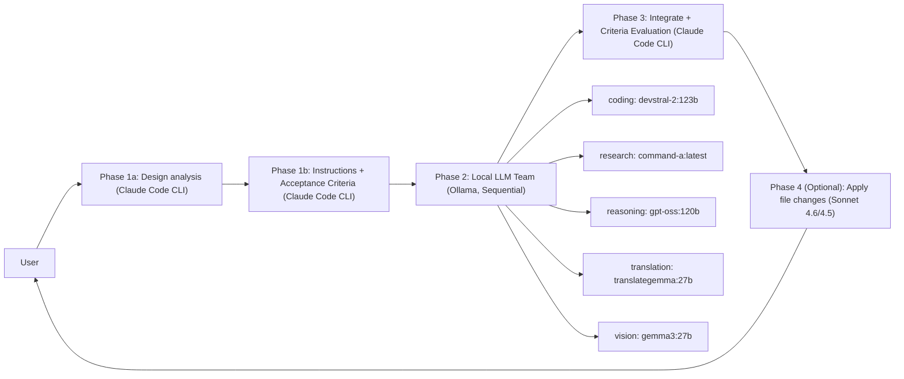

<!-- SPDX-FileCopyrightText: 2026 Helix AI Studio Contributors -->
<!-- SPDX-License-Identifier: MIT -->

# Helix AI Studio

**Claude-centric multi-model AI orchestration platform with dual interface (Desktop + Web)**
Claude Code CLI as the brain, local LLMs (Ollama) as specialized workers — unified in a Cyberpunk Minimal GUI with cross-device Web UI.


> Japanese README: [README_ja.md](README_ja.md)

---

## What it does

Helix AI Studio runs a **3+1 Phase pipeline**:

1. **Phase 1 (Claude Code CLI)** — design analysis → structured instructions for each local model
2. **Phase 2 (Local LLM team via Ollama, sequential)** — specialized execution (coding / research / reasoning / translation / vision)
3. **Phase 3 (Claude Code CLI)** — integrate, validate with Acceptance Criteria (PASS/FAIL), produce final output
4. **Phase 4 (Optional)** — Sonnet 4.6/4.5 applies file changes from Phase 3 structured output

This approach improves answer quality by combining multiple viewpoints while staying practical for **VRAM-heavy 120B-class models** (run sequentially).

Access from **anywhere** via the built-in Web UI — chat from your phone, tablet, or any browser while the desktop GPU server does the heavy lifting.

---

## Key Features (v9.9.1 "Memory & Codex")

### Orchestration (mixAI)
- **3+1 Phase Pipeline**: Claude plans → local team executes → Claude integrates & validates → (optional) Sonnet applies changes
- **Phase 4 (Optional)**: Sonnet 4.6/4.5 applies file changes from Phase 3 structured output
- **Structured Phase 1**: design_analysis + acceptance_criteria + expected_output_format
- **Acceptance Criteria evaluation in Phase 3** (PASS/FAIL checklist)
- **Quality loop**: configurable Phase-2 retry cap (`max_phase2_retries`)
- **Phase 2 skip**: each local LLM category can be set to "none" to skip
- **Neural Flow / phase progress visualization** (pipeline transparency)
- **Switchable P1/P3 Engine**: Claude API, local LLM, or GPT-5.3-Codex for orchestration phases
- **Presets**: One-click "P1=Opus4.6 / P3=GPT-5.3-Codex" preset button

### Direct Claude Chat (soloAI)
- **Claude Code CLI** direct conversation mode
- **GPT-5.3-Codex (CLI)** as an optional model — routes to Codex CLI backend
- **Adaptive thinking (effort)** for Opus 4.6 — configurable reasoning intensity (low/medium/high)
- **Search/Browse mode**: None / Claude WebSearch / Browser Use selector
- Streaming responses via WebSocket
- File attachment and context injection

### Local LLM Team (Ollama)
- **5 specialized categories**: coding / research / reasoning / translation / vision (each category can be skipped)
- **SequentialExecutor** for large models (load → run → unload)
- **Resident models**: Control AI + Embedding model managed in General Settings (optional, GPU-aware)

### Dual Interface (Desktop + Web)
- **Desktop**: PyQt6 native app with full control over all settings
- **Web UI**: React SPA accessible from any device (phone, tablet, remote PC)
- **Cross-Device Sync**: Tailscale VPN-based secure access, execution lock, file transfer
- **Persistent Sessions**: Chat history preserved across sessions with context modes (single/session/full)
- **Desktop Chat History** (v9.7.0): QDockWidget side panel with search, tab filters, date grouping — shares the same SQLite DB with Web UI

### Memory & Knowledge (Adaptive / Living Memory)
- **4-layer memory**: Thread / Episodic / Semantic / Procedural
- **Memory Risk Gate**: resident LLM quality-checks memory candidates (ADD/UPDATE/DEPRECATE/SKIP)
- **RAPTOR multi-level summaries** (session → weekly) for scalable long-term context
- **Temporal KG edges** + **GraphRAG community summaries**
- **RAG pipeline**: document chunking, vector search, knowledge graph integration

### "BIBLE-first" Documentation System
- **BIBLE Manager**: auto-discover → parse → inject into Phase 1/3 → lifecycle management
- Completeness score & section count for your current BIBLE

### i18n (Internationalization)
- **Japanese (default) + English** UI switching
- Shared translation files (`i18n/ja.json`, `i18n/en.json`) used by both Desktop and Web
- Language preference synced between Desktop and Web via `general_settings.json`

### UX / Desktop App
- Cyberpunk Minimal UI with consistent styling and tooltips (self-documenting UI)
- File attach / clipboard import / spot actions / tool execution log
- **VRAM Budget Simulator**
- **GPU Monitor** with timeline + recording

### MCP (Model Context Protocol) Support
- MCP server management (e.g., filesystem / git / web search connectors)
- Use MCP carefully; third-party MCP servers can introduce prompt-injection risks.
  See official MCP docs for details.

---

## Demo

### mixAI — 3+1 Phase Pipeline (Claude → Local LLMs → Claude → Sonnet)


### soloAI — Direct Claude CLI


---

## Screenshots

| mixAI Chat | mixAI Settings | soloAI Chat | General Settings |
|---|---|---|---|
|  |  |  |  |

---

## Quick Start

### Prerequisites
- Windows 10/11
- Python 3.12+
- NVIDIA GPU (CUDA) recommended
- **Ollama** running locally (default API: `http://localhost:11434/api`)
- **Claude Code CLI** (Node.js 18+)

Official docs:
- Claude Code CLI overview: https://docs.claude.com/en/docs/claude-code/overview
- Ollama API intro: https://docs.ollama.com/api/introduction
- MCP docs: https://docs.anthropic.com/en/docs/mcp

### Installation

```bash
git clone https://github.com/tsunamayo7/helix-ai-studio.git
cd helix-ai-studio

pip install -r requirements.txt

# Install Claude Code CLI (Node.js 18+)
npm install -g @anthropic-ai/claude-code

# (Optional) Pull local models for Phase 2 via Ollama
ollama pull devstral-2:123b
ollama pull command-a:latest
ollama pull gpt-oss:120b
ollama pull translategemma:27b
ollama pull gemma3:27b

# Resident models (optional)
ollama pull ministral-3:8b
ollama pull qwen3-embedding:4b

# Run the app
python HelixAIStudio.py
```

### Web UI Setup (optional)

```bash
# Build the Web UI frontend
cd frontend
npm install
npm run build
cd ..

# The Web UI is served automatically when the desktop app starts
# Access from any device on your network via Tailscale VPN
```

### Build standalone executable (Windows)

```bash
pip install pyinstaller
pyinstaller HelixAIStudio.spec --noconfirm
# dist/HelixAIStudio/HelixAIStudio.exe
```

---

## Architecture



### Dual Interface Architecture

```
Desktop (PyQt6)                Web UI (React + Vite)
     |                              |
     |    shared config/            | REST API + WebSocket
     |    general_settings.json     | (FastAPI)
     |         |                    |
     +-------- shared i18n ---------+
               i18n/ja.json
               i18n/en.json
```

---

## Security & Privacy Notes

* Helix can run sensitive workflows with **local LLMs** (Ollama) for Phase 2.
* Web UI access is secured by **PIN authentication + JWT** and designed for **Tailscale VPN** networks.
* When enabling **MCP tools**, be careful with third-party servers. Treat them as untrusted unless you audit them.
* Prefer allowlists, confirmations, and scoped access for filesystem / git / network tools.

---

## Tech Stack

| Component        | Technology                                     |
| ---------------- | ---------------------------------------------- |
| Desktop GUI      | PyQt6                                          |
| Web UI           | React + Vite + Tailwind CSS                    |
| Web Server       | FastAPI + Uvicorn (WebSocket)                  |
| Claude           | Claude Code CLI (`claude`)                     |
| Local LLM        | Ollama API (`http://localhost:11434/api`)       |
| Memory/Knowledge | SQLite + vector embeddings + graph utilities   |
| i18n             | Shared JSON (ja/en) for Desktop + Web          |
| Build            | PyInstaller (Desktop) / Vite (Web)             |
| Design           | Cyberpunk Minimal                              |

---

## Project Structure (high-level)

```
Helix AI Studio/
├── frontend/              # Web UI (React + Vite)
│   └── src/
│       ├── components/    # React components (ChatView, InputBar, etc.)
│       ├── i18n/          # React i18n hook (reads from root i18n/)
│       └── main.jsx       # Entry point
├── i18n/                  # Shared translation files
│   ├── ja.json            # Japanese (default)
│   └── en.json            # English
├── src/
│   ├── backends/          # Claude/Ollama orchestration (mix orchestrator, sequential executor)
│   ├── tabs/              # mixAI / soloAI / settings (PyQt6)
│   ├── widgets/           # Neural Flow, VRAM simulator, GPU monitor
│   ├── web/               # FastAPI server, WebSocket handlers, auth
│   ├── bible/             # BIBLE discovery/parser/panel
│   ├── memory/            # 4-layer memory, risk gate, RAPTOR/GraphRAG
│   ├── rag/               # RAG builder, vector search
│   ├── mcp/               # MCP integration / server management
│   ├── security/          # approvals / safety gates
│   └── utils/             # constants, diagnostics, i18n
├── config/                # Settings files
├── BIBLE/                 # Project documentation (PROJECT_BIBLE)
├── HelixAIStudio.py       # Desktop app entry point
└── requirements.txt       # Python dependencies
```

---

## Version History

| Version | Codename | Highlights |
|---------|----------|------------|
| v9.9.1 | Memory & Codex | HelixMemoryManager強化(private除外/段階注入/ビューア), Codex CLI soloAI対応, mixAI Opus4.6/Codexプリセット, 検索選択式, 設定保存修正, 差分ダイアログ修正, スクロール誤操作防止, 保存UIボタン統一 |
| v9.8.0 | GitHub Ready | Sonnet 4.6, Adaptive thinking (effort), Phase 4, resident model relocation, Phase 2 skip, context bar fix |
| v9.7.1 | Desktop Chat History | SpinBox UX fix, mixAI/soloAI header cleanup, model selector dedup, timeout i18n fix, NoScrollSpinBox for RAG, Ollama settings reorder |
| v9.7.0 | Desktop Chat History | Desktop chat history side panel, settings UI cleanup, Ollama settings consolidation |
| v9.6.0 | Global Ready | Web UI + Desktop UI English switching (shared i18n) / README.md |
| v9.5.0 | Cross-Device Sync | Web execution lock, mobile file attach, device transfer, post-logout chat view |
| v9.3.0 | Switchable Engine | P1/P3 engine switchable between Claude API and local LLM |
| v9.2.0 | Persistent Sessions | Chat history persistence, context modes (single/session/full) |
| v9.1.0 | Connected Knowledge | RAG pipeline, document chunking, file browser |
| v9.0.0 | Web UI | React Web UI, FastAPI backend, WebSocket streaming |
| v8.5.0 | Autonomous RAG | RAG builder, information collection tab, knowledge graph |
| v8.4.0 | Contextual Intelligence | 4-layer memory, RAPTOR summaries, mid-session context |

See [CHANGELOG.md](CHANGELOG.md) for detailed version history.

---

## Design Philosophy

1. **Claude as Orchestrator** — Claude Code CLI handles the hard parts (planning, integration, validation); local LLMs handle volume
2. **Sequential Execution** — Large models (100B+) run one at a time to fit in VRAM
3. **BIBLE-first** — Project documentation drives AI behavior, not ad-hoc prompts
4. **Dual Interface** — Desktop for power users, Web for mobile/remote access
5. **i18n with Fallback** — Shared translation files (ja.json/en.json); missing keys always fall back to Japanese

---

## License

MIT (see [LICENSE](LICENSE))

**Author**: tomlo ([@tsunamayo7](https://github.com/tsunamayo7))

## Changelog

See [CHANGELOG.md](CHANGELOG.md) for detailed version history.

---

## Contributing

Contributions are welcome! Please read [CONTRIBUTING.md](CONTRIBUTING.md) before submitting PRs.

## Security

For security vulnerabilities, see [SECURITY.md](SECURITY.md).

---
