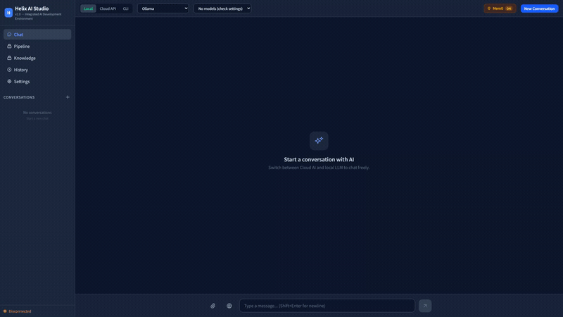
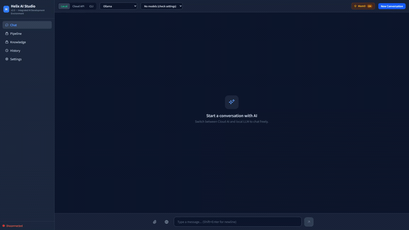
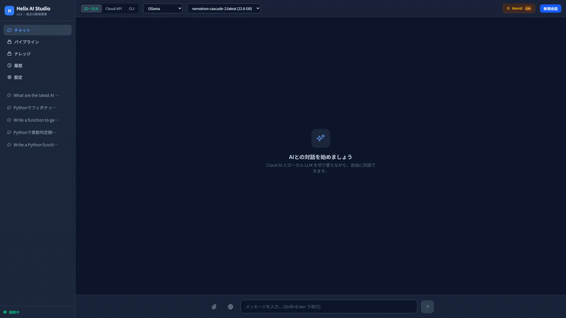
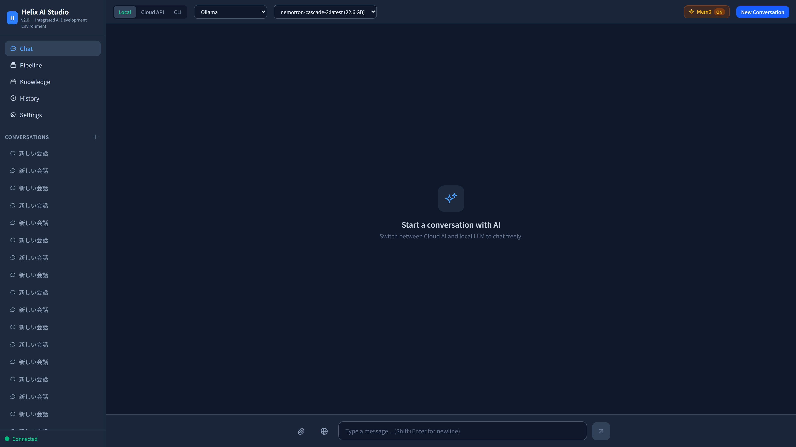
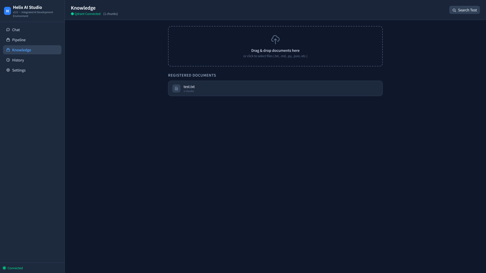
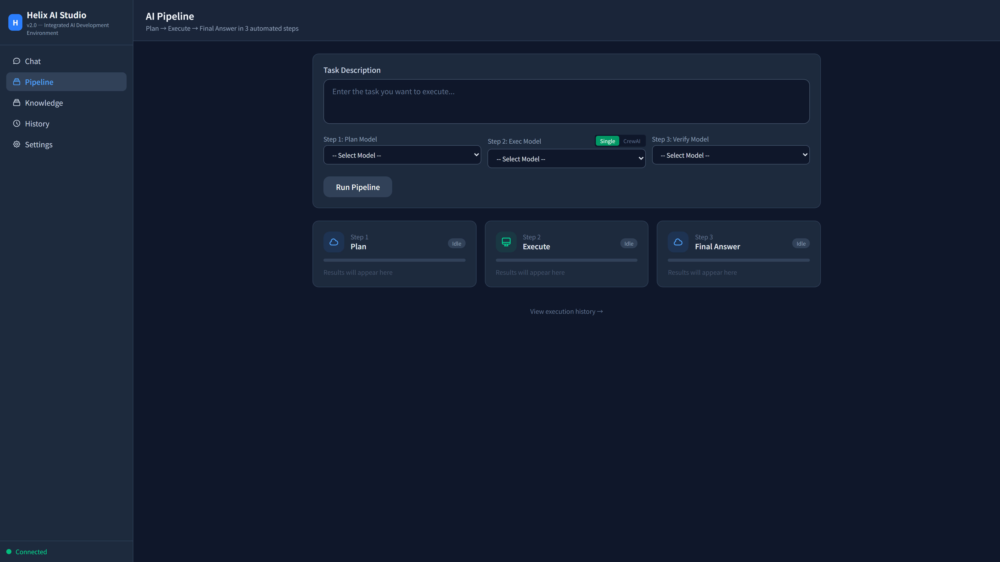
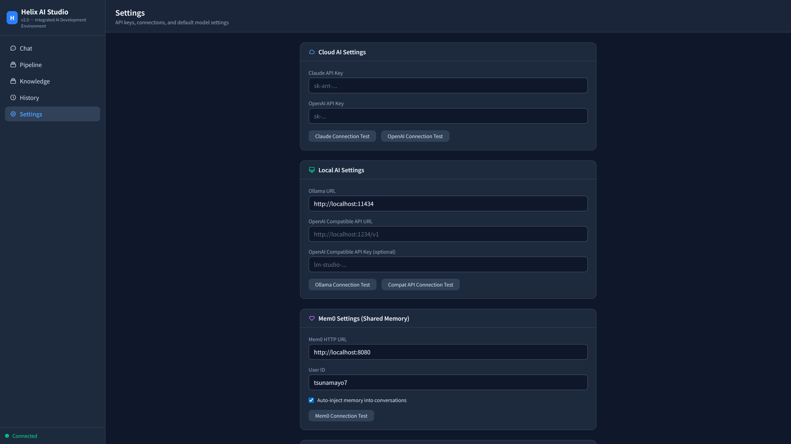

# Helix AI Studio

All-in-one AI chat studio — 7 providers, RAG knowledge base, MCP tool integration, Mem0 shared memory, CrewAI multi-agent, and 3-step pipeline in a single lightweight web app.

[](https://www.python.org/)
[](https://opensource.org/licenses/MIT)
[](https://docs.docker.com/)
[](https://ollama.com/)
[](https://github.com/tsunamayo7/helix-ai-studio)

> **[日本語版 README はこちら (README.ja.md)](README.ja.md)**

---

## Demo

### Chat — Streaming Response



Real-time WebSocket streaming with Ollama. Type a prompt, hit send, and watch the response stream in with syntax-highlighted code blocks.

### Provider & Model Switching



Switch between Local (Ollama), Cloud API (Claude/OpenAI), and CLI (Claude Code/Codex/Gemini) with one click. Models auto-load per provider.

### App Tour — All Features



Chat → Pipeline → Knowledge Base → Settings — everything in a single lightweight web app.

### Screenshots

| Chat UI | RAG Knowledge Base | Pipeline | Settings |
| :---: | :---: | :---: | :---: |
|  |  |  |  |
| Dark theme, sidebar, history | Drag & drop, Qdrant search | Plan → Execute → Verify | Cloud/Local/Mem0/MCP config |

---

## Why Helix AI Studio?

- **7 providers in one UI** — Ollama, Claude, OpenAI, vLLM/llama.cpp, Claude Code CLI, Codex CLI, Gemini CLI. Switch with one click.
- **100% local-capable** — Run entirely on your machine with Ollama + Qdrant. No cloud API required.
- **No vendor lock-in** — Bring your own models, swap providers anytime, keep your data on your hardware.
- **RAG + Mem0 + MCP in a single app** — Knowledge base, persistent shared memory, and external tool integration — all built in, no plugins needed.

---

## Features

### 7 AI Providers

| Provider | Method | Model Detection | Streaming |
| --- | --- | :---: | :---: |
| **Ollama** | HTTP API (localhost:11434) | Auto | Yes |
| **Claude API** | Anthropic SDK | Auto (key validation) | Yes |
| **OpenAI API** | OpenAI SDK | Auto (`models.list()`) | Yes |
| **OpenAI-Compatible** | HTTP API (vLLM, llama.cpp, LM Studio) | Auto (`/v1/models`) | Yes |
| **Claude Code CLI** | `claude -p` | Auto-detect installed | Pseudo |
| **Codex CLI** | `codex exec` | Auto-detect installed | Pseudo |
| **Gemini CLI** | `gemini -p` | Auto-detect installed | Pseudo |

CLI tools are automatically detected — if not installed, they are hidden from the UI.

### RAG Knowledge Base (NEW)

- **Drag & drop** document upload (.txt, .md, .py, .json, and 25+ formats)
- **Qdrant** vector database for semantic search
- **Ollama embedding** (qwen3-embedding:8b) — runs locally, no API cost
- **Auto-inject** relevant knowledge chunks into chat context
- **Search test UI** — verify RAG retrieval before chatting
- Separate from Mem0 (uses `helix_rag` collection)

### MCP Tool Integration (NEW)

- **Model Context Protocol** client for connecting external tools
- **stdio transport** — compatible with any MCP server
- Server start/stop management via API
- Tool discovery and execution
- Configurable in Settings

### Chat

- WebSocket streaming with real-time response
- Provider and model switching with one click
- Model info badge on every response
- Conversation history auto-save and restore
- `@search`, `@file`, `@ls` chat commands
- **Auto-inject** Mem0 memories + RAG knowledge into context

### Mem0 Shared Memory

- Search and add memories via Mem0 HTTP API
- Auto-inject relevant memories into chat context
- Qdrant direct search fallback
- Shared across all AI tools (Claude Code, Codex, Open WebUI)

### Pipeline

3-step automated pipeline:

```
Step 1: Plan (Cloud/CLI/Local) — Analyze task and generate plan
Step 2: Execute (Local/CrewAI) — Execute the plan
Step 3: Verify (Cloud/CLI/Local) — Verify results and evaluate quality
```

### CrewAI Multi-Agent

- Ollama-only, VRAM-managed multi-agent execution
- 3 preset teams: dev_team, research_team, writing_team
- Per-role model selection and VRAM estimation

### UI

- Dark theme with responsive design
- **Japanese / English** language switching
- Markdown rendering with syntax highlight and code copy
- Mobile accessible via Tailscale

---

## Quick Start

### Option 0: One-Click Deploy (Free)

[](https://render.com/deploy?repo=https://github.com/tsunamayo7/helix-ai-studio)

Deploy to Render's free tier in one click. Uses Cloud API providers (Claude/OpenAI) — enter your API keys in Settings after deploy.

### Option 1: Local Install

```bash
git clone https://github.com/tsunamayo7/helix-ai-studio.git
cd helix-ai-studio
uv sync
uv run python run.py
```

Open http://localhost:8504 in your browser.

### Option 2: Docker Compose

```bash
git clone https://github.com/tsunamayo7/helix-ai-studio.git
cd helix-ai-studio
docker compose up -d
```

This starts Helix AI Studio + Ollama + Qdrant + Mem0.

> **Note**: Local install uses port **8504**, Docker Compose uses port **8502**.

---

## Setup

### 1. Ollama (Required)

```bash
ollama pull gemma3:27b
ollama pull qwen3-embedding:8b  # For RAG & Mem0
```

### 2. Qdrant (Required for RAG)

```bash
docker run -d -p 6333:6333 qdrant/qdrant:latest
```

Or use the included `docker-compose.yml`.

### 3. Cloud AI (Optional)

Open Settings and enter API keys:

- **Claude**: [Anthropic Console](https://console.anthropic.com/)
- **OpenAI**: [OpenAI Platform](https://platform.openai.com/)

### 4. CLI Agents (Optional)

```bash
npm install -g @anthropic-ai/claude-code  # Claude Code
npm install -g @openai/codex               # Codex CLI
npm install -g @google/gemini-cli          # Gemini CLI
```

### 5. Mem0 Shared Memory (Optional)

Configure Mem0 HTTP URL in Settings (default: http://localhost:8080).

---

## Architecture

```
Browser (http://localhost:8504)
    |
    |-- WebSocket --- streaming chat
    |-- REST API ---- settings, history, models, memory, rag, mcp, pipeline
    |
Helix AI Studio (FastAPI + Jinja2 + Tailwind CSS + Alpine.js)
    |
    |-- Cloud AI ---------> Claude API / OpenAI API
    |-- Local AI ---------> Ollama / OpenAI-Compatible (vLLM, llama.cpp)
    |-- CLI Agents -------> Claude Code / Codex / Gemini CLI
    |-- RAG --------------> Qdrant + Ollama Embedding (helix_rag collection)
    |-- Memory -----------> Mem0 HTTP -> Qdrant + Ollama Embedding (mem0_shared)
    |-- MCP --------------> stdio transport -> Any MCP server
    |-- CrewAI -----------> Multi-agent (Ollama-only, VRAM-managed)
    |-- Web Search -------> DuckDuckGo (free)
    |-- File Operations --> Local filesystem (path traversal protected)
    |-- Pipeline ---------> Plan -> Execute -> Verify
```

### Tech Stack

| Layer | Technology |
| --- | --- |
| Backend | Python 3.12, FastAPI, aiosqlite, httpx |
| Frontend | Jinja2, Tailwind CSS (CDN), Alpine.js (CDN) |
| Database | SQLite (app data), Qdrant (vectors) |
| AI | anthropic SDK, openai SDK, Ollama HTTP API |
| RAG | Qdrant vector search, Ollama embedding |
| Memory | Mem0 HTTP API, Qdrant direct search fallback |
| MCP | JSON-RPC over stdio (no mcp SDK dependency) |
| Search | DuckDuckGo (free, no API key) |

---

## Pages

| Path | Description |
| --- | --- |
| `/` | Chat |
| `/knowledge` | RAG Knowledge Base |
| `/pipeline` | Pipeline |
| `/history` | Conversation History |
| `/settings` | Settings |

---

## API Endpoints

### Chat

| Method | Path | Description |
| --- | --- | --- |
| WebSocket | `/ws/chat` | Streaming chat |
| POST | `/api/chat` | Non-streaming chat |
| POST/GET | `/api/conversations` | Create / List conversations |
| GET/DELETE | `/api/conversations/{id}` | Get / Delete conversation |

### RAG (NEW)

| Method | Path | Description |
| --- | --- | --- |
| GET | `/api/rag/status` | RAG service status |
| GET | `/api/rag/documents` | List uploaded documents |
| POST | `/api/rag/upload` | Upload document (multipart) |
| POST | `/api/rag/search` | Vector search |
| DELETE | `/api/rag/documents/{doc_id}` | Delete document |

### MCP (NEW)

| Method | Path | Description |
| --- | --- | --- |
| GET | `/api/mcp/servers` | List MCP servers |
| POST | `/api/mcp/servers/start` | Start MCP server |
| POST | `/api/mcp/servers/{name}/stop` | Stop MCP server |
| GET | `/api/mcp/tools` | List all MCP tools |
| POST | `/api/mcp/tools/call` | Call MCP tool |

### Models / Settings / Memory / Tools / Pipeline / CrewAI

| Method | Path | Description |
| --- | --- | --- |
| GET | `/api/models` | All provider models |
| GET/PUT | `/api/settings` | Settings CRUD |
| POST | `/api/memory/search` | Search Mem0 memories |
| POST | `/api/memory/add` | Add memory |
| POST | `/api/tools/search` | Web search |
| POST | `/api/pipeline/start` | Start pipeline |
| GET | `/api/crew/teams` | CrewAI teams |

---

## Related Projects

| Project | Description |
| --- | --- |
| [helix-pilot](https://github.com/tsunamayo7/helix-pilot) | GUI automation MCP server — AI controls Windows desktop |
| [helix-sandbox](https://github.com/tsunamayo7/helix-sandbox) | Secure sandbox MCP server — Docker + Windows Sandbox |

---

## Development

```bash
uv sync --dev
uv run ruff check helix_studio/
```

## Support

If you find this project useful, please star this repo! It helps others discover it and motivates continued development.

[](https://star-history.com/#tsunamayo7/helix-ai-studio&Date)

---

## License

MIT
