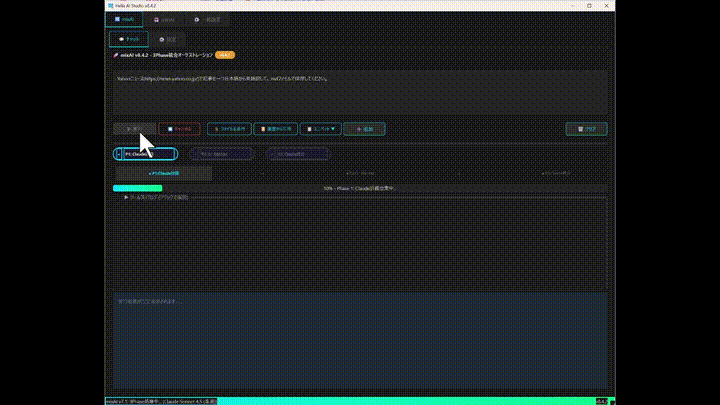
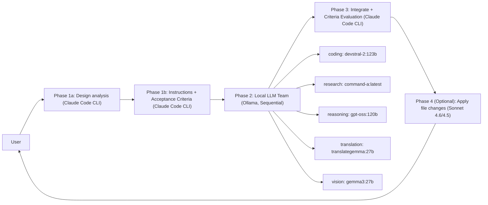

<!-- SPDX-FileCopyrightText: 2026 Helix AI Studio Contributors -->
<!-- SPDX-License-Identifier: MIT -->

# Helix AI Studio

**Claude中心のマルチモデルAIオーケストレーション デュアルインターフェースアプリ (Desktop + Web)**
Claude Code CLIを「頭脳」、ローカルLLM（Ollama）を「専門チーム」として配置 — Cyberpunk Minimal GUIとクロスデバイスWeb UIで統合。


> English README: [README.md](README.md)

> 🧩 **目的**: クラウドAI（Claude）の強みを活かしながら、ローカルLLMの得意分野（軽量推論、常駐・監視機能）を分離・併用して、回答品質と再現性を底上げする。

---

## 動作概要

Helix AI Studioは **3+1Phaseパイプライン** で動作します：

1. **Phase 1 (Claude Code CLI)** — 設計分析 → 各ローカルモデルへの構造化指示書を生成
2. **Phase 2 (ローカルLLMチーム / Ollama, 順次実行)** — 専門カテゴリ別に実行 (coding / research / reasoning / translation / vision)
3. **Phase 3 (Claude Code CLI)** — 統合、Acceptance Criteria (PASS/FAIL) で検証・最終回答を生成
4. **Phase 4（オプション）** — Sonnet 4.6/4.5がPhase 3の構造化出力からファイル変更を適用

このアプローチは、複数の視点を統合することで回答品質を向上させつつ、**VRAM負荷の高い120Bクラスモデル**（順次実行）にも対応します。

---

## 主な機能 (v11.5.3 "Web LocalAI + Discord")

### オーケストレーション (mixAI)
- **3+1Phaseパイプライン**: Claude計画 → ローカルチーム実行 → Claude統合・検証 → (任意) Sonnetが変更適用
- **Phase 4（オプション）**: Sonnet 4.6/4.5がPhase 3の構造化出力からファイル変更を適用
- **構造化Phase 1**: design_analysis + acceptance_criteria + expected_output_format
- **Phase 3でのAcceptance Criteria評価** (PASS/FAILチェックリスト)
- **品質ループ**: 設定可能なPhase 2リトライ上限 (`max_phase2_retries`)
- **Phase 2スキップ**: 各ローカルLLMカテゴリを「未選択」にしてスキップ可能
- **Neural Flow / Phase進捗可視化** (パイプラインの透明性)
- **P1/P3エンジン切替**: Claude API、ローカルLLM、GPT-5.3-Codexに対応
- **プリセット**: 「P1=Opus4.6 / P3=GPT-5.3-Codex」ワンクリックプリセット

### Claude直接チャット (soloAI)
- **Claude Code CLI** 直接対話モード
- **GPT-5.3-Codex (CLI)** — Codex CLIバックエンド経由の実行オプション
- **Opus 4.6専用Adaptive thinking (effort)** — 推論強度を調整可能 (low/medium/high)
- **検索/ブラウズ方式**: なし / Claude WebSearch / Browser Use 選択式
- WebSocketによるストリーミング応答
- ファイル添付とコンテキスト注入

### ローカルLLMチーム (Ollama)
- **5つの専門カテゴリ**: coding / research / reasoning / translation / vision（各カテゴリのスキップ可能）
- **SequentialExecutor**: 大型モデル用 (ロード → 実行 → アンロード)
- **常駐モデル**: 制御AI + Embeddingモデルを一般設定で管理（任意、GPU検出対応）

### デュアルインターフェース (Desktop + Web)
- **デスクトップ**: PyQt6ネイティブアプリ（全設定フルコントロール）
- **Web UI**: React SPA（スマートフォン・タブレット・リモートPCからアクセス可能）
- **クロスデバイス同期**: Tailscale VPN経由のセキュアアクセス、実行ロック、ファイル転送
- **チャット履歴永続化**: コンテキストモード（single/session/full）付きセッション管理
- **デスクトップチャット履歴** (v9.7.0): QDockWidgetサイドパネル。検索/タブフィルタ/日付グループ化。Web UIと同じSQLite DBを共有

### メモリ・ナレッジ (Adaptive / Living Memory)
- **4層メモリ**: Thread / Episodic / Semantic / Procedural
- **Memory Risk Gate**: 常駐LLMが記憶候補を品質判定 (ADD/UPDATE/DEPRECATE/SKIP)
- **RAPTOR多段要約** (session → weekly) でスケーラブルな長期コンテキスト
- **Temporal KGエッジ** + **GraphRAGコミュニティ要約**
- **防御的メモリ注入** (保存済み記憶からのプロンプトインジェクションを防止するガードテキスト)

### "BIBLE-first" ドキュメントシステム
- **BIBLE Manager**: 自動検出 → パース → Phase 1/3注入 → ライフサイクル管理
- 現在のBIBLEの完全性スコア・セクション数を表示

### UX / デスクトップアプリ
- Cyberpunk Minimalなデザイン、一貫したスタイルとツールチップ（セルフドキュメンティングUI）
- ファイル添付 / クリップボードインポート / スポットアクション / ツール実行ログ
- **VRAM Budget Simulator**
- **GPUモニター** (タイムライン + 記録機能)

### MCP (Model Context Protocol) サポート
- MCPサーバー管理 (filesystem / git / web search コネクタ等)
- MCPの使用には注意が必要です。サードパーティMCPサーバーはプロンプトインジェクションのリスクがあります。
  詳細は公式MCPドキュメントを参照してください。

---

## デモ

### mixAI — 3+1Phaseパイプライン (Claude → ローカルLLM → Claude → Sonnet)


### soloAI — Claude CLI直接実行


---

## スクリーンショット

| mixAI Chat | mixAI Settings | soloAI Chat | General Settings |
|---|---|---|---|
|  |  |  |  |

---

## クイックスタート

### 前提条件
- Windows 10/11
- Python 3.12+
- NVIDIA GPU (CUDA) 推奨
- **Ollama** がローカルで動作していること (デフォルトAPI: `http://localhost:11434/api`)
- **Claude Code CLI** (Node.js 18+)

公式ドキュメント:
- Claude Code CLI 概要: https://docs.claude.com/en/docs/claude-code/overview
- Ollama API 入門: https://docs.ollama.com/api/introduction
- MCP ドキュメント: https://docs.anthropic.com/en/docs/mcp

### インストール

```bash
git clone https://github.com/tsunamayo7/helix-ai-studio.git
cd helix-ai-studio

pip install -r requirements.txt

# Claude Code CLI のインストール (Node.js 18+)
npm install -g @anthropic-ai/claude-code

# (任意) Phase 2用のローカルモデルをOllamaでプル
ollama pull devstral-2:123b
ollama pull command-a:latest
ollama pull gpt-oss:120b
ollama pull translategemma:27b
ollama pull gemma3:27b

# 常駐モデル (任意)
ollama pull ministral-3:8b
ollama pull qwen3-embedding:4b

# アプリ起動
python HelixAIStudio.py
````

### スタンドアロン実行ファイルのビルド (Windows)

```bash
pip install pyinstaller
pyinstaller HelixAIStudio.spec --noconfirm
# dist/HelixAIStudio/HelixAIStudio.exe
```

---

## アーキテクチャ



---

## セキュリティ・プライバシーについて

* Helixは **ローカルLLM** (Ollama) でPhase 2の機密ワークフローを実行可能です。
* **MCPツール**を有効にする際は、サードパーティサーバーに注意してください。監査しない限り信頼しないでください。
* ファイルシステム / git / ネットワークツールには、許可リスト・確認・スコープ制限を推奨します。

---

### i18n (国際化)
- **日本語 (デフォルト) + 英語** UI切替
- 共有翻訳ファイル (`i18n/ja.json`, `i18n/en.json`) をDesktopとWebの両方で使用

## 技術スタック

| コンポーネント | 技術 |
| -------------- | ---- |
| デスクトップGUI | PyQt6 |
| Web UI | React + Vite + Tailwind CSS |
| Webサーバー | FastAPI + Uvicorn (WebSocket) |
| Claude | Claude Code CLI (`claude`) |
| ローカルLLM | Ollama API (`http://localhost:11434/api`) |
| メモリ・ナレッジ | SQLite + ベクトル埋め込み + グラフユーティリティ |
| i18n | 共有JSON (ja/en) Desktop + Web両対応 |
| ビルド | PyInstaller (Desktop) / Vite (Web) |
| デザイン | Cyberpunk Minimal |

---

## プロジェクト構成 (概要)

```
Helix AI Studio/
├── frontend/              # Web UI (React + Vite)
│   └── src/
│       ├── components/    # Reactコンポーネント
│       ├── i18n/          # React i18nフック
│       └── main.jsx
├── i18n/                  # 共有翻訳ファイル
│   ├── ja.json            # 日本語 (デフォルト)
│   └── en.json            # 英語
├── src/
│   ├── backends/          # Claude/Ollama オーケストレーション
│   ├── tabs/              # mixAI / soloAI / settings (PyQt6)
│   ├── widgets/           # Neural Flow, VRAM simulator, チャット履歴パネル
│   ├── web/               # FastAPIサーバー, WebSocket, 認証, ChatStore
│   ├── bible/             # BIBLE discovery/parser/panel
│   ├── memory/            # 4層メモリ, risk gate, RAPTOR/GraphRAG
│   ├── rag/               # RAGビルダー, ベクトル検索
│   ├── mcp/               # MCP統合 / サーバー管理
│   ├── security/          # approvals / safety gates
│   └── utils/             # constants, diagnostics, i18n
├── config/                # 設定ファイル
├── BIBLE/                 # プロジェクトドキュメント
├── HelixAIStudio.py       # デスクトップアプリ エントリポイント
└── requirements.txt
```

---

### Web UI セットアップ (任意)

```bash
# Web UIフロントエンドのビルド
cd frontend
npm install
npm run build
cd ..

# デスクトップアプリ起動時にWeb UIが自動提供されます
# Tailscale VPN経由で任意のデバイスからアクセス可能
```

---

## バージョン履歴

| バージョン | コードネーム | 主な変更 |
|-----------|------------|---------|
| v11.5.3 | Web LocalAI + Discord | Web LocalAI (Ollama WebSocket)、Discord通知、cloudAI/localAI表示統一 |
| v11.5.2 | Safety & Hygiene | ログローテーション、パストラバーサル修正、ブルートフォース対策、自動クリーンアップ、RAG2ステップ |
| v11.5.1 | Provider Pure | プロバイダールーティング整理、APIキーセキュリティUI |
| v11.5.0 | Model Agnostic | マルチプロバイダーAPI (Anthropic/OpenAI/Google)、APIファースト |
| v9.9.1 | Memory & Codex | HelixMemoryManager強化(private除外/段階注入/ビューアAPI)、Codex CLI soloAI対応、mixAI Opus4.6/Codexプリセット、検索選択式、設定保存修正、差分ダイアログ修正、スクロール誤操作防止、保存UIボタン統一 |
| v9.8.0 | GitHub Ready | Sonnet 4.6追加、Adaptive thinking (effort)、Phase 4実装適用、常駐モデル一般設定移設、Phase 2スキップ、コンテキストバー修正 |
| v9.7.1 | Desktop Chat History | SpinBox UX修正、mixAI/soloAIヘッダー整理、モデルセレクタ重複排除、タイムアウトi18n修正、RAG設定NoScrollSpinBox、Ollama設定並び順変更 |
| v9.7.0 | Desktop Chat History | デスクトップチャット履歴サイドパネル、設定UI簡素化、Ollama設定一元化 |
| v9.6.0 | Global Ready | Web UI + デスクトップUI 英語切替（共有i18n基盤）/ README.md |
| v9.5.0 | Cross-Device Sync | Web実行ロック、モバイルファイル添付、デバイス間転送 |
| v9.3.0 | Switchable Engine | P1/P3エンジン切替（Claude API / ローカルLLM） |
| v9.2.0 | Persistent Sessions | チャット永続化、コンテキストモード |
| v9.0.0 | Web UI | React Web UI、FastAPI、WebSocketストリーミング |
| v8.5.0 | Autonomous RAG | RAGビルダー、情報収集タブ |
| v8.4.0 | Contextual Intelligence | 4層メモリ、RAPTOR要約 |

詳細は [CHANGELOG.md](CHANGELOG.md) を参照してください。

---

## Discord通知の設定

1. [Discord Webhook URL](https://support.discord.com/hc/ja/articles/228383668) を取得
2. Helix AI Studio → 一般設定タブ → Web UI Server セクション
3. Discord Webhook URL 欄に貼り付けて保存
4. 通知イベント（チャット開始/完了/エラー）を各チェックボックスで選択

## Web UIのビルド（開発者向け）

`frontend/dist/` はgit管理外です。クローン後または変更後に以下を実行してください：

```bash
cd frontend
npm install
npm run build
cd ..
```

デスクトップアプリ起動時に `dist/` が自動的に配信されます。

---

## ライセンス

MIT (詳細は LICENSE を参照)

## 変更履歴

[CHANGELOG.md](CHANGELOG.md) に詳細なバージョン履歴を記載しています。

---

## コントリビュート

コントリビュートを歓迎します！ PRを提出する前に [CONTRIBUTING.md](CONTRIBUTING.md) をお読みください。

## セキュリティ

セキュリティ脆弱性については [SECURITY.md](SECURITY.md) を参照してください。

---

> 🤖 **AI支援について**: このプロジェクトの開発・ドキュメント作成にはAIツール（Claude）を活用しています。最終的な設計判断・検証・品質管理は開発者が責任を持って行っています。
