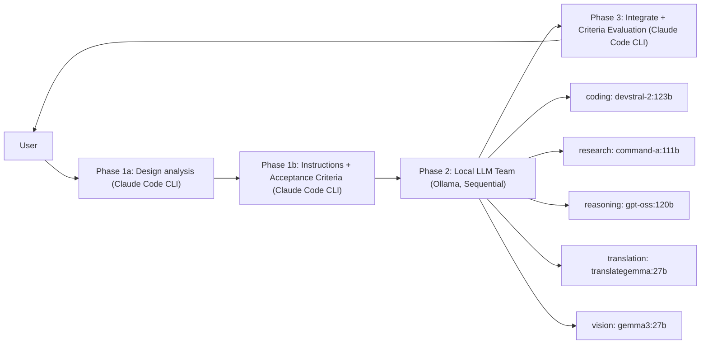

<!-- SPDX-FileCopyrightText: 2026 Helix AI Studio Contributors -->
<!-- SPDX-License-Identifier: MIT -->

# Helix AI Studio

**Claude中心のマルチモデルオーケストレーション デスクトップアプリ (Windows)**
Claude Code CLIを「頭脳」、ローカルLLM（Ollama）を「専門チーム」として配置 — Cyberpunk Minimal GUIで統合。


> English README: [README.md](README.md)

> 🧩 **目的**: クラウドAI（Claude）の強みを活かしながら、ローカルLLMの得意分野（軽量推論、常駐・監視機能）を分離・併用して、回答品質と再現性を底上げする。

---

## 動作概要

Helix AI Studioは **3Phaseパイプライン** で動作します：

1. **Phase 1 (Claude Code CLI)** — 設計分析 → 各ローカルモデルへの構造化指示書を生成
2. **Phase 2 (ローカルLLMチーム / Ollama, 順次実行)** — 専門カテゴリ別に実行 (coding / research / reasoning / translation / vision)
3. **Phase 3 (Claude Code CLI)** — 統合、Acceptance Criteria (PASS/FAIL) で検証・最終回答を生成

このアプローチは、複数の視点を統合することで回答品質を向上させつつ、**VRAM負荷の高い120Bクラスモデル**（順次実行）にも対応します。

---

## 主な機能 (v8.4.2 "Contextual Intelligence")

### オーケストレーション
- **3Phaseパイプライン**: Claude計画 → ローカルチーム実行 → Claude統合・検証
- **構造化Phase 1**: design_analysis + acceptance_criteria + expected_output_format
- **Phase 3でのAcceptance Criteria評価** (PASS/FAILチェックリスト)
- **品質ループ**: 設定可能なPhase 2リトライ上限 (`max_phase2_retries`)
- **Neural Flow / Phase進捗可視化** (パイプラインの透明性)

### ローカルLLMチーム (Ollama)
- **5つの専門カテゴリ**: coding / research / reasoning / translation / vision
- **SequentialExecutor**: 大型モデル用 (ロード → 実行 → アンロード)
- **常駐モデル**: 制御AI + Embeddingモデルを小型GPU固定 (任意)

### メモリ・ナレッジ (Adaptive / Living Memory)
- **4層メモリ**: Thread / Episodic / Semantic / Procedural
- **Memory Risk Gate**: 常駐LLMが記憶候補を品質判定 (ADD/UPDATE/DEPRECATE/SKIP)
- **RAPTOR多段要約** (session → weekly) でスケーラブルな長期コンテキスト
- **Temporal KGエッジ** + **GraphRAGコミュニティ要約**
- **防御的メモリ注入** (保存済み記憶からのプロンプトインジェクションを防止するガードテキスト)

### "BIBLE-first" ドキュメントシステム
- **BIBLE Manager**: 自動検出 → パース → Phase 1/3注入 → ライフサイクル管理
- 現在のBIBLEの完全性スコア・セクション数を表示

### UX / デスクトップアプリ
- Cyberpunk Minimalなデザイン、一貫したスタイルとツールチップ（セルフドキュメンティングUI）
- ファイル添付 / クリップボードインポート / スポットアクション / ツール実行ログ
- **VRAM Budget Simulator**
- **GPUモニター** (タイムライン + 記録機能)

### MCP (Model Context Protocol) サポート
- MCPサーバー管理 (filesystem / git / web search コネクタ等)
- MCPの使用には注意が必要です。サードパーティMCPサーバーはプロンプトインジェクションのリスクがあります。
  詳細は公式MCPドキュメントを参照してください。

---

## デモ

### mixAI — 3Phaseパイプライン (Claude → ローカルLLM → Claude)


### soloAI — Claude CLI直接実行


---

## スクリーンショット

| mixAI Chat | mixAI Settings | soloAI Chat | General Settings |
|---|---|---|---|
|  |  |  |  |

---

## クイックスタート

### 前提条件
- Windows 10/11
- Python 3.12+
- NVIDIA GPU (CUDA) 推奨
- **Ollama** がローカルで動作していること (デフォルトAPI: `http://localhost:11434/api`)
- **Claude Code CLI** (Node.js 18+)

公式ドキュメント:
- Claude Code CLI 概要: https://docs.claude.com/en/docs/claude-code/overview
- Ollama API 入門: https://docs.ollama.com/api/introduction
- MCP ドキュメント: https://docs.anthropic.com/en/docs/mcp

### インストール

```bash
git clone https://github.com/tsunamayo7/helix-ai-studio.git
cd helix-ai-studio

pip install -r requirements.txt

# Claude Code CLI のインストール (Node.js 18+)
npm install -g @anthropic-ai/claude-code

# (任意) Phase 2用のローカルモデルをOllamaでプル
ollama pull devstral-2:123b
ollama pull command-a:111b
ollama pull gpt-oss:120b
ollama pull translategemma:27b
ollama pull gemma3:27b

# 常駐モデル (任意)
ollama pull ministral-3:8b
ollama pull qwen3-embedding:4b

# アプリ起動
python HelixAIStudio.py
````

### スタンドアロン実行ファイルのビルド (Windows)

```bash
pip install pyinstaller
pyinstaller HelixAIStudio.spec --noconfirm
# dist/HelixAIStudio/HelixAIStudio.exe
```

---

## アーキテクチャ



---

## セキュリティ・プライバシーについて

* Helixは **ローカルLLM** (Ollama) でPhase 2の機密ワークフローを実行可能です。
* **MCPツール**を有効にする際は、サードパーティサーバーに注意してください。監査しない限り信頼しないでください。
* ファイルシステム / git / ネットワークツールには、許可リスト・確認・スコープ制限を推奨します。

---

## 技術スタック

| コンポーネント | 技術 |
| -------------- | ---- |
| GUI | PyQt6 |
| Claude | Claude Code CLI (`claude`) |
| ローカルLLM | Ollama API (`http://localhost:11434/api`) |
| メモリ・ナレッジ | SQLite + ベクトル埋め込み + グラフユーティリティ |
| ビルド | PyInstaller |
| デザイン | Cyberpunk Minimal |

---

## プロジェクト構成 (概要)

```
src/
  backends/          # Claude/Ollama オーケストレーション (mix orchestrator, sequential executor)
  tabs/              # mixAI / soloAI / settings
  widgets/           # Neural Flow, VRAM simulator, GPU monitor
  bible/             # BIBLE discovery/parser/panel
  memory/            # 4層メモリ, risk gate, RAPTOR/GraphRAG
  mcp/               # MCP統合 / サーバー管理
  security/          # approvals / safety gates
  utils/             # constants, diagnostics
config/
  app_settings.json
```

---

## ライセンス

MIT (詳細は LICENSE を参照)

## 変更履歴

[CHANGELOG.md](CHANGELOG.md) に詳細なバージョン履歴を記載しています。

---

## コントリビュート

コントリビュートを歓迎します！ PRを提出する前に [CONTRIBUTING.md](CONTRIBUTING.md) をお読みください。

## セキュリティ

セキュリティ脆弱性については [SECURITY.md](SECURITY.md) を参照してください。

---

> 🤖 **AI支援について**: このプロジェクトの開発・ドキュメント作成にはAIツール（Claude）を活用しています。最終的な設計判断・検証・品質管理は開発者が責任を持って行っています。
