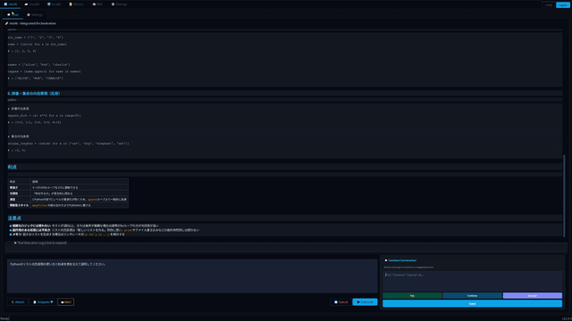
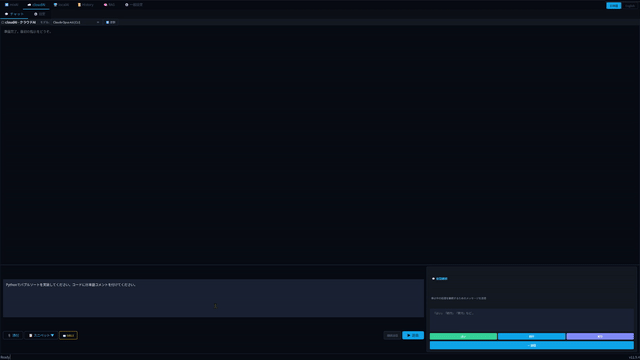
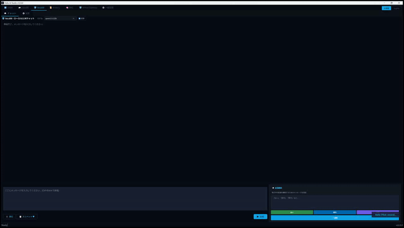
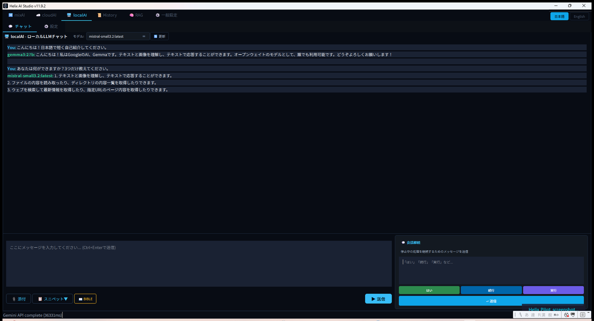

<!-- SPDX-FileCopyrightText: 2026 Helix AI Studio Contributors -->
<!-- SPDX-License-Identifier: MIT -->

# 🧬 Helix AI Studio

**ひとつのプロンプト。複数のAI。ひとつの統合された回答。**

Claude・GPT・Gemini・ローカルLLMを**本当の意味で「協力」させる**デスクトップアプリです。
ひとつのRAGナレッジベースを全AIで共有。プロンプトを入力するだけで、Claudeが計画を立て、ローカルLLMが実行し、Claudeが結果を検証します。コピペも、コーディングも不要。

[](https://github.com/tsunamayo7/helix-ai-studio/stargazers)
[](https://opensource.org/licenses/MIT)
[](https://www.python.org/downloads/)
[](https://pypi.org/project/PyQt6/)
[](https://github.com/tsunamayo7/helix-ai-studio/releases)


🌐 **English README**: [README.md](README.md) · 📖 [セットアップガイド](SETUP_GUIDE.md) · 📋 [更新履歴](CHANGELOG.md) · 🔒 [セキュリティ](SECURITY.md)

> ⭐ **役に立ちそうだと思ったら、スターをいただけると他の開発者に届きやすくなります。ありがとうございます！**

---

## 📋 目次

- [動いている様子を見てみよう](#動いている様子を見てみよう)
- [60秒で始めよう](#60秒で始めよう)
- [Helixの何がすごいのか？](#helixの何がすごいのか)
- [パイプラインの仕組み](#パイプラインの仕組み)
- [主な機能](#主な機能)
- [インストールガイド](#インストールガイド)
- [技術スタック](#技術スタック)
- [セキュリティとプライバシー](#セキュリティとプライバシー)
- [スクリーンショット](#スクリーンショット)
- [バージョン履歴](#バージョン履歴)
- [記事・リソース](#記事リソース)
- [コントリビューション](#コントリビューション)
- [ライセンス](#ライセンス)

---

## 🎬 動いている様子を見てみよう

### mixAI パイプライン — 3フェーズAIオーケストレーション



> Claudeが作業計画を立て、ローカルLLMが実行し、Claudeが結果を検証します。ワンクリックで全自動。

### cloudAI チャット — Claude・GPT・Geminiと直接対話



### localAI チャット — ローカルモデルと直接対話



> Ollamaのモデルを選んですぐチャット。会話の途中でモデルを切り替えることもできます。すべてあなたのGPUで動作します。

### 🆕 Helix Pilot v2.0 — AIがUIを自動操作

> **v11.9.4の新機能**: Helix Pilot は、ローカルのVision LLMがスクリーンを読み取り、アプリを自律的に操作するエージェントです。Claude Codeが日本語でタスクを指示するだけで、Helix Pilotがクリック・スクロール・入力をすべて代行します。

```bash
# 例: Claude がワークフローを自動化
python scripts/helix_pilot.py auto "mixAIタブを開いてプロンプトを入力して送信" --window "Helix AI Studio"
```

---

## 🚀 60秒で始めよう

```bash
git clone https://github.com/tsunamayo7/helix-ai-studio.git
cd helix-ai-studio
pip install -r requirements.txt
python HelixAIStudio.py
```

これだけです。アプリが起動し、`http://localhost:8500` でWeb UIにもアクセスできます。

設定画面でAPIキーを追加するか、[Ollama](https://ollama.com) をインストールすれば、完全にローカルで動くプライベートなAI環境が手に入ります。

> **はじめての方へ**: [SETUP_GUIDE.md](SETUP_GUIDE.md) にPython・Ollama・APIキーの設定まで丁寧に解説しています。

---

## 💡 Helixの何がすごいのか？

多くのAIツールは「1つのモデルとのチャット画面」です。Helix は**複数のモデルが協力するパイプライン**です。

**核心的なアイデア**: どのAIにも得意・不得意があります。異なるアーキテクチャや学習データを持つモデルにプロンプトを分配し、強力なモデルが結果をまとめて検証することで、どの単一モデルよりも正確で包括的な回答が得られます。

| | Helix AI Studio | 単一モデルのチャットアプリ |
|---|---|---|
| **マルチAIパイプライン** | Claudeが計画、ローカルLLMが実行、Claudeが検証 | 1つのモデルが全部やる |
| 📚 **統合RAG** | ひとつのナレッジベースを**Claude・GPT・Gemini・Ollama**で共有 — 一度構築すれば全モデルが活用 | 各モデルが個別のコンテキストを持つ |
| **コスト効率** | 高価なモデル（Claude）は仕事の20%。無料のローカルモデルが80%を担当 | すべて有料APIに依存 |
| **プライバシー重視** | 実行フェーズはすべてあなたのGPU上。機密コードが外部に出ることはありません | クラウドのみ — すべて外部サーバーに送信 |
| **デスクトップ + モバイル** | ネイティブデスクトップアプリ + 内蔵Web UI。スマホからもチャット可能 | たいてい片方だけ |
| **Helix Pilot v2.0** | Vision LLMエージェントが画面を読み取り、日本語指示でアプリを自動操作 | 静的UIのみ、自動化なし |
| **コード不要** | 設定画面のあるGUIアプリ。クリックするだけ | オーケストレーションツールの多くはコードが必要 |
| **無料・オープン** | MITライセンス。サブスクなし、テレメトリなし | SaaSやフリーミアムが多い |

### 競合との比較

| | Open WebUI | AnythingLLM | Dify | LangChain | **Helix** |
|---|---|---|---|---|---|
| GitHub Stars | 60k+ ⭐ | 30k+ ⭐ | 129k+ ⭐ | 80k+ ⭐ | — |
| 自動パイプライン (クラウド+ローカル) | ❌ 手動 | ❌ 手動 | ⚠️ ビジュアルビルダー | ⚠️ コード必要 | ✅ ワンクリック |
| 統合RAG (クラウド+ローカル) | ❌ | ⚠️ 部分的 | ⚠️ クラウドのみ | ⚠️ 手動 | ✅ 全モデル対応 |
| デスクトップアプリ | ❌ | ✅ | ❌ | ❌ | ✅ |
| LAN Web UI | ✅ | ❌ | ❌ | ❌ | ✅ |
| Docker不要 | ✅ 必要 | オプション | ✅ 必要 | N/A | ❌ **不要** |
| セットアップ | docker run | インストーラー | docker compose | pip + コード | **pip + 起動** |
| Claude/GPT/Gemini対応 | ⚠️ プロキシ経由 | ✅ | ✅ | ✅ | ✅ |
| コスト最適化 | ❌ | ❌ | ❌ | 手動 | **✅ 自動** |
| MITライセンス | ✅ | ✅ | ✅ | ✅ | ✅ |

**Helixが埋めるギャップ**: クラウド + ローカルモデルを自動でコスト最適化するGUIデスクトップアプリ — **全AIプロバイダーで共有される統合RAGナレッジベース**付き、Docker不要、LAN対応内蔵。

---

## ⚙️ パイプラインの仕組み

```
あなたのプロンプト
        |
        v
┌───────────────────────┐
│   Phase 1: 計画立案   │  ← クラウドAI（Claude / GPT / Gemini）
│  - 設計分析           │
│  - 合格基準の設定     │
│  - モデル別タスク作成  │
└───────────────────────┘
        |
┌───────┬──────┴──────┬───────┐
v       v             v       v
┌──────┐┌────────┐ ┌─────────┐┌────────┐
│コーディング││リサーチ│ │  推論   ││ビジョン│  Phase 2: ローカル
│devstral││gemma3 │ │ministral││gemma3 │  （あなたのGPU）
└──────┘└────────┘ └─────────┘└────────┘
        |
        v
┌───────────────────────┐
│   Phase 3: 統合・検証 │  ← クラウドAI（Claude / GPT / Gemini）
│  - 全出力の統合       │
│  - PASS/FAIL チェック │
│  - 最終回答の生成     │
└───────────────────────┘
        |
        v
     最終出力
```

| フェーズ | 担当 | 内容 |
|---|---|---|
| **Phase 1** | クラウドAI | プロンプトを分析し、各ローカルモデルへの構造化された指示を作成 |
| **Phase 2** | ローカルLLM（あなたのGPU） | コーディング・リサーチ・推論・翻訳・ビジョンの各スペシャリストが並列実行 |
| **Phase 3** | クラウドAI | 全てを統合し、合格基準と照合して最終回答を生成 |

---

## ✨ 主な機能

| 機能 | 説明 |
|------|------|
| 🔀 **mixAI パイプライン** | 3+1フェーズのオーケストレーション: 計画 → 実行 → 検証 → (任意) ファイル変更適用 |
| ☁️ **cloudAI チャット** | Claude・GPT・Gemini と API や CLI で直接チャット |
| 💻 **localAI チャット** | Ollama のローカルモデルとGPU上でチャット |
| 🤖 **Helix Pilot v2.0** | Vision LLMエージェントが画面を認識し、日本語の指示でアプリを自律操作 |
| 📚 **統合RAG** | ひとつのナレッジベースを**Claude・GPT・Gemini・Ollama**で共有 — ローカル埋め込みで一度構築すれば全モデルが活用 |
| 🌐 **Web UI** | React ベースのモバイルフレンドリーなインターフェース。どのデバイスからもアクセス可能 |
| 🧠 **4層メモリ** | Thread / Episodic / Semantic / Procedural — セッションを超えてコンテキストを記憶 |
| 🌍 **多言語対応** | 日本語と英語の完全対応。いつでも切り替え可能 |
| 🔔 **Discord通知** | AIタスクの完了をリアルタイムで通知 |
| 📜 **チャット履歴** | SQLiteベースの履歴をデスクトップとWebで共有 |
| 📖 **BIBLEシステム** | プロジェクトドキュメントをAIプロンプトに自動注入し、より良いコンテキストを提供 |

---

## 📦 インストールガイド

### 必要な環境

| 項目 | 要件 |
|---|---|
| OS | **Windows 10/11** または **macOS 12 Monterey以上**（Apple Silicon・Intel両対応） |
| Python | **3.10以上**（3.11推奨） |
| GPU | NVIDIA + CUDA（ローカルLLM使用時 — 任意）※macOSはMetal/CPU推論 |
| RAM | **16GB以上**（大型モデルには32GB以上推奨） |

### セットアップ手順

**1. クローンとインストール**

```bash
git clone https://github.com/tsunamayo7/helix-ai-studio.git
cd helix-ai-studio
pip install -r requirements.txt
```

**2. （任意）ローカルLLMのセットアップ**

```bash
# Ollama をダウンロード: https://ollama.com/download
# インストール後、モデルをダウンロード:
ollama pull gemma3:4b          # 軽量モデル。ほとんどのGPUで動作
ollama pull gemma3:27b         # 高品質。16GB以上のVRAMが必要
ollama pull mistral-small3.2   # 画像認識にも対応するモデル
```

**3. （任意）クラウドAI用のAPIキーを設定**

```bash
# Windows
copy config\general_settings.example.json config\general_settings.json

# macOS / Linux
cp config/general_settings.example.json config/general_settings.json
```

`config/general_settings.json` をエディタで開いて、以下のキーを設定:

| プロバイダー | キーの取得先 | 使えるようになる機能 |
|---|---|---|
| Anthropic | [console.anthropic.com](https://console.anthropic.com/settings/keys) | Claudeチャット、パイプライン計画立案 |
| Google | [aistudio.google.com](https://aistudio.google.com/app/apikey)（無料枠あり） | Geminiチャット |
| OpenAI | [platform.openai.com](https://platform.openai.com/api-keys) | GPTチャット |

**4. 起動**

```bash
# Windows
python HelixAIStudio.py

# macOS
python3 HelixAIStudio.py
```

**5. （任意）スマホからアクセス**

設定画面でWeb UIを有効化し、同一ネットワーク上の任意のデバイスから `http://localhost:8500` にアクセスしてください。

> CLI ツール、Node.js、トラブルシューティングなど詳細なセットアップは [SETUP_GUIDE.md](SETUP_GUIDE.md) をご覧ください。

---

## 🛠️ 技術スタック

| コンポーネント | 技術 |
|---|---|
| デスクトップ GUI | PyQt6 |
| Web UI | React + Vite + Tailwind CSS |
| Web サーバー | FastAPI + Uvicorn (WebSocket) |
| クラウド AI | Anthropic / OpenAI / Google Gemini API |
| CLI バックエンド | Claude Code CLI / Codex CLI |
| ローカル LLM | Ollama |
| メモリ | SQLite + ベクトル埋め込み + ナレッジグラフ |
| 多言語対応 | 共有 JSON (ja/en) — デスクトップ + Web 共通 |

---

## 🔒 セキュリティとプライバシー

- **Phase 2は100%ローカル** — 実行フェーズ中、コードやドキュメントがあなたのマシンの外に出ることはありません
- **APIキーはローカル保存** — `config/general_settings.json`（git管理対象外）に保存。第三者に送信されることはありません
- **Web UIはプライベート** — ローカル/VPNアクセス専用設計。パブリックインターネットへの公開は非推奨
- **メモリインジェクション防御** — 蓄積されたコンテキストを利用したプロンプトインジェクションを安全プロンプトで防止

> Anthropic・OpenAI・Ollamaの利用規約への準拠の詳細は [SECURITY.md](SECURITY.md) をご覧ください。

---

## 📸 スクリーンショット

<details>
<summary><strong>クリックでスクリーンショットを表示</strong></summary>

### パイプラインモニター — AIの動作をリアルタイムで監視


### パイプライン完了 — PASS/FAIL検証済みの最終出力


### Claude Sonnetチャット — クラウドAIとの直接対話


### Gemini APIチャット — マルチプロバイダー対応


### ローカルAIチャット（gemma3） — マルチモデル切替


### マルチモデル会話 — チャットの途中でモデルを切り替え


### RAGナレッジベース — 知識の構築と検索


### 設定画面 — APIキー、テーマ、自動化設定


### Web UI — スマホからチャット


### Web UI（英語） — 完全なi18n対応


</details>

---

## 📅 バージョン履歴

| バージョン | 主な変更 |
|---|---|
| **v11.9.5** | 🎬 **デモビデオ追加**（14本）、📚 **統合RAG** — Claude/GPT/Gemini/Ollamaがひとつのナレッジベースを共有、cloudAI WebSocket DBスキーマ修正 |
| v11.9.4 | 🆕 Helix Pilot v2.0（Vision LLM自律GUIエージェント）、タブ切り替えUI改善、多言語強化 |
| v11.9.3 | プロバイダーベースのモデル分類、コンボ幅修正 |
| v11.9.2 | ターミナル表示トグル、Enter送信切替、240+カラーリテラル排除 |
| v11.9.0 | Unified Obsidianテーマ、SSセマンティックヘルパー、スプラッシュスクリーン |
| v11.8.0 | 4層カラーシステム、グローバルスタイルシート |
| v11.5.0 | マルチプロバイダーAPI（Anthropic/OpenAI/Google）、モデル非依存アーキテクチャ |
| v11.0.0 | Historyタブ、BIBLEクロスタブ、クラウドモデルセレクター |
| v9.0.0 | Web UI（React + FastAPI） |

詳細は [CHANGELOG.md](CHANGELOG.md) をご覧ください。

---

## 📰 記事・リソース

| 記事 | リンク |
|------|--------|
| 🆕 v11.9.4 リリース — Helix Pilot v2.0・タブ切り替えUI・多言語強化 | [note.com](https://note.com/ai_tsunamayo_7/n/n7268ff58d0b0) |
| v11.9.1 リリース — インラインカラー完全排除とパイプライン自動化 | [note.com](https://note.com/ai_tsunamayo_7/n/n410888aabe47) |
| 【技術解説】マルチAIオーケストレーション アーキテクチャ | [note.com](https://note.com/ai_tsunamayo_7/n/n5a97fbf68798) |
| 【無料・オープンソース】Helix AI Studio を作った話 | [note.com](https://note.com/ai_tsunamayo_7/n/n410331c01ab0) |
| 【完全無料】複数のAIを同時に使えるデスクトップアプリ | [note.com](https://note.com/ai_tsunamayo_7/n/nb23a3ece82f8) |

---

## 🤝 コントリビューション

コントリビューションは歓迎です！ガイドラインは [CONTRIBUTING.md](CONTRIBUTING.md) をご覧ください。

セキュリティの問題は [SECURITY.md](SECURITY.md) をご覧ください。

---

## 📄 ライセンス

MIT — [LICENSE](LICENSE) を参照

**作者**: tsunamayo7 ([@tsunamayo7](https://github.com/tsunamayo7))

Helix AI Studio が役に立ったら、ぜひ ⭐ スターをお願いします！フィードバック、Issue、PRはいつでも歓迎です。
