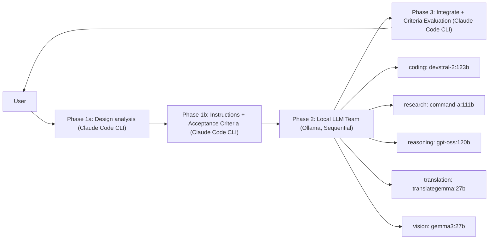

<!-- SPDX-FileCopyrightText: 2026 Helix AI Studio Contributors -->
<!-- SPDX-License-Identifier: MIT -->

# Helix AI Studio

**Claude中忁E�EマルチモチE��オーケストレーション チE��クトップアプリ (Windows)**
Claude Code CLIを「頭脳」、ローカルLLM�E�Ellama�E�を「専門チ�Eム」として配置  ECyberpunk Minimal GUIで統合、E


> English README: [README.md](README.md)

> 🧩 **目皁E*: クラウドAI�E�Elaude�E��E強みを活かしながら、ローカルLLMの得意刁E���E�軽量推論、常駐�E琁E��機寁E�E離�E�を併用して、回答品質と再現性を底上げする、E

---

## 動作概要E

Helix AI Studioは **3Phaseパイプライン** で動作しまぁE

1. **Phase 1 (Claude Code CLI)**  E設計�E极EↁE吁E��ーカルモチE��への構造化指示書を生戁E
2. **Phase 2 (ローカルLLMチ�Eム / Ollama, 頁E��実衁E**  E専門カチE��リ別に実衁E(coding / research / reasoning / translation / vision)
3. **Phase 3 (Claude Code CLI)**  E統合�EAcceptance Criteria (PASS/FAIL) で検証・最終回答を生�E

こ�Eアプローチ�E、褁E��の視点を統合することで回答品質を向上させつつ、E*VRAM雁E��E��の120BクラスモチE��**�E�頁E��実行）にも対応します、E

---

## 主な機�E (v8.4.2 "Contextual Intelligence")

### オーケストレーション
- **3Phaseパイプライン**: Claude計画 ↁEローカルチ�Eム実衁EↁEClaude統合�E検証
- **構造化Phase 1**: design_analysis + acceptance_criteria + expected_output_format
- **Phase 3でのAcceptance Criteria評価** (PASS/FAILチェチE��リスチE
- **品質ルーチE*: 設定可能なPhase 2リトライ上限 (`max_phase2_retries`)
- **Neural Flow / Phase進捗可視化** (パイプラインの透�E性)

### ローカルLLMチ�Eム (Ollama)
- **5つの専門カチE��リ**: coding / research / reasoning / translation / vision
- **SequentialExecutor**: 大型モチE��用 (ローチEↁE実衁EↁEアンローチE
- **常駐モチE��**: 制御AI + EmbeddingモチE��を小型GPU固宁E(任愁E

### メモリ・ナレチE�� (Adaptive / Living Memory)
- **4層メモリ**: Thread / Episodic / Semantic / Procedural
- **Memory Risk Gate**: 常駐LLMが記�E候補を品質判宁E(ADD/UPDATE/DEPRECATE/SKIP)
- **RAPTOR多段要紁E* (session ↁEweekly) でスケーラブルな長期コンチE��スチE
- **Temporal KGエチE��** + **GraphRAGコミュニティ要紁E*
- **防御皁E���E注入** (保存済み記�Eからのプロンプトインジェクションを防止するガードテキスチE

### "BIBLE-first" ドキュメントシスチE��
- **BIBLE Manager**: 自動検�E ↁEパ�Eス ↁEPhase 1/3注入 ↁEライフサイクル管琁E
- 現在のBIBLEの完�E性スコア・セクション数を表示

### UX / チE��クトップアプリ
- Cyberpunk MinimalなチE��イン、一貫したスタイルとチE�Eルチップ（セルフドキュメンチE��ングUI�E�E
- ファイル添仁E/ クリチE�Eボ�Eドインポ�EチE/ スポットアクション / チE�Eル実行ログ
- **VRAM Budget Simulator**
- **GPUモニター** (タイムライン + 記録機�E)

### MCP (Model Context Protocol) サポ�EチE
- MCPサーバ�E管琁E(filesystem / git / web search コネクタ筁E
- MCPの使用には注意が忁E��です。サードパーチE��MCPサーバ�Eはプロンプトインジェクションのリスクがあります、E
  詳細は公式MCPドキュメントを参�Eしてください、E

---

## スクリーンショチE��

> `docs/screenshots/` にスクリーンショチE��を�E置し、以下�Eパスを更新してください、E

| mixAI Chat | mixAI Settings | soloAI Chat | General Settings |
|---|---|---|---|
|  |  |  |  |

---

## クイチE��スターチE

### 前提条件
- Windows 10/11
- Python 3.12+
- NVIDIA GPU (CUDA) 推奨
- **Ollama** がローカルで動作してぁE��こと (チE��ォルチEPI: `http://localhost:11434/api`)
- **Claude Code CLI** (Node.js 18+)

公式ドキュメンチE
- Claude Code CLI 概要E https://docs.claude.com/en/docs/claude-code/overview
- Ollama API 入門: https://docs.ollama.com/api/introduction
- MCP ドキュメンチE https://docs.anthropic.com/en/docs/mcp

### インスト�Eル

```bash
git clone https://github.com/tsunamayo7/helix-ai-studio.git
cd helix-ai-studio

pip install -r requirements.txt

# Claude Code CLI のインスト�Eル (Node.js 18+)
npm install -g @anthropic-ai/claude-code

# (任愁E Phase 2用のローカルモチE��をOllamaでプル
ollama pull devstral-2:123b
ollama pull command-a:111b
ollama pull gpt-oss:120b
ollama pull translategemma:27b
ollama pull gemma3:27b

# 常駐モチE�� (任愁E
ollama pull ministral-3:8b
ollama pull qwen3-embedding:4b

# アプリ起勁E
python HelixAIStudio.py
````

### スタンドアロン実行ファイルのビルチE(Windows)

```bash
pip install pyinstaller
pyinstaller HelixAIStudio.spec --noconfirm
# dist/HelixAIStudio/HelixAIStudio.exe
```

---

## アーキチE��チャ



---

## セキュリチE��・プライバシーにつぁE��

* Helixは **ローカルLLM** (Ollama) でPhase 2の機寁E��ークフローを実行可能です、E
* **MCPチE�Eル**を有効にする際�E、サードパーチE��サーバ�Eに注意してください。監査しなぁE��り信頼しなぁE��ください、E
* ファイルシスチE�� / git / ネットワークチE�Eルには、許可リスト�E確認�Eスコープ制限を推奨します、E

---

## 技術スタチE��

| コンポ�EネンチE| 技衁E|
| -------------- | ---- |
| GUI | PyQt6 |
| Claude | Claude Code CLI (`claude`) |
| ローカルLLM | Ollama API (`http://localhost:11434/api`) |
| メモリ・ナレチE�� | SQLite + ベクトル埋め込み + グラフユーチE��リチE�� |
| ビルチE| PyInstaller |
| チE��イン | Cyberpunk Minimal |

---

## プロジェクト構�E (概要E

```
src/
  backends/          # Claude/Ollama オーケストレーション (mix orchestrator, sequential executor)
  tabs/              # mixAI / soloAI / settings
  widgets/           # Neural Flow, VRAM simulator, GPU monitor
  bible/             # BIBLE discovery/parser/panel
  memory/            # 4層メモリ, risk gate, RAPTOR/GraphRAG
  mcp/               # MCP統吁E/ サーバ�E管琁E
  security/          # approvals / safety gates
  utils/             # constants, diagnostics
config/
  app_settings.json
```

---

## ライセンス

MIT (詳細は LICENSE を参照)

## 変更履歴

[CHANGELOG.md](CHANGELOG.md) に詳細なバ�Eジョン履歴を記載してぁE��す、E

---

## コントリビューチE

コントリビュートを歓迎しまぁE PRを提出する前に [CONTRIBUTING.md](CONTRIBUTING.md) をお読みください、E

## セキュリチE��

セキュリチE��脁E��性につぁE��は [SECURITY.md](SECURITY.md) を参照してください、E

---

## AI支援につぁE���E�任意で開示�E�E

本プロジェクト�E、設計�E実裁E�Eドキュメント�E一部に生�EAI�E�Elaude等）を活用してぁE��す、E
ただし、E*最終的な意思決定�E統合�E検証は人間が行う** ことを前提としてぁE��す、E
