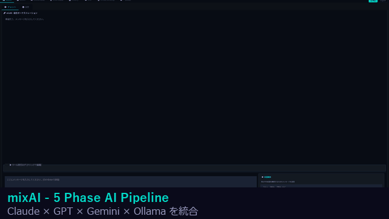
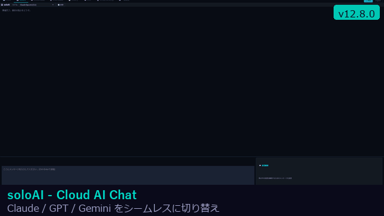
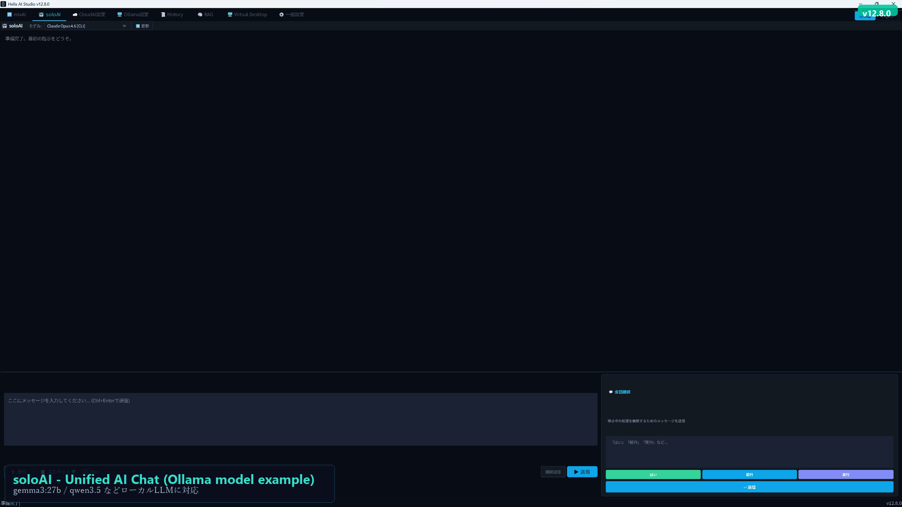
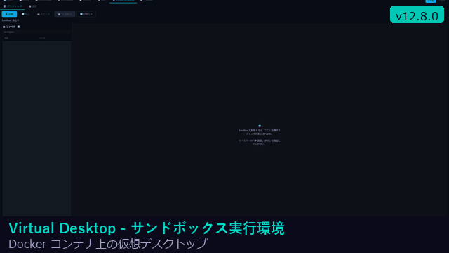

<!-- SPDX-FileCopyrightText: 2026 Helix AI Studio Contributors -->
<!-- SPDX-License-Identifier: MIT -->

<div align="center">

# Helix AI Studio

### Claude, GPT, Gemini, ローカルAI ―― 全部まとめて、ひとつのアプリで。

*複数のAIが自動で協力し、ひとつの回答を仕上げます。*
*ローカルLLMだけなら完全無料。API キーがあればクラウドAIも使えます。*

[](https://github.com/tsunamayo7/helix-ai-studio/stargazers)
[](https://opensource.org/licenses/MIT)
[](https://www.python.org/downloads/)
[](https://github.com/tsunamayo7/helix-ai-studio/releases)


[English](README.md) · [セットアップガイド](SETUP_GUIDE.md) · [更新履歴](CHANGELOG.md)


</div>

---

## はじめかた

3行コピペするだけ。必要なツールはインストーラーが全部揃えます。

### Windows

```cmd
git clone https://github.com/tsunamayo7/helix-ai-studio.git
cd helix-ai-studio
install.bat
```

### macOS / Linux

```bash
git clone https://github.com/tsunamayo7/helix-ai-studio.git
cd helix-ai-studio
chmod +x install.sh && ./install.sh
```

```bash
python HelixAIStudio.py   # 起動
```

デスクトップアプリが開きます。スマホからは `http://localhost:8500` でアクセスできます。

<details>
<summary>インストーラーが自動でやること</summary>

- AI 関連パッケージの一括インストール
- ローカル AI エンジン（Ollama）のインストールと初期モデルのダウンロード
- Web UI のビルド
- CLI ツール（Claude Code / Codex）のセットアップ
- 設定ファイルの作成

途中でエラーが出ても止まりません。失敗した項目は `[WARN]` で表示され、あとから対応できます。

</details>

> はじめての方は [セットアップガイド](SETUP_GUIDE.md) もどうぞ。

---

## Helix でできること

| 機能 | 何ができるか |
|------|------------|
| **mixAI パイプライン** | 複数の AI が「計画→実行→検証→仕上げ」を自動で分担し、ひとつの回答を生成 |
| **cloudAI チャット** | Claude・GPT・Gemini を切り替えてチャット。途中でモデルを変えても会話が続く |
| **localAI チャット** | Ollama のローカルモデルで完全オフライン。API 費用ゼロ |
| **Virtual Desktop** | 隔離された仮想デスクトップ内で AI がコードを書いて実行。PC 環境を汚さない |
| **RAG** | PDF やテキストを読み込ませて、すべての AI が参照できる共有知識に |
| **Web UI** | LAN 上のスマホやタブレットからもアクセス |
| **MCP 対応** | Model Context Protocol で外部ツール連携 |
| **日本語 / 英語** | UI の言語をワンクリックで切替 |

---

## 動いている様子

### 複数の AI が協力して回答を作る（mixAI パイプライン）

Claude が計画を立て、Mistral と Gemma が実行し、最後に統合・検証。ひとつのプロンプトを入れるだけ。



### 好きなモデルを選んでチャット（cloudAI）

Claude・GPT・Gemini をドロップダウンで切り替え。モデルを変えても会話の流れはそのまま。



### ローカル LLM でコード生成（localAI）

Ollama の qwen3.5（122B）が Python コードを生成。インターネット不要、API 費用ゼロ。



### AI が作ったアプリをその場で確認（Virtual Desktop）

隔離された仮想デスクトップ内でアプリが動く（Windows Sandbox または Docker）。あなたの PC 環境は一切汚れません。



---

## API キーについて

**ローカル AI（Ollama）だけ使うなら、API キーは不要です。** 無料で始められます。

クラウド AI も使いたい場合:

| プロバイダー | 取得先 | 備考 |
|------------|--------|------|
| Google | [aistudio.google.com](https://aistudio.google.com/app/apikey) | Gemini（**無料枠あり**） |
| Anthropic | [console.anthropic.com](https://console.anthropic.com/settings/keys) | Claude |
| OpenAI | [platform.openai.com](https://platform.openai.com/api-keys) | GPT |

起動後の設定画面から入力できます。

---

## 他のツールとの違い

| やりたいこと | Open WebUI | AnythingLLM | Dify | CrewAI | **Helix** |
|---|:---:|:---:|:---:|:---:|:---:|
| **複数 AI を自動連携** | — | — | ビルダー | コード | **GUI ワンクリック** |
| **AI エージェントチーム** | — | — | プラグイン | コード必須 | **画面から設定** |
| **デスクトップアプリ** | — | あり | — | — | **あり** |
| **スマホからアクセス** | あり | — | — | — | **あり** |
| **Docker 不要** | 必須 | 任意 | 必須 | pip | **不要** |

> GUI で使える「マルチ AI パイプライン」は他にありません。

---

## パイプラインの仕組み

```
あなたのプロンプト
        |
        v
┌─────────────────────────┐
│  Phase 1: 計画           │  クラウド AI がタスク分割を決定
└─────────────────────────┘
        |
  ┌─────┼─────┬─────┐
  v     v     v     v
┌────┐┌────┐┌────┐┌────┐
│実装││調査││推論││画像│    Phase 2: エージェントが並行作業
└────┘└────┘└────┘└────┘
        └─────┬─────┘
              v
┌─────────────────────────┐
│  Phase 3: 統合・検証     │  出力を統合し品質チェック
└─────────────────────────┘
              |
              v
┌─────────────────────────┐
│  Phase 4: 最終仕上げ     │  表現を整えて回答を出力
└─────────────────────────┘
              |
              v
         完成した回答
```

> Phase 2 では CrewAI エンジンを選択可能。Sequential / Hierarchical の 2 モード。

---

<details>
<summary><strong>スクリーンショットをもっと見る</strong></summary>

### パイプライン実行中


### パイプライン完了


### ローカル AI チャット


### RAG ナレッジベース


### 設定画面


### Web UI


</details>

---

<details>
<summary><strong>技術スタック</strong></summary>

| レイヤー | 技術 |
|---------|------|
| デスクトップ | PyQt6 |
| Web UI | React + Vite + Tailwind CSS |
| サーバー | FastAPI + Uvicorn（WebSocket） |
| クラウド AI | Anthropic / OpenAI / Google Gemini API |
| CLI | Claude Code CLI / Codex CLI |
| ローカル LLM | Ollama |
| マルチエージェント | CrewAI（Sequential / Hierarchical） |
| サンドボックス | Windows Sandbox（標準）/ Docker + NoVNC（任意） |
| 記憶 | SQLite + ベクトル埋め込み |
| ツール連携 | MCP（Model Context Protocol） |

</details>

---

## セキュリティ

- **Phase 2 は 100% ローカル実行** ― コードやドキュメントが PC の外に出ません
- **API キーはローカル保存** ― git 管理対象外
- **Web UI は LAN 専用** ― インターネットに公開されません

> 詳細は [SECURITY.md](SECURITY.md)

---

## アップデート

```bash
git pull && pip install -r requirements.txt && python HelixAIStudio.py
```

> 設定（`config/`）とデータ（`data/`）はアップデートで消えません。

---

## バージョン履歴

| バージョン | 主な変更 |
|----------|---------|
| **v12.7.0** | Windows Sandbox デフォルト化、バックエンド抽象化レイヤー |
| **v12.5.0** | CrewAI 統合、MCP 全タブ対応、5 Phase パイプライン |
| **v12.0.0** | Virtual Desktop（sandbox）、7 タブ構成 |
| v11.9.4 | Helix Pilot v2.0（Vision LLM 自律 GUI エージェント） |
| v11.5.0 | マルチプロバイダー API |
| v9.0.0 | Web UI（React + FastAPI） |

詳細は [CHANGELOG.md](CHANGELOG.md)

---

## 記事

| 記事 | リンク |
|------|--------|
| Helix Pilot v2.0 リリース | [note.com](https://note.com/ai_tsunamayo_7/n/n7268ff58d0b0) |
| マルチ AI オーケストレーション技術解説 | [note.com](https://note.com/ai_tsunamayo_7/n/n5a97fbf68798) |
| 複数の AI を同時に使えるデスクトップアプリ | [note.com](https://note.com/ai_tsunamayo_7/n/nb23a3ece82f8) |

---

## コントリビューション

Issue や Pull Request は歓迎です。[CONTRIBUTING.md](CONTRIBUTING.md)

---

## ライセンス

MIT — [LICENSE](LICENSE)

**作者**: tsunamayo7 ([@tsunamayo7](https://github.com/tsunamayo7))

---

<div align="center">

**気に入ったらスターで応援してください。**

</div>
