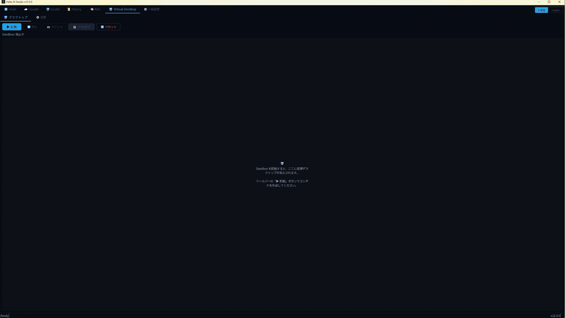
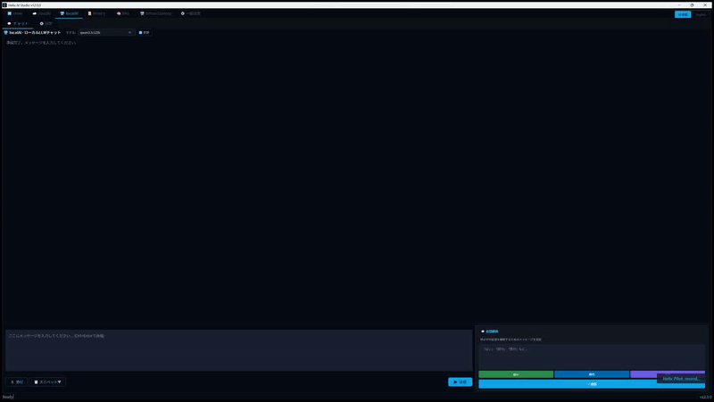
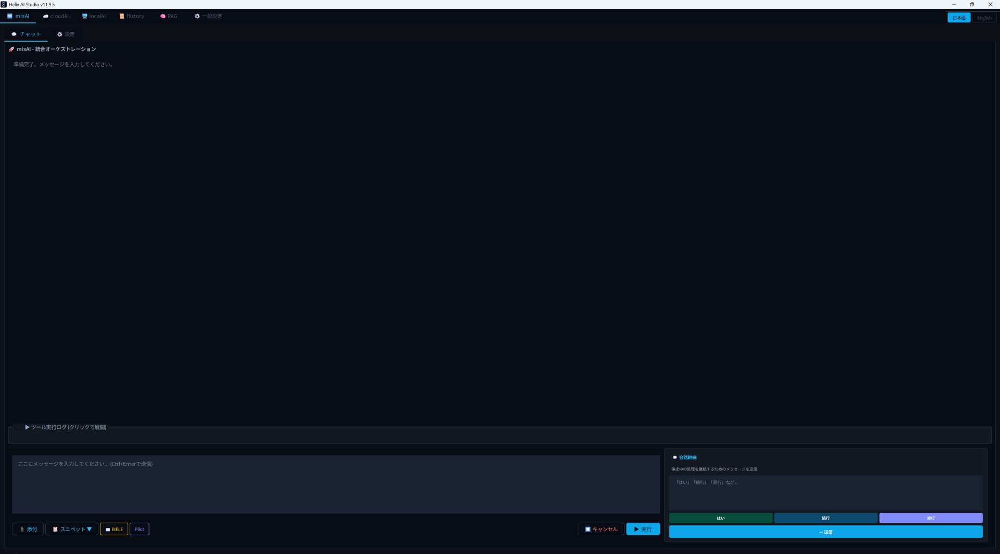
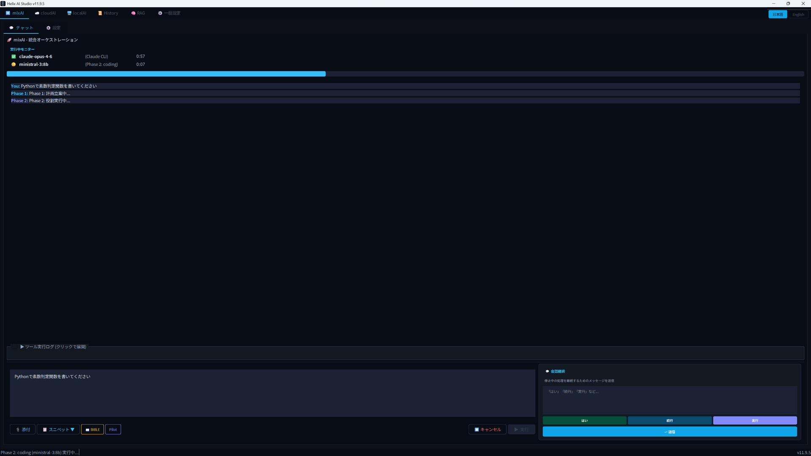
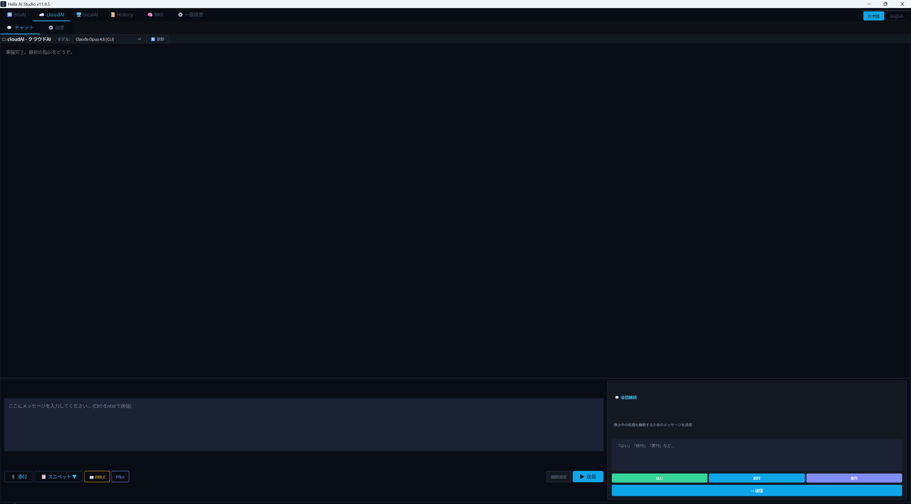
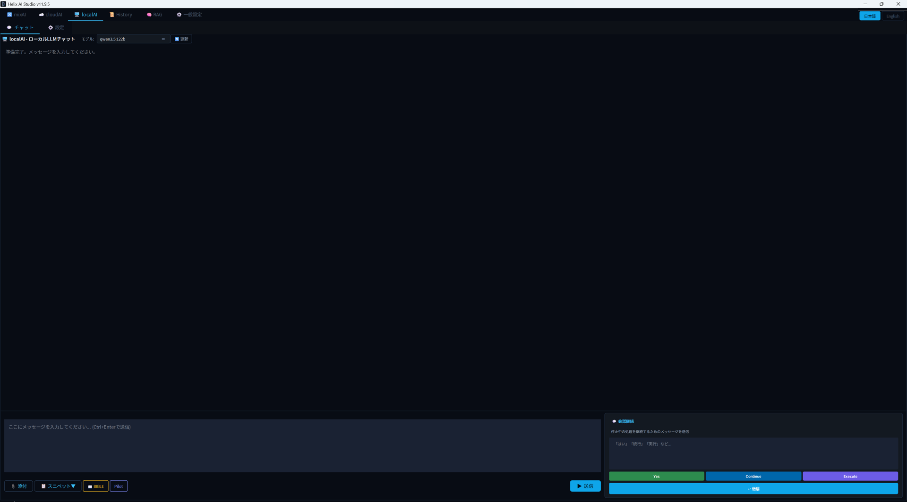
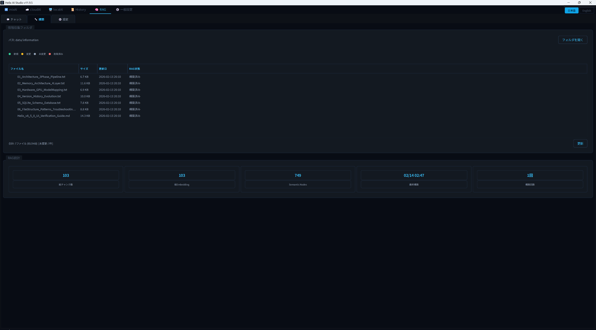
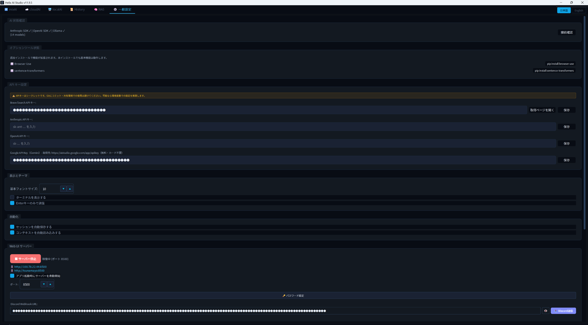
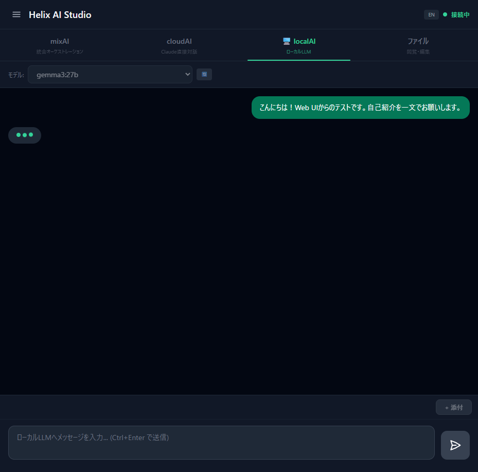

<!-- SPDX-FileCopyrightText: 2026 Helix AI Studio Contributors -->
<!-- SPDX-License-Identifier: MIT -->

<div align="center">

# Helix AI Studio

**ひとつのプロンプト。複数のAI。ひとつの統合された回答。**

*Claude・GPT・Gemini・ローカルLLMを**本当の意味で「協力」させる**デスクトップアプリです。
ひとつのRAGナレッジベースを全AIで共有。コピペも、コーディングも不要。*

[](https://github.com/tsunamayo7/helix-ai-studio/stargazers)
[](https://opensource.org/licenses/MIT)
[](https://www.python.org/downloads/)
[](https://pypi.org/project/PyQt6/)
[](https://github.com/tsunamayo7/helix-ai-studio/releases)


[English README](README.md) · [セットアップガイド](SETUP_GUIDE.md) · [更新履歴](CHANGELOG.md) · [セキュリティ](SECURITY.md)

> 役に立ちそうだと思ったら、スターをいただけると他の開発者に届きやすくなります。ありがとうございます！

</div>

---

## なぜ Helix？

| | |
|---|---|
| **トークン節約、品質はそのまま** | Claudeが担当するのは仕事の20%（計画+検証）。無料のローカルLLMが80%を実行。同じ結果を、わずかなコストで。 |
| **クラウド全力モードも可能** | Claude・GPT・Geminiに直接プロンプトを送って、フルパワーのクラウドAIを使うこともできます。 |
| **Virtual Desktopで安全に開発** | Docker仮想デスクトップ内でAIがファイルを書き込み。差分をプレビューしてからホストに適用。あなたの環境は安全です。 |
| **全モデルで共有するメモリ** | Claude・GPT・Gemini・OllamaがひとつのRAGナレッジベースを共有。一度構築すれば、どのモデルも活用可能。 |
| **あなたの環境で、あなたのルールで** | Docker不要。サブスクなし。`pip install`して起動するだけ。Ollamaを入れれば完全ローカルで動作。 |

---

## デモ

### mixAI パイプライン — クラウドが計画、ローカルが実行、クラウドが検証


### Virtual Desktop — Docker仮想デスクトップ（NoVNC）



### localAI チャット — OllamaモデルをあなたのGPUで



---

## クイックスタート

```bash
git clone https://github.com/tsunamayo7/helix-ai-studio.git
cd helix-ai-studio
pip install -r requirements.txt
python HelixAIStudio.py          # macOS: python3
```

設定画面でAPIキーを追加するか、[Ollama](https://ollama.com) をインストールすれば完全ローカルで動作。
Web UIは `http://localhost:8500` でアクセス可能。

> はじめての方へ: [SETUP_GUIDE.md](SETUP_GUIDE.md) にPython・Ollama・APIキーの設定まで丁寧に解説しています。

---

## パイプラインの仕組み

```
あなたのプロンプト
        |
        v
┌─────────────────────────┐
│   Phase 1: 計画立案     │  クラウドAI（Claude / GPT / Gemini）
│  - タスクを分析         │
│  - サブタスクを作成     │
│  - 合格基準を設定       │
└─────────────────────────┘
        |
  ┌─────┬────┴────┬─────┐
  v     v         v     v
┌──────┐┌────────┐┌─────────┐┌────────┐
│コーディング││リサーチ││  推論   ││ビジョン│  Phase 2: ローカル（あなたのGPU）
└──────┘└────────┘└─────────┘└────────┘
        |
        v
┌─────────────────────────┐
│   Phase 3: 統合・検証   │  クラウドAI
│  - 全出力の統合         │
│  - PASS/FAIL チェック   │
│  - 最終回答の生成       │
└─────────────────────────┘
        |
        v
     最終出力
```

---

## 主な機能

| 機能 | 説明 |
|------|------|
| **mixAI パイプライン** | 3フェーズのオーケストレーション: 計画 → 実行 → 検証 — ワンクリック |
| **cloudAI チャット** | Claude・GPT・Gemini と API で直接チャット |
| **localAI チャット** | Ollama のローカルモデルとGPU上でチャット |
| **Docker Sandbox** | 仮想デスクトップ（NoVNC）でAIがファイルを書き込み。差分プレビュー後にホストへ適用 |
| **統合RAG** | ひとつのナレッジベースを全AIプロバイダーで共有 — ローカル埋め込みで一度構築 |
| **Helix Pilot v2.0** | Vision LLMエージェントが全チャットタブに統合 — 画面認識 + GUI自動操作 |
| **Web UI** | React ベースのモバイルフレンドリーなインターフェース。LAN上のどのデバイスからもアクセス可能 |
| **4層メモリ** | Thread / Episodic / Semantic / Procedural — セッションを超えてコンテキストを記憶 |
| **多言語対応** | 日本語と英語の完全対応。いつでも切り替え可能 |

---

## 競合との比較

| | Open WebUI | AnythingLLM | Dify | LangChain | **Helix** |
|---|:---:|:---:|:---:|:---:|:---:|
| **GitHub Stars** | 60k+ | 30k+ | 129k+ | 80k+ | — |
| **自動パイプライン (クラウド+ローカル)** | 手動 | 手動 | ビジュアルビルダー | コード必要 | **ワンクリック** |
| **統合RAG (クラウド+ローカル)** | — | 部分的 | クラウドのみ | 手動 | **全モデル対応** |
| **デスクトップアプリ** | — | あり | — | — | **あり** |
| **LAN Web UI** | あり | — | — | — | **あり** |
| **Docker不要** | 必要 | オプション | 必要 | N/A | **不要** |
| **セットアップ** | docker run | インストーラー | docker compose | pip + コード | **pip + 起動** |
| **Claude/GPT/Gemini対応** | プロキシ経由 | あり | あり | あり | **あり** |
| **コスト最適化** | — | — | — | 手動 | **自動** |
| **MITライセンス** | あり | あり | あり | あり | **あり** |

> **Helixが埋めるギャップ**: クラウド + ローカルモデルを自動でコスト最適化するGUIデスクトップアプリ — 全AIプロバイダーで共有される統合RAGナレッジベース付き、Docker不要、LAN対応内蔵。

---

<details>
<summary><strong>スクリーンショット</strong></summary>

### パイプラインモニター


### パイプライン完了


### クラウドAIチャット


### ローカルAIチャット


### RAGナレッジベース


### 設定画面


### Web UI


</details>

---

## インストール

### 必要な環境

| 項目 | 要件 |
|------|------|
| OS | Windows 10/11 または macOS 12+（Apple Silicon・Intel両対応） |
| Python | 3.10以上（3.11推奨） |
| GPU | NVIDIA + CUDA（ローカルLLM用 — 任意）。macOSはMetal/CPU推論 |
| RAM | 16GB以上（大型モデルには32GB以上推奨） |

### セットアップ

```bash
git clone https://github.com/tsunamayo7/helix-ai-studio.git
cd helix-ai-studio
pip install -r requirements.txt
```

**（任意）ローカルLLM:**

```bash
ollama pull gemma3:4b           # 軽量モデル
ollama pull gemma3:27b          # 高品質（16GB以上のVRAMが必要）
ollama pull mistral-small3.2    # 画像認識対応
```

**（任意）クラウドAI APIキー:**

```bash
# Windows
copy config\general_settings.example.json config\general_settings.json
# macOS / Linux
cp config/general_settings.example.json config/general_settings.json
```

| プロバイダー | キーの取得先 | 使えるようになる機能 |
|------------|------------|-------------------|
| Anthropic | [console.anthropic.com](https://console.anthropic.com/settings/keys) | Claudeチャット、パイプライン計画立案 |
| Google | [aistudio.google.com](https://aistudio.google.com/app/apikey)（無料枠あり） | Geminiチャット |
| OpenAI | [platform.openai.com](https://platform.openai.com/api-keys) | GPTチャット |

**起動:**

```bash
python HelixAIStudio.py   # macOS: python3
```

### アップデート

```bash
git pull && pip install -r requirements.txt && python HelixAIStudio.py
```

> 設定ファイル（`config/`）やデータ（`data/`）は git 管理対象外のため、アップデートで上書きされません。

---

## 技術スタック

| コンポーネント | 技術 |
|--------------|------|
| デスクトップ GUI | PyQt6 |
| Web UI | React + Vite + Tailwind CSS |
| Web サーバー | FastAPI + Uvicorn (WebSocket) |
| クラウド AI | Anthropic / OpenAI / Google Gemini API |
| CLI バックエンド | Claude Code CLI / Codex CLI |
| ローカル LLM | Ollama |
| Sandbox | Docker + Xvfb + NoVNC（オプション） |
| メモリ | SQLite + ベクトル埋め込み |
| 多言語対応 | 共有 JSON (ja/en) — デスクトップ + Web 共通 |

---

## セキュリティとプライバシー

- **Phase 2は100%ローカル** — 実行フェーズ中、コードやドキュメントがあなたのマシンの外に出ることはありません
- **APIキーはローカル保存** — `config/general_settings.json`（git管理対象外）に保存
- **Web UIはプライベート** — ローカル/VPNアクセス専用設計
- **メモリインジェクション防御** — 蓄積されたコンテキストを利用したプロンプトインジェクションを防止

> 詳細は [SECURITY.md](SECURITY.md) をご覧ください。

---

## バージョン履歴

| バージョン | 主な変更 |
|----------|---------|
| **v12.0.0** | Docker Sandbox Virtual Desktop（NoVNC）、Promotion Engine（差分プレビュー＋本番適用）、7タブ構成 |
| v11.9.7 | BIBLE/Pilot設定タブ移行、Feature Flags、エラー翻訳システム |
| v11.9.5 | Helix Pilotアプリ内統合（全3チャットタブ + 設定）、モデル非依存性強化 |
| v11.9.4 | Helix Pilot v2.0（Vision LLM自律GUIエージェント） |
| v11.9.0 | Unified Obsidianテーマ、スプラッシュスクリーン |
| v11.5.0 | マルチプロバイダーAPI（Anthropic/OpenAI/Google） |
| v11.0.0 | Historyタブ、BIBLEクロスタブ、クラウドモデルセレクター |
| v9.0.0 | Web UI（React + FastAPI） |

詳細は [CHANGELOG.md](CHANGELOG.md) をご覧ください。

---

## 記事・リソース

| 記事 | リンク |
|------|--------|
| v11.9.4 リリース — Helix Pilot v2.0・タブ切り替えUI・多言語強化 | [note.com](https://note.com/ai_tsunamayo_7/n/n7268ff58d0b0) |
| v11.9.1 リリース — インラインカラー完全排除とパイプライン自動化 | [note.com](https://note.com/ai_tsunamayo_7/n/n410888aabe47) |
| 【技術解説】マルチAIオーケストレーション アーキテクチャ | [note.com](https://note.com/ai_tsunamayo_7/n/n5a97fbf68798) |
| 【無料・オープンソース】Helix AI Studio を作った話 | [note.com](https://note.com/ai_tsunamayo_7/n/n410331c01ab0) |
| 【完全無料】複数のAIを同時に使えるデスクトップアプリ | [note.com](https://note.com/ai_tsunamayo_7/n/nb23a3ece82f8) |

---

## コントリビューション

コントリビューションは歓迎です！ガイドラインは [CONTRIBUTING.md](CONTRIBUTING.md) をご覧ください。
セキュリティの問題は [SECURITY.md](SECURITY.md) をご覧ください。

---

## ライセンス

MIT — [LICENSE](LICENSE) を参照

**作者**: tsunamayo7 ([@tsunamayo7](https://github.com/tsunamayo7))

---

<div align="center">

**Helix AI Studio が役に立ったら、ぜひスターをお願いします！**
フィードバック、Issue、PRはいつでも歓迎です。

</div>
