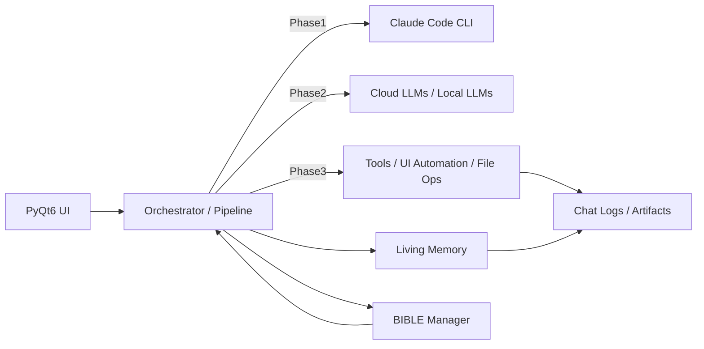

<!-- SPDX-FileCopyrightText: 2026 Helix AI Studio Contributors -->
<!-- SPDX-License-Identifier: MIT -->

# Helix AI Studio

**Helix AI Studio** は、**Claude Code CLI（`claude -p`）を中核**に据えつつ、ローカルLLM（Ollama）・検索・画像読取り・メモリ（要約/知識化）・安全ガードを組み合わせて、**「設計→実装→検証→ログ整理」**までを一気通貫で回すための **Windowsデスクトップ・オーケストレーター（PyQt6）** です。

> 🧩 目的：クラウドAI（Claude/GPT 等）の強みを活かしながら、ローカルLLMの得意分野（軽量推論、常駐処理、ログ整理、機密分離）を併用して、開発体験と再現性を底上げする。


- English README: `README.md`
- 日本語（このファイル）: `README_ja.md`

---

## 主な特徴（v8.4.2時点）

### 1) Claude主導の「3フェーズ」パイプライン
- **Phase 1（設計）**：目的/制約/Acceptance Criteria を構造化して計画を確定
- **Phase 2（実装）**：複数モデル（クラウド/ローカル）を並列活用して実装案・差分・検証案を生成
- **Phase 3（実行/検証）**：ツール実行・UI操作・ログ整理・成果物出力（再現性重視）

### 2) Contextual Intelligence（コンテクスト注入の高度化）
- **BIBLE-first**：PROJECT_BIBLE を「仕様の真実（Source of Truth）」として自動発見→注入
- **Mid-Session Summary**：長い対話でも途中で要点を圧縮し、後半の精度を維持
- **Max Retry / 再試行ポリシー**：Phase 2 の失敗をルール化し、暴走を防止（例：最大リトライ回数）

### 3) Living Memory（多層メモリ）
- 4層メモリ（Thread / Episodic / Semantic / Global）の整理
- RAPTOR風の多段要約、Temporal KG、GraphRAG の足場（実装/拡張前提）
- 常駐LLMによる **Memory Risk Gate**（「保存すべき情報」と「保存してはいけない情報」を分離）

### 4) マルチLLM協調（クラウド + ローカル）
- Claude Code CLI を中核に、**ローカルLLM（Ollama）を工程別に割当**
- 画像読取り/検索レポート/コーディング/リファクタ/要約整理など役割分担
- GPU/VRAMに合わせた軽量モデル運用（常駐用モデルなど）

### 5) 安全性（Prompt Injection対策の“現場適用”）
- 検索・外部入力・ファイル本文をそのまま信じないための **安全ガード文字列**
- 「命令」ではなく「資料」として扱う注入ルールを内蔵（防御的プロンプト）

---

## アーキテクチャ概要



---

## スクリーンショット（例）

`docs/screenshots/` に配置する想定です（ファイル名は任意）。

- `docs/screenshots/HelixAIStudio_20260211_152431.png`
- `docs/screenshots/HelixAIStudio_20260211_152438.png`
- `docs/screenshots/HelixAIStudio_20260211_152444.png`
- `docs/screenshots/HelixAIStudio_20260211_152448.png`
- `docs/screenshots/HelixAIStudio_20260211_152452.png`
- `docs/screenshots/HelixAIStudio_20260211_152457.png`
- `docs/screenshots/HelixAIStudio_20260211_152503.png`

---

## クイックスタート

### 前提
- Windows 10/11
- Python 3.11+（推奨：3.12）
- NVIDIA GPU（任意だが推奨）
- **Claude Code CLI**（`claude` コマンドが実行できること）
- **Ollama**（ローカルモデルを使う場合）

### 1) 依存関係のインストール
```bash
python -m venv .venv
.venv\Scripts\activate
pip install -U pip
pip install -r requirements.txt
```

### 2) Ollamaモデル（例）
利用する工程に合わせてプルしてください（例：軽量常駐 + 埋め込み + 推論用）。

```bash
ollama pull ministral-3:8b
ollama pull qwen3-embedding:4b
# ほか：要約/コーディング/レビュー用など
```

### 3) 起動
```bash
python HelixAIStudio.py
```

---

## 設定（Config）

代表例（実際のキーは実装に合わせて更新してください）：

- `config/app_settings.json`：UIやパイプラインの設定（例：max retry、UI復帰など）
- `config/general_settings.json`：常駐/メモリ/プロファイル/MCPの有効化など

---

## リポジトリ構成（例）

```
HelixAIStudio/
  HelixAIStudio.py
  core/
  ui/
  config/
  docs/
  artifacts/
  README.md
  README_ja.md
  LICENSE
```

---

## ライセンス

MIT License（詳細は `LICENSE` を参照）。

---

## AI支援について（任意で開示）
本プロジェクトは、設計・実装・ドキュメントの一部に生成AI（Claude/GPT 等）を活用しています。
ただし、**最終的な意思決定・統合・検証は人間が行う** ことを前提としています。
