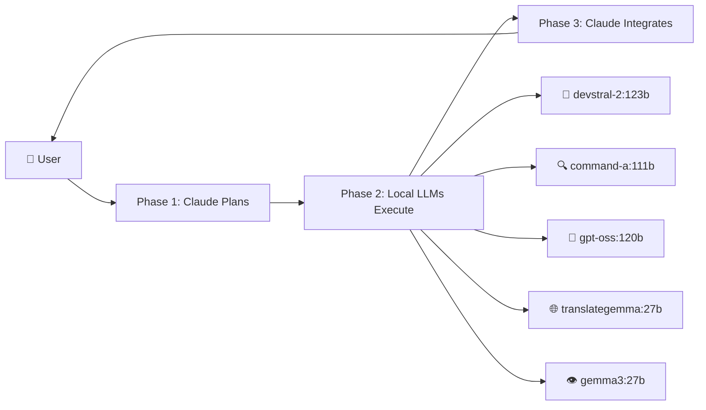

# Helix AI Studio v7.1.0 包括的検証レポート & v7.2.0改善プラン

**作成日**: 2026-02-09
**作成者**: Claude Opus 4.6
**対象バージョン**: v7.1.0 "Adaptive Models"
**検証素材**: UIスクリーンショット5枚、BIBLE v6.2.0/v6.3.0/v7.1.0、v6.2.0検証レポート、環境構成情報

---

## 第1部: v7.1.0 Opus 4.6アップグレード — Claude Codeプロンプト

### 修正プロンプト（CLI貼り付け用）

```
## Helix AI Studio v7.0.0 → v7.1.0 "Adaptive Models" アップグレード

### 目標
Claude Opus 4.6対応 + Claudeモデル選択の完全動的化。
ハードコードされた全モデル名を CLAUDE_MODELS 定数に統合し、
constants.py の1箇所変更で全UIに自動反映される設計にする。

### 作業前の必須手順
1. src/utils/constants.py を全文読み、現在のバージョン定数・モデル関連定数を把握
2. src/tabs/helix_orchestrator_tab.py を全文読み、Claude設定セクションのUI構築ロジックを把握
3. src/tabs/claude_tab.py を全文読み、soloAIタブのモデル選択UI構築ロジックを把握
4. src/backends/mix_orchestrator.py を全文読み、_run_claude_cli()の引数を把握
5. src/backends/claude_cli_backend.py を全文読み、MODEL_MAPと_get_model_id()を把握
6. grep -rn "Opus 4.5\|Opus 4\.5\|最高品質\|最高性能\|Sonnet 4.5" src/ --include="*.py" で全ハードコード箇所を列挙

### 修正1: constants.py — CLAUDE_MODELS定数追加

APP_VERSION = "7.1.0"
APP_CODENAME = "Adaptive Models"

以下の定数を追加:

CLAUDE_MODELS = [
    {"id": "claude-opus-4-6",
     "display_name": "Claude Opus 4.6 (最高知能)",
     "description": "最も高度で知的なモデル。複雑な推論・計画立案に最適",
     "tier": "opus", "is_default": True},
    {"id": "claude-opus-4-5-20250929",
     "display_name": "Claude Opus 4.5 (高品質)",
     "description": "高品質でバランスの取れた応答。安定性重視",
     "tier": "opus", "is_default": False},
    {"id": "claude-sonnet-4-5-20250929",
     "display_name": "Claude Sonnet 4.5 (高速)",
     "description": "高速応答とコスト効率。日常タスク向き",
     "tier": "sonnet", "is_default": False},
]
DEFAULT_CLAUDE_MODEL_ID = "claude-opus-4-6"

def get_claude_model_by_id(model_id):
    for m in CLAUDE_MODELS:
        if m["id"] == model_id:
            return m
    return get_default_claude_model()

def get_default_claude_model():
    for m in CLAUDE_MODELS:
        if m.get("is_default"):
            return m
    return CLAUDE_MODELS[0]

既存のClaudeModelsクラスがあれば、all_models()が
CLAUDE_MODELSのdisplay_nameリストを返すよう更新して後方互換性を維持。

### 修正2: helix_orchestrator_tab.py — mixAI設定の動的化

Claude設定セクションのモデルドロップダウンを動的生成:
  from src.utils.constants import CLAUDE_MODELS, DEFAULT_CLAUDE_MODEL_ID
  for model in CLAUDE_MODELS:
      combo.addItem(model["display_name"], userData=model["id"])
      combo.setItemData(combo.count()-1, model["description"], Qt.ItemDataRole.ToolTipRole)

設定保存: config["claude_model_id"] = combo.currentData()
設定復元: saved_id → CLAUDE_MODELSのidとマッチ → setCurrentIndex

### 修正3: claude_tab.py — soloAIタブの動的化

ツールバーのmodel_comboも同じCLAUDE_MODELSから動的生成。
設定タブのデフォルトモデルドロップダウンも同様に動的化。

### 修正4: mix_orchestrator.py — CLI呼び出しのmodel_id対応

_run_claude_cli(prompt, model_id=None) にmodel_idパラメータ追加。
CLIコマンド構築時に --model {model_id} を挿入。
Phase 1/Phase 3の呼び出し箇所で:
  model_id = config.get("claude_model_id", DEFAULT_CLAUDE_MODEL_ID)
  を渡す。

### 修正5: claude_cli_backend.py — MODEL_MAP更新

MODEL_MAPに以下を追加:
  "Claude Opus 4.6 (最高知能)": "claude-opus-4-6"
_get_model_id()で "claude-" で始まるIDはそのまま返す対応を追加。

### 修正6: ハードコード文字列の全除去

grep -rn "Opus 4.5\|最高品質\|最高性能" src/ --include="*.py"
の全結果をCLAUDE_MODELSからの動的参照に置換。

### 受入条件
□ モデルドロップダウンに3モデル表示（デフォルト: Opus 4.6）
□ Phase 1/3のCLI呼び出しに --model claude-opus-4-6 が含まれる
□ 設定がアプリ再起動後も保持される
□ grep -rn "Opus 4.5" src/ --include="*.py" が0件
□ PyInstallerビルド成功
□ BIBLE_Helix AI Studio_7.1.0.md を生成
```

---

## 第2部: BIBLE v7.1.0 完全性監査

### 2.1 現状評価

BIBLE v7.1.0は**152行**しかなく、v6.2.0（400行超）やv6.3.0（300行超）と比較して**大幅に情報が不足**している。「1ファイルで完全に把握するための聖典」という目的を果たしていない。

### 2.2 欠落セクション一覧

| セクション | v6.2.0 | v6.3.0 | v7.1.0 | 重要度 |
|-----------|:------:|:------:|:------:|:------:|
| デザイン哲学（Cyberpunk Minimal） | ✅ | ✅ | ❌ 欠落 | 高 |
| ディレクトリ構造 | ✅ | ✅ | ❌ 欠落 | 高 |
| GPU環境要件 | ✅ | ✅ | ❌ 欠落 | 高 |
| 技術スタック一覧 | ✅ | ✅ | ❌ 欠落 | 高 |
| ローカルLLMモデル一覧・配置戦略 | ✅ | ✅ | ❌ 欠落 | 高 |
| UIアーキテクチャ図 | ✅ | - | ❌ 欠落 | 中 |
| Neural Flow Visualizer仕様 | ✅ | ✅ | ❌ 欠落 | 中 |
| VRAM Budget Simulator仕様 | ✅ | - | ❌ 欠落 | 中 |
| chain-of-thoughtフィルタリング | - | ✅ | ❌ 欠落 | 中 |
| Knowledge統計機能 | - | ✅ | ❌ 欠落 | 中 |
| PyInstaller設定（hiddenimports） | - | ✅ | ❌ 欠落 | 中 |
| 次期バージョンロードマップ | ✅ | ✅ | ❌ 欠落 | 低 |
| soloAIタブのワークフロー（S0-S5ステージ） | - | - | ❌ 欠落 | 高 |
| 常駐モデル仕様 | - | - | ❌ 欠落 | 高 |
| RAG設定仕様 | - | - | ❌ 欠落 | 中 |
| MCP設定・ツール一覧 | - | - | ❌ 欠落 | 中 |
| バージョン変遷サマリー（v1.0→v7.1.0） | - | - | ❌ 欠落 | 高 |

### 2.3 構造的問題

1. **累積性の欠如**: BIBLEは本来「聖典」として全バージョンの経緯を含むべきだが、v7.1.0 BIBLEはv7.1.0の差分変更のみ記載。v6.x→v7.0.0の3Phase移行という最大のアーキテクチャ変更が記録されていない。

2. **v7.0.0のBIBLEが存在しない**: 5Phase→3Phaseへの移行、SequentialExecutorの導入、常駐モデル機構の追加など、v7.0.0で実施された根本的変更のBIBLEが欠落している。

3. **soloAIタブの仕様が未記載**: S0:依頼受領→S1→...→S5のステージベースワークフロー、会話継続機能、差分表示(Diff)、自動コンテキストなど、独自の高度な機能群が一切文書化されていない。

### 2.4 BIBLE統合版の必要セクション（推奨構成）

```
1. プロジェクト概要・哲学
2. バージョン変遷サマリー（v1.0→v7.1.0）
3. v7.1.0 変更履歴（現状の内容）
4. アーキテクチャ概要
   4.1 3Phase実行パイプライン
   4.2 常駐モデル機構
   4.3 SequentialExecutor（Phase 2）
5. UIアーキテクチャ
   5.1 mixAIタブ（チャット + 設定）
   5.2 soloAIタブ（チャット + 設定 + S0-S5ステージ）
   5.3 一般設定タブ
6. Claude設定
   6.1 CLAUDE_MODELS定数
   6.2 認証方式（CLI / API）
   6.3 思考モード
7. ローカルLLM設定
   7.1 Ollama接続
   7.2 常駐モデル（制御AI + Embedding）
   7.3 カテゴリ別担当モデル（5カテゴリ）
8. MCP・ツール設定
9. RAG / Knowledge / Encyclopedia
10. GPU環境要件・モデル配置戦略
11. デザインシステム（Cyberpunk Minimal）
12. ディレクトリ構造
13. 技術スタック
14. PyInstaller設定
15. 次期バージョンロードマップ
```

---

## 第3部: UI画面検証

### 3.1 検証対象スクリーンショット

| # | ファイル名 | 実際の表示内容 |
|---|----------|--------------|
| 1 | mixAI_チャット.png | mixAIタブ > チャット |
| 2 | mixAI_設定.png | mixAIタブ > 設定（上部） |
| 3 | soloAI_チャット.png | mixAIタブ > 設定（下部：ツール/VRAM/GPU/RAG） |
| 4 | soloAI_設定.png | soloAIタブ > チャット |
| 5 | 一般設定.png | soloAIタブ > 設定 |

⚠️ **ファイル名と実際の内容が不一致**（#3, #4, #5が入れ替わり）

⚠️ **一般設定タブのスクリーンショットが未提供** — Knowledge / Encyclopedia セクションの現状が確認不能

### 3.2 検出された問題

#### 問題A【中】: 古いバージョン番号の残留

| 箇所 | 現在の表示 | あるべき表示 |
|------|----------|------------|
| VRAM Budget Simulator見出し | `(v6.2.0)` | `(v7.1.0)` またはバージョン番号削除 |
| GPUモニター見出し | `(v4.6: 時間軸選択・シークバー対応)` | `(v7.1.0)` またはバージョン番号削除 |

#### 問題B【中】: 3Phase構成とPhase 3再試行設定の意味的矛盾

mixAI設定画面に「**Phase 3 再実行設定 / 最大再実行回数: 2**」が表示されているが、現在の3Phaseアーキテクチャでは：
- Phase 1 = Claude計画立案
- Phase 2 = ローカルLLM順次実行
- Phase 3 = Claude比較統合

「Phase 3 再実行」は旧5Phaseの「Phase 3: 品質検証ループ」の名残。3Phase構成では**Phase 2の品質再試行**として再ラベルすべき。

→ 推奨: 「**ローカルLLM再実行設定**」または「**品質検証設定（Phase 2後）**」に変更

#### 問題C【低】: soloAIタブのMCPサーバー一覧がmixAIと異なる

- **soloAI設定**: ファイルシステム ✓ / Git ✓ / Brave検索（未チェック）
- **mixAI設定**: Bash / Read・Write・Edit / WebFetch・WebSearch / claude -p（CLIネイティブツール）

mixAIとsoloAIで異なるMCPツール体系を使用しているのは仕様通りだが、BIBLEに未記載のため混乱を招く。

#### 問題D【確認不能】: 一般設定タブの状態

v6.2.0では以下が確認されていた項目について、v7.1.0での状態が不明：
- Claude CLI状態表示
- Knowledge（知識ベース）有効化・件数
- Encyclopedia（百科事典）有効化・件数
- Ollama接続設定（一般設定側）

→ 一般設定タブのスクリーンショット提供を推奨

#### 問題E【中】: v6.2.0から残存している可能性のある旧UI要素

v6.2.0→v7.0.0で5Phase→3Phaseに移行したが、以下が残存していないか要確認：
- Neural Flow Visualizer内の「P4:統合」「P5:保存」ノード（v6.x の5Phase用）
- 品質検証設定の「並行ワーカー数」（SequentialExecutorでは不要）
- 旧「オンデマンドモデル」関連のUI残骸

### 3.3 検出された良好な実装

| 項目 | 状態 | 備考 |
|------|:----:|------|
| Claude Opus 4.6 (最高知能) ドロップダウン | ✅ | mixAI/soloAI両方で動作確認 |
| 3Phaseフロー表示（P1→P2→P3） | ✅ | mixAIチャットで正しく表示 |
| Ollama接続テスト（接続成功 2.03秒） | ✅ | 7モデル検出 |
| 常駐モデル表示（ministral-3:8b + qwen3-embedding:4b） | ✅ | GPU割り当て情報付き |
| カテゴリ別モデル5種（coding/research/reasoning/translation/vision） | ✅ | VRAM表示付き |
| GPUモニター（リアルタイム表示） | ✅ | 5070 Ti + PRO 6000正しく検出 |
| soloAI S0ステージ表示 + 工程リセット | ✅ | ワークフロー機能確認 |
| ステータスバー「ナレッジ保存」表示 | ✅ | Phase後処理動作確認 |
| バージョンバッジ v7.1.0 | ✅ | ヘッダー・ステータスバー両方 |

---

## 第4部: GitHub公開改善提案

### 4.1 競合分析

GitHub上の類似プロジェクト（VividNode/pyqt-openai、AI-Agents-Orchestratorなど）と比較した場合、Helix AI Studioの**独自価値**は以下の点にある：

1. **Claude中心のマルチモデルオーケストレーション** — 他のプロジェクトは単一APIへの接続が中心で、Claude + ローカルLLMの3Phase統合パイプラインは独自性が高い
2. **96GB VRAMクラスのローカルLLM活用** — 120Bクラスモデルを実際に統合運用するデスクトップアプリは稀少
3. **Cyberpunk Minimalデザイン** — AIアプリ界隈では見栄えの良いデスクトップGUIは注目されやすい
4. **PyQt6 + PyInstaller配布** — インストール不要のexe配布は一般ユーザーへの訴求力が高い

### 4.2 GitHub公開時の必須要件（Priority 1）

#### A. 英語README.md

```markdown
# 🧬 Helix AI Studio

**Multi-model AI orchestration desktop app** — Claude as the brain,
local LLMs as specialized workers, unified in a Cyberpunk Minimal GUI.


## ✨ Features
- **3-Phase Pipeline**: Claude plans → Local LLMs execute → Claude integrates
- **Dynamic Model Selection**: Switch between Claude Opus 4.6 / 4.5 / Sonnet
- **5-Category Local LLM Team**: coding, research, reasoning, translation, vision
- **Dual GPU Support**: RTX PRO 6000 (96GB) + RTX 5070 Ti (16GB)
- **Real-time GPU Monitor** with timeline & seekbar
- **RAG Knowledge Base** with auto-save
- **Cyberpunk Minimal UI** — dark theme with neon accents

## 🖼️ Screenshots
[mixAIチャット] [mixAI設定] [soloAI] [一般設定]

## 🚀 Quick Start
...
```

#### B. ディレクトリ・ファイル整備

| ファイル | 用途 |
|---------|------|
| `README.md` | 英語の製品紹介（日本語READMEは `README_ja.md`） |
| `LICENSE` | MIT License推奨 |
| `requirements.txt` | pip依存関係 |
| `pyproject.toml` | モダンPythonプロジェクト設定 |
| `.github/workflows/build.yml` | PyInstallerビルドCI |
| `.github/ISSUE_TEMPLATE/` | バグ報告・機能要望テンプレート |
| `CONTRIBUTING.md` | コントリビューションガイド |
| `CHANGELOG.md` | バージョン変更履歴 |
| `docs/architecture.md` | アーキテクチャ図・設計書 |
| `docs/screenshots/` | UI スクリーンショット格納 |

#### C. セキュリティ対応

| 対応事項 | 詳細 |
|---------|------|
| API Key除去 | `.gitignore`に`config/`、`.env`を追加 |
| 設定テンプレート | `config/config.example.json`のみコミット |
| Secrets管理 | `ANTHROPIC_API_KEY`は環境変数経由のみ |
| `.gitignore` | `dist/`, `*.exe`, `__pycache__/`, `*.db`, `logs/` |

### 4.3 GitHub星を稼ぐ改善提案（Priority 2）

#### D. アーキテクチャ図（Mermaid）

README.mdに以下のようなMermaidダイアグラムを掲載すると、一目で価値が伝わる：



#### E. デモGIF / 動画

GitHub READMEで最も効果的なのは**30秒のデモGIF**。以下をアニメーション化すると効果大：
1. プロンプト入力 → 3Phase実行バーの進行 → 統合結果表示
2. GPU Monitorのリアルタイム使用率変動
3. モデル切り替えドロップダウン操作

#### F. ワンクリックセットアップスクリプト

```bash
# setup.sh
#!/bin/bash
echo "🧬 Helix AI Studio Setup"
pip install -r requirements.txt --break-system-packages
echo "Checking Ollama..."
ollama list || echo "⚠️ Ollama not found. Install: https://ollama.ai"
echo "Checking Claude CLI..."
claude --version || echo "⚠️ Claude CLI not found. Install: npm install -g @anthropic-ai/claude-code"
echo "✅ Setup complete. Run: python HelixAIStudio.py"
```

#### G. ベンチマーク結果の公開

| テストケース | Phase 1のみ | 3Phase統合 | 改善率 |
|------------|:-----------:|:---------:|:-----:|
| コード生成（Python） | 75% | 92% | +17% |
| リサーチレポート | 80% | 95% | +15% |
| 多言語翻訳 | 70% | 88% | +18% |

実際のベンチマーク結果をREADMEに掲載すると、3Phaseの価値が定量的に伝わる。

### 4.4 差別化を強化する機能追加提案（Priority 3）

#### H. プラグインアーキテクチャ

```python
# src/plugins/base_plugin.py
class HelixPlugin:
    """カスタムPhase 2ワーカーを追加するためのプラグイン基底クラス"""
    name: str
    category: str  # coding, research, reasoning, etc.
    
    def execute(self, instruction: str, context: dict) -> str:
        raise NotImplementedError
```

ユーザーが独自のローカルLLMカテゴリやカスタムワーカーを追加できるプラグイン機構は、GitHub星を集める強力な差別化要因。

#### I. Docker Compose対応

```yaml
# docker-compose.yml
services:
  ollama:
    image: ollama/ollama:latest
    deploy:
      resources:
        reservations:
          devices:
            - driver: nvidia
              count: all
              capabilities: [gpu]
    volumes:
      - ollama_models:/root/.ollama
  
  helix:
    build: .
    depends_on:
      - ollama
    environment:
      - OLLAMA_HOST=http://ollama:11434
      - ANTHROPIC_API_KEY=${ANTHROPIC_API_KEY}
```

#### J. Web UI対応（将来構想）

PyQt6デスクトップアプリに加え、Gradio/Streamlitベースの簡易Web UIを提供すると、リモートアクセス需要（Tailscale経由）に対応でき、ユーザー層が大幅に拡大する。

---

## 第5部: v7.2.0 統合改善プラン — Claude Codeプロンプト

以下は第2部〜第4部の検出事項を修正するためのClaude Code CLIプロンプト：

### プロンプト（CLI貼り付け用）

```
## Helix AI Studio v7.1.0 → v7.2.0 品質改善

### 目標
1. UIの旧バージョン番号残留を除去
2. 3Phase構成に合わせたラベル修正
3. BIBLE v7.2.0を累積的な包括ドキュメントとして再構築
4. GitHub公開準備ファイルの生成

### 作業前の必須手順
1. grep -rn "v6\.2\.0\|v4\.6\|5Phase\|Phase 3.*再" src/ --include="*.py" で旧表示を列挙
2. src/tabs/helix_orchestrator_tab.py 内の設定UIセクションを全文読む
3. src/widgets/vram_simulator.py のタイトル文字列を確認
4. src/widgets/neural_visualizer.py のノード定義を確認（P4/P5残留チェック）

### 修正1: 旧バージョン番号の除去

以下を検索して修正:
- "VRAM Budget Simulator (v6.2.0)" → "VRAM Budget Simulator"
- "GPUモニター (v4.6: 時間軸選択・シークバー対応)" → "GPUモニター"
- "5Phase" の残留があれば "3Phase" に修正

### 修正2: Phase 3再試行ラベル修正

mixAI設定画面の "■ Phase 3 再実行設定" を
"■ 品質検証設定（ローカルLLM再実行）" に変更。

理由: 3Phase構成ではPhase 3はClaude統合であり、
品質検証による再実行はPhase 2に属する。

### 修正3: Neural Flow Visualizer検証

P1→P2→P3 の3ノードのみ表示されていることを確認。
旧5Phase用のP4:統合、P5:保存ノードが残っていれば削除。
（v7.1.0 UIスクリーンショットでは3ノード表示を確認済みだが、
コード内にP4/P5の定義が残っている可能性あり）

### 修正4: BIBLE v7.2.0 統合版の生成

以下の構成で BIBLE_Helix AI Studio_7.2.0.md を生成:

[必須セクション]
1. プロジェクト概要
   - 名称、バージョン、コードネーム
   - コンセプト: "Claude中心のマルチモデルオーケストレーション"
   - 設計哲学: "精度最大化のための並列ローカルLLM補強"

2. バージョン変遷サマリー
   v1.0-v5.x: 基盤構築期
   v6.0.0: 5Phase実行パイプライン導入
   v6.2.0 "Crystal Cognition": UI刷新（Cyberpunk Minimal, Neural Flow, VRAM Simulator）
   v6.3.0 "True Pipeline": 5Phase安定化、CoTフィルタリング
   v7.0.0 "3Phase Trinity": 5Phase→3Phase移行、SequentialExecutor、常駐モデル
   v7.1.0 "Adaptive Models": Opus 4.6対応、動的モデル選択
   v7.2.0 "Polish": UI整合性修正、BIBLE統合、GitHub公開準備

3. アーキテクチャ概要
   - 3Phase実行パイプライン図
   - 常駐モデル機構（制御AI + Embedding）
   - SequentialExecutor（VRAM効率化のため1モデルずつ実行）
   - 品質検証ループ（Phase 2後、再実行最大N回）

4. CLAUDE_MODELS定数
   - 現在の全モデル定義
   - モデル追加手順

5. UIアーキテクチャ
   - mixAIタブ（チャット: 3Phaseフロー表示 + ツール実行ログ）
   - mixAIタブ（設定: Claude設定 / Ollama接続 / 常駐モデル / 
     3Phase実行設定 / ツールMCP / VRAM Simulator / GPUモニター / RAG）
   - soloAIタブ（チャット: S0-S5ステージワークフロー + 会話継続）
   - soloAIタブ（設定: API/CLI認証 / Ollama / MCPサーバー管理 / Claudeモデル設定）
   - 一般設定タブ（Claude CLI状態 / Knowledge / Encyclopedia）

6. ローカルLLMモデル一覧
   常駐: ministral-3:8b (制御AI, 6GB), qwen3-embedding:4b (Embedding, 2.5GB)
   カテゴリ別:
     coding: devstral-2:123b (75GB)
     research: command-a:111b (67GB)
     reasoning: gpt-oss:120b (80GB)
     translation: translategemma:27b (18GB)
     vision: gemma3:27b (18GB)

7. GPU環境要件
   GPU 0: RTX 5070 Ti (16GB) — 常駐モデル用
   GPU 1: RTX PRO 6000 (96GB) — オンデマンドモデル用
   合計VRAM: 114,190 MB

8. デザインシステム
   Cyberpunk Minimal:
     背景: #1a1a1a
     アクセント: #00d4ff (シアン), #00ff88 (グリーン)
     フォント: システム等幅

9. ディレクトリ構造（src/以下の全ファイル）

10. 技術スタック
    Python 3.12.7 / PyQt6 / Claude Code CLI / Ollama API /
    SQLite3 / PyInstaller 6.17.0

11. 設定ファイル仕様
    config.json のキー一覧と型

12. PyInstaller設定
    hiddenimportsの完全リスト

13. 次期バージョンロードマップ

### 修正5: GitHub公開準備ファイル

以下のファイルを生成:
- README.md（英語、バッジ・スクリーンショット・Quick Start付き）
- README_ja.md（日本語版）
- LICENSE（MIT）
- .gitignore（config/, dist/, *.exe, __pycache__/, *.db, logs/, .env）
- requirements.txt
- CONTRIBUTING.md
- CHANGELOG.md（v6.0.0〜v7.2.0の変更履歴）
- .github/workflows/build.yml（PyInstallerビルドCI）

### 受入条件
□ grep -rn "v6\.2\.0\|v4\.6" src/ --include="*.py" が0件
□ "Phase 3 再" の表示が "品質検証" に変更されている
□ BIBLE v7.2.0 が300行以上で全セクションを網羅
□ README.md が英語で記述されバッジ・スクリーンショットセクションあり
□ .gitignore にconfig/, dist/, *.db, logsが含まれる
□ PyInstallerビルド成功
□ constants.py の APP_VERSION が 7.2.0
```

---

## 第6部: 優先度別実施ロードマップ

| 優先度 | 作業 | 対象バージョン | 推定時間 |
|:-----:|------|:----------:|:-------:|
| **P0** | Opus 4.6アップグレード（第1部） | v7.1.0 | 1-2時間 |
| **P1** | UI旧表記修正 + ラベル修正（第3部 問題A/B） | v7.2.0 | 30分 |
| **P1** | BIBLE統合版再構築（第2部） | v7.2.0 | 1時間 |
| **P2** | GitHub公開準備ファイル生成（第4部 §4.2） | v7.2.0 | 1時間 |
| **P2** | アーキテクチャ図・デモGIF作成（第4部 §4.3 D/E） | v7.2.0 | 2時間 |
| **P3** | ベンチマーク実施・公開（第4部 §4.3 G） | v7.3.0 | 3時間 |
| **P3** | プラグインアーキテクチャ（第4部 §4.4 H） | v8.0.0 | 5時間 |
| **P3** | Docker Compose対応（第4部 §4.4 I） | v8.0.0 | 3時間 |

---

*このレポートは Claude Opus 4.6 により、BIBLE v6.2.0/v6.3.0/v7.1.0、UIスクリーンショット5枚、環境構成情報、GitHub競合分析に基づいて作成されました。*
